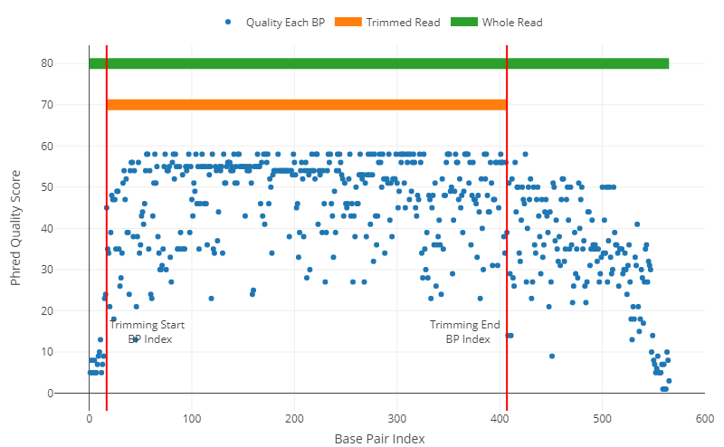

```{r setup, include=FALSE}

knitr::opts_chunk$set(echo = TRUE)
usethis::git_vaccinate()

```

# Introducción

Se muestreó en tres puntos de la Planta de tratamiento de aguas residuales en la provincia de Napo-Ecuador: tanque de homogeneización (MTH), cámara anóxica (MCA), y cámara de salida (MCS). Las muestras de agua fueron cultivadas en medio de cultivo sólido selectivo para al género *Mycobacterium*. Posteriormente, se realizó extracción de ADN de las colonias aisladas, amplificación del gen 16S rRNA y secuenciación mediante el método Sanger. El objetivo del presente script R fue registrar los procedimientos de control de calidad de las secuencias Sanger y tratamientos estadísticos. En cada paso se registrará un breve detalle de los códigos usados y gráficos de ser el caso.

# Identificación Molecular

Previo la identificación molecular de las posibles especies de Micobacterias aisladas, se realizó el control de calidad de la secuenciación Sanger (electroferograma) mediante el paquete [sangeranalyseR](https://github.com/roblanf/sangeranalyseR) de R.

## Preprocesamiento

A continuación, se instaló el paquete sangeranalyseR para el preprocesamiento de los electroferogramas obtenidos de la secuenciación Sanger.

```{r sanger, echo=TRUE, message=FALSE, warning=FALSE, error=FALSE}

# Instalación del paquete sangeranalyseR
#if (!requireNamespace("BiocManager", quietly = TRUE))
#    install.packages("BiocManager")
#BiocManager::install("sangeranalyseR")

# Cargado de la biblioteca del paquete sangeranalyseR
library(sangeranalyseR)

```

Se procedió a cargar los electroferogramas (*.ab1) para el análisis de calidad.

```{r files, echo=TRUE, message=FALSE, warning=FALSE, error=FALSE}

# Directorio/carpeta de trabajo
ppath <- "../Environmental_Mycobacteria/"

# Carpeta con los datos Sanger
sanger_files <- file.path(ppath, "Data", "palandacocha_sanger")

# Confirmamos la presencia de los archivos Sanger en la carpeta
#list.files(sanger_files)

# Filtramos solo archivos (*.ab1)
ab1_files <- list.files(path = sanger_files, pattern = "[.]ab1", full.names = TRUE)

```

Una vez cargadas las secuencias (*.ab1) se procedió con el control de calidad de la secuenciación de Sanger. Para ello se tomaron en cuenta los parámetros recomendados en el trabajo de [Crossley (2020)](https://doi.org/10.1177%2F1040638720905833). El puntaje de recortado de lectura usado fue 30 (recomendado > 20) de acuerdo con el puntaje de calidad Phred calculado con método modificado de Mott. El ruido se estableció en 33 % (recomendado < 20 %), con este valor consideramos picos o pares de bases (bp) que al menos alcancen 1/3 del pico más alto (o de la secuencia principal).

### Ejemplo para un cromatograma

A continuación, se exploran los parámetros con un electroferograma de ejemplo.

```{r load_test, echo=TRUE, message=FALSE, warning=FALSE, error=FALSE}

# Cargado del archivo ejemplo
file_test <- file.path(ppath,
                      "Data",
                      "palandacocha_sanger",
                      "A1-F-12Y_F08_06.ab1")

# Control de calidad de los nucleótidos
clean_test <- SangerRead(printLevel = "SangerRead",
                           inputSource = "ABIF",
                           readFeature = "Forward Read",
                           readFileName = file_test,
                           geneticCode = GENETIC_CODE,
                           TrimmingMethod = "M1",
                           M1TrimmingCutoff = 0.001, # Para Q = 30
                           baseNumPerRow = 100,
                           heightPerRow = 200,
                           signalRatioCutoff = 0.33,
                           showTrimmed = TRUE)
clean_test

```

Como resultado se obtuvo una secuencia más corta que la inicial, pero con bp de puntaje de calidad de Phred superior al 30 (Q = 30).

A continuación, se muestra un gráfico con la secuencia recortada (eje X) y la calidad de las pares de bases (eje Y).

```{r plot_test, echo=TRUE, message=FALSE, warning=FALSE, error=FALSE}

# Gráfico de calidad de bp
qual_test <- qualityBasePlot(clean_test)
qual_test # Imagen disponible en formato HTML

```



Finalmente, la secuencia será exportada en formato (*.fa) para análisis posteriores.

```{r export_test, echo=TRUE, message=FALSE, warning=FALSE, error=FALSE}

# Directorio para guardar los cromatogramas tratados
results_test <- file.path(ppath, "Result", "palandacocha_results", "test_results")

# Exportación del cromatograma preprocesado
exp_test  <- writeFasta(clean_test,
                        outputDir = results_test,
                        compress = FALSE,
                        compression_level = NA)

```

### Preprocesamiento en Batch

Una vez obtenidos los parámetros adecuados, se procede a aplicar dichos parámetros para todos los electroferogramas. Luego, los electroferograma tratados fueron exportados en formato (*.fa) para análisis posteriores.

```{r clean, echo=TRUE, message=FALSE, warning=FALSE, error=FALSE}

# Directorio para guardar los cromatogramas tratados
results_files <- file.path(ppath, "Result", "palandacocha_results")

# Usamos un bucle for para preprocesar todos los datos
for(i in 1:33){
  sanger_read <- SangerRead(printLevel = "SangerRead",
                           inputSource = "ABIF",
                           readFeature = "Forward Read",
                           readFileName = ab1_files[i],
                           geneticCode = GENETIC_CODE,
                           TrimmingMethod = "M1",
                           M1TrimmingCutoff = 0.001, # Para Q = 30
                           M2CutoffQualityScore = NULL,
                           M2SlidingWindowSize = NULL,
                           baseNumPerRow = 100,
                           heightPerRow = 200,
                           signalRatioCutoff = 0.33,
                           showTrimmed = TRUE)
  writeFasta(sanger_read,
           outputDir = results_files,
           compress = FALSE,
           compression_level = NA)
}

```

## BLAST

Una vez limpiadas las secuencias se procedió con la identificación de especies mediante la comparación de secuencias experimentales con las secuencias de la base de datos de BLAST. Para ello, se usó el paquete R ["annotate"](https://doi.org/10.18129/B9.bioc.annotate).

```{r blast, echo=TRUE, message=FALSE, warning=FALSE, error=FALSE}

# Instalación del paquete annotate
#if (!require("BiocManager", quietly = TRUE))
#    install.packages("BiocManager")
#BiocManager::install("annotate")

# Cargado de la biblioteca del paquete annotate
library("annotate")

```

Ejemplo de identificación molecular mediante BLAST para una secuencia.

```{r fa_files, echo=TRUE, message=FALSE, warning=FALSE, error=FALSE}

# Cargado del archivo ejemplo
fa_test <- file.path(ppath,
                      "Result",
                      "palandacocha_results",
                      "test_results",
                      "A1-F-12Y_F08_06.fa")

# Características generales de la secuencia ejemplo
ident_test <- SangerRead(inputSource = "FASTA",
                         readFeature = "Forward Read",
                         readFileName = fa_test,
                         fastaReadName = "A1-F-12Y_F08_06.ab1",
                         geneticCode = GENETIC_CODE)

# Lista de especies coincididas con la secuencia ejemplo
blast_test <- blastSequences(paste(ident_test@primarySeq),as='data.frame')
blast_test$Hit_def

```

# Árbol filogenético


# Estadística

Se usarán índices de diversidad en cada punto de muestreo para un seguimiento al tratamiento de las aguas residuales que realiza la planta Palandacocha. En cambio, todas las especies identificadas en la planta serán consideradas como la diversidad de Micobacterias presentes en las aguas residuales del cantón Tena (representado por aquellas que llegan a la planta Palandacocha).

## Diversidad Alfa

Los índices de diversidad más usados en la literatura son Simpson y Shannon (cita). El índice de Simpson está relacionado con la dominancia de las especies en un área o ecosistema en particular (cita). En este caso se calculará el índice de Simpson en muestras (área o punto de muestreo) antes del ingreso, dentro y a la salida de la planta de tratamiento Palandacocha. De existir una especie dominante a la salida de la planta podría deberse a la resistencia del microorganismo a los métodos descontaminantes empleadas en la planta.

Por otro lado, el índice de Shannon está relacionado a la equidad/uniformidad de las especies en un área o ecosistema en particular (cita). Este estadístico nos permitirá conocer si las diferentes áreas muestrales son iguales, más o menos uniformes. De esta manera, la uniformidad semejante entre los sitios muéstreles podría deberse a la resistencia de los microrganismos a los métodos de descontaminación empleadas en la planta de Palandacocha.

Para los cálculos de la diversidad alfa se usará el paquete R [vegan](https://github.com/vegandevs/vegan/tree/master) disponible en GitHub (vegandevs/vegan). En la siguiente línea de código se instalará y activarán las bibliotecas del paquete R vegan.

```{r vegan, echo=TRUE, message=FALSE, warning=FALSE, error=FALSE}

# Instalación y cargado de bibliotecas del paquete vegan
#install.packages("remotes")
#remotes::install_github("vegandevs/vegan")

library("vegan")

```

### Índice de Simpson

Cargado del libro Excel con los microorganismos identificados en cada punto muestral y cálculo del índice de Simpson.

```{r simp, echo=TRUE, message=FALSE, warning=FALSE, error=FALSE}

# Llamado de datos
diver_data <- readxl::read_excel("Data/to_palandacocha_diversity.xlsx", 1)
# Creando DataFrame
diver_data <- data.frame(diver_data)
# Nombrar filas
row.names(diver_data) <- diver_data$Site
# Eliminar columna con los nombres anteriores
diver_data <- diver_data[1:4,-1]
# Cálculo del índice Simpson
pal_rich <- specnumber(diver_data, MARGIN = 1)  # Número de species por área/grupo
pal_rich
pal_rich2 <- specnumber(diver_data, MARGIN = 2) # Frecuencia por área/grupo, asigna 1 si la                                                                   # especie fue encontrada en un área/grupo
pal_simp <- diversity(diver_data, index = "simpson")
pal_simp
pal_shan <- diversity(diver_data, index = "shannon")
pal_shan

# Plot result
pairs(cbind(pal_shan, pal_simp), pch="*", col="blue")

```

### Índice de Shannon

Descripción

## Diversidad Beta

Descripción

```{r pressure, echo=FALSE}

#her plot

```


