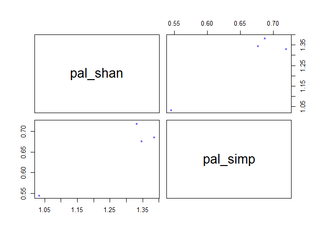

Análisis de datos de Micobacterias ambientales presentes en la Planta de
tratamiento de aguas residuales Palandacocha
================
Silvana Morocho, Jefferson Pastuña
2023-10-09

- <a href="#introducción" id="toc-introducción">Introducción</a>
- <a href="#identificación-molecular"
  id="toc-identificación-molecular">Identificación Molecular</a>
- <a href="#estadística" id="toc-estadística">Estadística</a>
  - <a href="#diversidad-alfa" id="toc-diversidad-alfa">Diversidad Alfa</a>
    - <a href="#índice-de-simpson" id="toc-índice-de-simpson">Índice de
      Simpson</a>
    - <a href="#índice-de-shannon" id="toc-índice-de-shannon">Índice de
      Shannon</a>
  - <a href="#diversidad-beta" id="toc-diversidad-beta">Diversidad Beta</a>

# Introducción

General…

# Identificación Molecular

Previo la identificación molecular de las posibles especies, se realizó
el control de calidad de la secuenciación Sanger (electroferograma) con
el paquete [sangeranalyseR](https://github.com/roblanf/sangeranalyseR)
de R.

``` r
#Instalación y cargado de bibliotecas del paquete sangeranalyseR
#if (!requireNamespace("BiocManager", quietly = TRUE))
#    install.packages("BiocManager")
#BiocManager::install("sangeranalyseR")

library(sangeranalyseR)
```

# Estadística

Se usarán índices de diversidad en cada punto de muestreo para un
seguimiento al tratamiento de las aguas residuales que realiza la planta
Palandacocha. En cambio, todas las especies identificadas en la planta
serán consideradas como la diversidad de Micobacterias presentes en las
aguas residuales del cantón Tena (representado por aquellas que llegan a
la planta Palandacocha).

## Diversidad Alfa

Los índices de diversidad más usados en la literatura son Simpson y
Shannon (cita). El índice de Simpson está relacionado con la dominancia
de las especies en un área o ecosistema en particular (cita). En este
caso se calculará el índice de Simpson en muestras (área o punto de
muestreo) antes del ingreso, dentro y a la salida de la planta de
tratamiento Palandacocha. De existir una especie dominante a la salida
de la planta podría deberse a la resistencia del microorganismo a los
métodos descontaminantes empleadas en la planta.

Por otro lado, el índice de Shannon está relacionado a la
equidad/uniformidad de las especies en un área o ecosistema en
particular (cita). Este estadístico nos permitirá conocer si las
diferentes áreas muestrales son iguales, más o menos uniformes. De esta
manera, la uniformidad semejante entre los sitios muéstreles podría
deberse a la resistencia de los microrganismos a los métodos de
descontaminación empleadas en la planta de Palandacocha.

Para los cálculos de la diversidad alfa se usará el paquete R
[vegan](https://github.com/vegandevs/vegan/tree/master) disponible en
GitHub (vegandevs/vegan). En la siguiente línea de código se instalará y
activarán las bibliotecas del paquete R vegan.

``` r
# Instalación y cargado de bibliotecas del paquete vegan
#install.packages("remotes")
#remotes::install_github("vegandevs/vegan")

library("vegan")
```

### Índice de Simpson

Cargado del libro Excel con los microorganismos identificados en cada
punto muestral y cálculo del índice de Simpson.

``` r
# Llamado de datos
diver_data <- readxl::read_excel("Data/to_palandacocha_diversity.xlsx", 1)
# Creando DataFrame
diver_data <- data.frame(diver_data)
# Nombrar filas
row.names(diver_data) <- diver_data$Site
# Eliminar columna con los nombres anteriores
diver_data <- diver_data[1:4,-1]
# Cálculo del índice Simpson
pal_rich <- specnumber(diver_data, MARGIN = 1)  # Número de species por área/grupo
pal_rich
```

    ##  MTH  MCA  MCS Tena 
    ##    5    4    4    5

``` r
pal_rich2 <- specnumber(diver_data, MARGIN = 2) # Frecuencia por área/grupo, asigna 1 si la                                                                   # especie fue encontrada en un área/grupo
pal_simp <- diversity(diver_data, index = "simpson")
pal_simp
```

    ##       MTH       MCA       MCS      Tena 
    ## 0.6875000 0.5454545 0.7200000 0.6770833

``` r
pal_shan <- diversity(diver_data, index = "shannon")
pal_shan
```

    ##      MTH      MCA      MCS     Tena 
    ## 1.386294 1.033562 1.332179 1.347450

``` r
# Plot result
pairs(cbind(pal_shan, pal_simp), pch="*", col="blue")
```

<!-- -->

### Índice de Shannon

Descripción

## Diversidad Beta

Descripción
