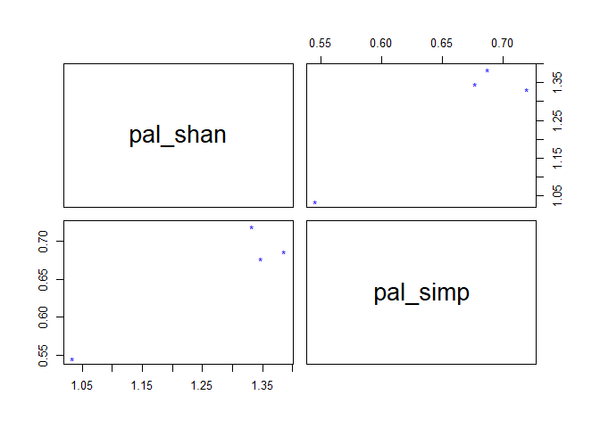

# Introducción

General...

# Identificación Molecular

Previo la identificación molecular de las posibles especies, se realizó el control de calidad de la secuenciación Sanger (electroferograma) con el paquete [sangeranalyseR](https://github.com/roblanf/sangeranalyseR) de R.

## Preprocesamiento

A continuación, se instaló el paquete sangeranalyseR para el preprocesamiento de los electroferogramas obtenidos de la secuenciación Sanger.


```r
#Instalación y cargado de bibliotecas del paquete sangeranalyseR
#if (!requireNamespace("BiocManager", quietly = TRUE))
#    install.packages("BiocManager")
#BiocManager::install("sangeranalyseR")

library(sangeranalyseR)
```

Se procedió a cargar los electroferogramas (*.ab1) para el análisis.


```r
# Directorio/carpeta de trabajo
ppath <- "C:/Users/F4ss0/Documents/Ikiam21062022/Environmental_Mycobacteria/"
# Carpeta con los datos Sanger
sanger_files <- file.path(ppath, "Data", "palandacocha_sanger")
# Confirmamos la precencia de los archivos Sanger en la carpeta
#list.files(sanger_files)
# Filtramos solo archivos (*.ab1)
ab1_files <- list.files(path = sanger_files, pattern = "[.]ab1", full.names = TRUE)
```

Unas vez cargadas las secuencias (*.ab1) se procedió con el control de calidad de las mismas. Para ello se tomaron en cuenta los parámetro  recomendados en el trabajo de [Crossley  (2020)](https://doi.org/10.1177%2F1040638720905833). El puntaje de recortado de lectura usado fue 30 (recomendado > 20) usando el método modificado de Mott. El ruido se estableció en 33 % (recomendado < 20 %), con este valor consideramos picos/bases que al menos sean 1/3 del pico más alto (de la secuencia pricipal).

### Ejemplo para un cromatograma

A continuación, se exploran los parámetros con un electroferograma de ejemplo.


```r
# Cragado del archivo ejemplo
file_test <- file.path(ppath,
                      "Data",
                      "palandacocha_sanger",
                      "A1-F-12Y_F08_06.ab1")
# Control de calidad de los nucleótidos
clean_test <- SangerRead(printLevel = "SangerRead",
                           inputSource = "ABIF",
                           readFeature = "Forward Read",
                           readFileName = file_test,
                           geneticCode = GENETIC_CODE,
                           TrimmingMethod = "M1",
                           M1TrimmingCutoff = 0.001, # Para Q = 30
                           baseNumPerRow = 100,
                           heightPerRow = 200,
                           signalRatioCutoff = 0.33,
                           showTrimmed = TRUE)
clean_test
```

```
## SangerRead S4 instance
##            Input Source :  ABIF 
##            Read Feature :  Forward Read 
##           Read FileName :  A1-F-12Y_F08_06.ab1 
##         Trimming Method :  M1 
##      M1 Trimming Cutoff :  0.001 
##        Primary Sequence :  TCGGGGTGCTCGAGTGGCGAACGGGTGAGTAACACGTGGGTGATCTGCCCTGCACTTTGGGATAAGCCTGGGAAACTGGGTCTAATACCGAATAGGACTCCGGACTGCATGGTCTGGGGTGGAAAGCTTTTGCGGTGTGGGATGGGCCCGCGGCCTATCAGCTTGTTGGTGGGGTGATGGCCTACCAAGGCGACGACGGGTAGCCGGCCTGAGAGGGTGACCGGCCACACTGGGACTGAGATACGGCCCAGACTCCTACGGGAGGCAGCAGTGGGGAATATTGCACAATGGGCGCAAGCCTGATGCAGCGACGCCGCGTGAGGGATGACGGCCTTCGGGTTGTAAACCTCTTTCAGCACAGACGAAGCGCGAGTGACGGTATGTGCAGAA 
##      Secondary Sequence :  TCGGGGTGCTCGAGTGGCGAACGGGTGAGTAACACGTGGGTGATCTGCCCTGCACTTTGGGATAAGCCTGGGAAACTGGGTCTAATACCGAATAGGACTCCGGACTGCATGGTCTGGGGTGGAAAGCTTTTGCGGTGTGGGATGGGCCCGCGGCCTATCAGCTTGTTGGTGGGGTGATGGCCTACCAAGGCGACGACGGGTAGCCGGCCTGAGAGGGTGACCGGCCACACTGGGACTGAGATACGGCCCAGACTCCTACGGGAGGCAGCAGTGGGGAATATTGCACAATGGGCGCAAGCCTGATGCAGCGACGCCGCGTGAGGGATGACGGCCTTCGGGTTGTAAACCTCTTTCAGCACAGACGAAGCGCGAGTGACGGTATGTGCAGAA
```

Como resultado se obtuvo una secuencia más corta que la inicial con pares de bases (BP) de calidad establecida por el usuario (Q = 30).

También podemos observar el recorte realizada a la secuencia inicial y la calidad de las pares de bases (BP) presentes en la secuencia.


```r
qual_test <- qualityBasePlot(clean_test)
qual_test
```

```{=html}
<div class="plotly html-widget html-fill-item-overflow-hidden html-fill-item" id="htmlwidget-151e00ad877f10e4c34d" style="width:672px;height:480px;"></div>
<script type="application/json" data-for="htmlwidget-151e00ad877f10e4c34d">{"x":{"visdat":{"ecc36f77e7d":["function () ","plotlyVisDat"]},"cur_data":"ecc36f77e7d","attrs":{"ecc36f77e7d":{"x":{},"alpha_stroke":1,"sizes":[10,100],"spans":[1,20],"y":{},"type":"scatter","mode":"markers","text":{},"name":"Quality Each BP","inherit":true},"ecc36f77e7d.1":{"x":[17,18,19,20,21,22,23,24,25,26,27,28,29,30,31,32,33,34,35,36,37,38,39,40,41,42,43,44,45,46,47,48,49,50,51,52,53,54,55,56,57,58,59,60,61,62,63,64,65,66,67,68,69,70,71,72,73,74,75,76,77,78,79,80,81,82,83,84,85,86,87,88,89,90,91,92,93,94,95,96,97,98,99,100,101,102,103,104,105,106,107,108,109,110,111,112,113,114,115,116,117,118,119,120,121,122,123,124,125,126,127,128,129,130,131,132,133,134,135,136,137,138,139,140,141,142,143,144,145,146,147,148,149,150,151,152,153,154,155,156,157,158,159,160,161,162,163,164,165,166,167,168,169,170,171,172,173,174,175,176,177,178,179,180,181,182,183,184,185,186,187,188,189,190,191,192,193,194,195,196,197,198,199,200,201,202,203,204,205,206,207,208,209,210,211,212,213,214,215,216,217,218,219,220,221,222,223,224,225,226,227,228,229,230,231,232,233,234,235,236,237,238,239,240,241,242,243,244,245,246,247,248,249,250,251,252,253,254,255,256,257,258,259,260,261,262,263,264,265,266,267,268,269,270,271,272,273,274,275,276,277,278,279,280,281,282,283,284,285,286,287,288,289,290,291,292,293,294,295,296,297,298,299,300,301,302,303,304,305,306,307,308,309,310,311,312,313,314,315,316,317,318,319,320,321,322,323,324,325,326,327,328,329,330,331,332,333,334,335,336,337,338,339,340,341,342,343,344,345,346,347,348,349,350,351,352,353,354,355,356,357,358,359,360,361,362,363,364,365,366,367,368,369,370,371,372,373,374,375,376,377,378,379,380,381,382,383,384,385,386,387,388,389,390,391,392,393,394,395,396,397,398,399,400,401,402,403,404,405,406,407],"alpha_stroke":1,"sizes":[10,100],"spans":[1,20],"y":[70,70,70,70,70,70,70,70,70,70,70,70,70,70,70,70,70,70,70,70,70,70,70,70,70,70,70,70,70,70,70,70,70,70,70,70,70,70,70,70,70,70,70,70,70,70,70,70,70,70,70,70,70,70,70,70,70,70,70,70,70,70,70,70,70,70,70,70,70,70,70,70,70,70,70,70,70,70,70,70,70,70,70,70,70,70,70,70,70,70,70,70,70,70,70,70,70,70,70,70,70,70,70,70,70,70,70,70,70,70,70,70,70,70,70,70,70,70,70,70,70,70,70,70,70,70,70,70,70,70,70,70,70,70,70,70,70,70,70,70,70,70,70,70,70,70,70,70,70,70,70,70,70,70,70,70,70,70,70,70,70,70,70,70,70,70,70,70,70,70,70,70,70,70,70,70,70,70,70,70,70,70,70,70,70,70,70,70,70,70,70,70,70,70,70,70,70,70,70,70,70,70,70,70,70,70,70,70,70,70,70,70,70,70,70,70,70,70,70,70,70,70,70,70,70,70,70,70,70,70,70,70,70,70,70,70,70,70,70,70,70,70,70,70,70,70,70,70,70,70,70,70,70,70,70,70,70,70,70,70,70,70,70,70,70,70,70,70,70,70,70,70,70,70,70,70,70,70,70,70,70,70,70,70,70,70,70,70,70,70,70,70,70,70,70,70,70,70,70,70,70,70,70,70,70,70,70,70,70,70,70,70,70,70,70,70,70,70,70,70,70,70,70,70,70,70,70,70,70,70,70,70,70,70,70,70,70,70,70,70,70,70,70,70,70,70,70,70,70,70,70,70,70,70,70,70,70,70,70,70,70,70,70,70,70,70,70,70,70,70,70,70,70,70,70,70,70,70,70,70,70,70,70,70,70,70,70,70,70,70,70],"mode":"lines","hoverinfo":"text","text":"Trimmed Reads BP length: 391 BPs <br> Trimmed Reads BP ratio: 69.2 %","line":{"width":12},"name":"Trimmed Read","inherit":true},"ecc36f77e7d.2":{"x":[0,1.00177304964539,2.00354609929078,3.00531914893617,4.00709219858156,5.00886524822695,6.01063829787234,7.01241134751773,8.01418439716312,9.01595744680851,10.0177304964539,11.0195035460993,12.0212765957447,13.0230496453901,14.0248226950355,15.0265957446809,16.0283687943262,17.0301418439716,18.031914893617,19.0336879432624,20.0354609929078,21.0372340425532,22.0390070921986,23.040780141844,24.0425531914894,25.0443262411348,26.0460992907801,27.0478723404255,28.0496453900709,29.0514184397163,30.0531914893617,31.0549645390071,32.0567375886525,33.0585106382979,34.0602836879433,35.0620567375886,36.063829787234,37.0656028368794,38.0673758865248,39.0691489361702,40.0709219858156,41.072695035461,42.0744680851064,43.0762411347518,44.0780141843972,45.0797872340426,46.0815602836879,47.0833333333333,48.0851063829787,49.0868794326241,50.0886524822695,51.0904255319149,52.0921985815603,53.0939716312057,54.0957446808511,55.0975177304964,56.0992907801418,57.1010638297872,58.1028368794326,59.104609929078,60.1063829787234,61.1081560283688,62.1099290780142,63.1117021276596,64.113475177305,65.1152482269504,66.1170212765958,67.1187943262411,68.1205673758865,69.1223404255319,70.1241134751773,71.1258865248227,72.1276595744681,73.1294326241135,74.1312056737589,75.1329787234042,76.1347517730496,77.136524822695,78.1382978723404,79.1400709219858,80.1418439716312,81.1436170212766,82.145390070922,83.1471631205674,84.1489361702128,85.1507092198582,86.1524822695035,87.1542553191489,88.1560283687943,89.1578014184397,90.1595744680851,91.1613475177305,92.1631205673759,93.1648936170213,94.1666666666667,95.1684397163121,96.1702127659574,97.1719858156028,98.1737588652482,99.1755319148936,100.177304964539,101.179078014184,102.18085106383,103.182624113475,104.184397163121,105.186170212766,106.187943262411,107.189716312057,108.191489361702,109.193262411348,110.195035460993,111.196808510638,112.198581560284,113.200354609929,114.202127659574,115.20390070922,116.205673758865,117.207446808511,118.209219858156,119.210992907801,120.212765957447,121.214539007092,122.216312056738,123.218085106383,124.219858156028,125.221631205674,126.223404255319,127.225177304965,128.22695035461,129.228723404255,130.230496453901,131.232269503546,132.234042553192,133.235815602837,134.237588652482,135.239361702128,136.241134751773,137.242907801418,138.244680851064,139.246453900709,140.248226950355,141.25,142.251773049645,143.253546099291,144.255319148936,145.257092198582,146.258865248227,147.260638297872,148.262411347518,149.264184397163,150.265957446808,151.267730496454,152.269503546099,153.271276595745,154.27304964539,155.274822695035,156.276595744681,157.278368794326,158.280141843972,159.281914893617,160.283687943262,161.285460992908,162.287234042553,163.289007092199,164.290780141844,165.292553191489,166.294326241135,167.29609929078,168.297872340426,169.299645390071,170.301418439716,171.303191489362,172.304964539007,173.306737588652,174.308510638298,175.310283687943,176.312056737589,177.313829787234,178.315602836879,179.317375886525,180.31914893617,181.320921985816,182.322695035461,183.324468085106,184.326241134752,185.328014184397,186.329787234043,187.331560283688,188.333333333333,189.335106382979,190.336879432624,191.33865248227,192.340425531915,193.34219858156,194.343971631206,195.345744680851,196.347517730496,197.349290780142,198.351063829787,199.352836879433,200.354609929078,201.356382978723,202.358156028369,203.359929078014,204.36170212766,205.363475177305,206.36524822695,207.367021276596,208.368794326241,209.370567375887,210.372340425532,211.374113475177,212.375886524823,213.377659574468,214.379432624113,215.381205673759,216.382978723404,217.38475177305,218.386524822695,219.38829787234,220.390070921986,221.391843971631,222.393617021277,223.395390070922,224.397163120567,225.398936170213,226.400709219858,227.402482269504,228.404255319149,229.406028368794,230.40780141844,231.409574468085,232.41134751773,233.413120567376,234.414893617021,235.416666666667,236.418439716312,237.420212765957,238.421985815603,239.423758865248,240.425531914894,241.427304964539,242.429078014184,243.43085106383,244.432624113475,245.434397163121,246.436170212766,247.437943262411,248.439716312057,249.441489361702,250.443262411348,251.445035460993,252.446808510638,253.448581560284,254.450354609929,255.452127659574,256.45390070922,257.455673758865,258.457446808511,259.459219858156,260.460992907801,261.462765957447,262.464539007092,263.466312056738,264.468085106383,265.469858156028,266.471631205674,267.473404255319,268.475177304965,269.47695035461,270.478723404255,271.480496453901,272.482269503546,273.484042553192,274.485815602837,275.487588652482,276.489361702128,277.491134751773,278.492907801418,279.494680851064,280.496453900709,281.498226950355,282.5,283.501773049645,284.503546099291,285.505319148936,286.507092198582,287.508865248227,288.510638297872,289.512411347518,290.514184397163,291.515957446808,292.517730496454,293.519503546099,294.521276595745,295.52304964539,296.524822695035,297.526595744681,298.528368794326,299.530141843972,300.531914893617,301.533687943262,302.535460992908,303.537234042553,304.539007092199,305.540780141844,306.542553191489,307.544326241135,308.54609929078,309.547872340425,310.549645390071,311.551418439716,312.553191489362,313.554964539007,314.556737588652,315.558510638298,316.560283687943,317.562056737589,318.563829787234,319.565602836879,320.567375886525,321.56914893617,322.570921985816,323.572695035461,324.574468085106,325.576241134752,326.578014184397,327.579787234043,328.581560283688,329.583333333333,330.585106382979,331.586879432624,332.588652482269,333.590425531915,334.59219858156,335.593971631206,336.595744680851,337.597517730496,338.599290780142,339.601063829787,340.602836879433,341.604609929078,342.606382978723,343.608156028369,344.609929078014,345.61170212766,346.613475177305,347.61524822695,348.617021276596,349.618794326241,350.620567375887,351.622340425532,352.624113475177,353.625886524823,354.627659574468,355.629432624113,356.631205673759,357.632978723404,358.63475177305,359.636524822695,360.63829787234,361.640070921986,362.641843971631,363.643617021277,364.645390070922,365.647163120567,366.648936170213,367.650709219858,368.652482269504,369.654255319149,370.656028368794,371.65780141844,372.659574468085,373.66134751773,374.663120567376,375.664893617021,376.666666666667,377.668439716312,378.670212765957,379.671985815603,380.673758865248,381.675531914894,382.677304964539,383.679078014184,384.68085106383,385.682624113475,386.684397163121,387.686170212766,388.687943262411,389.689716312057,390.691489361702,391.693262411348,392.695035460993,393.696808510638,394.698581560284,395.700354609929,396.702127659574,397.70390070922,398.705673758865,399.707446808511,400.709219858156,401.710992907801,402.712765957447,403.714539007092,404.716312056738,405.718085106383,406.719858156028,407.721631205674,408.723404255319,409.725177304965,410.72695035461,411.728723404255,412.730496453901,413.732269503546,414.734042553192,415.735815602837,416.737588652482,417.739361702128,418.741134751773,419.742907801418,420.744680851064,421.746453900709,422.748226950355,423.75,424.751773049645,425.753546099291,426.755319148936,427.757092198582,428.758865248227,429.760638297872,430.762411347518,431.764184397163,432.765957446808,433.767730496454,434.769503546099,435.771276595745,436.77304964539,437.774822695035,438.776595744681,439.778368794326,440.780141843972,441.781914893617,442.783687943262,443.785460992908,444.787234042553,445.789007092199,446.790780141844,447.792553191489,448.794326241135,449.79609929078,450.797872340425,451.799645390071,452.801418439716,453.803191489362,454.804964539007,455.806737588652,456.808510638298,457.810283687943,458.812056737589,459.813829787234,460.815602836879,461.817375886525,462.81914893617,463.820921985816,464.822695035461,465.824468085106,466.826241134752,467.828014184397,468.829787234043,469.831560283688,470.833333333333,471.835106382979,472.836879432624,473.838652482269,474.840425531915,475.84219858156,476.843971631206,477.845744680851,478.847517730496,479.849290780142,480.851063829787,481.852836879433,482.854609929078,483.856382978723,484.858156028369,485.859929078014,486.86170212766,487.863475177305,488.86524822695,489.867021276596,490.868794326241,491.870567375887,492.872340425532,493.874113475177,494.875886524823,495.877659574468,496.879432624113,497.881205673759,498.882978723404,499.88475177305,500.886524822695,501.88829787234,502.890070921986,503.891843971631,504.893617021277,505.895390070922,506.897163120567,507.898936170213,508.900709219858,509.902482269504,510.904255319149,511.906028368794,512.90780141844,513.909574468085,514.911347517731,515.913120567376,516.914893617021,517.916666666667,518.918439716312,519.920212765957,520.921985815603,521.923758865248,522.925531914894,523.927304964539,524.929078014184,525.93085106383,526.932624113475,527.934397163121,528.936170212766,529.937943262411,530.939716312057,531.941489361702,532.943262411348,533.945035460993,534.946808510638,535.948581560284,536.950354609929,537.952127659574,538.95390070922,539.955673758865,540.957446808511,541.959219858156,542.960992907801,543.962765957447,544.964539007092,545.966312056738,546.968085106383,547.969858156028,548.971631205674,549.973404255319,550.975177304965,551.97695035461,552.978723404255,553.980496453901,554.982269503546,555.984042553191,556.985815602837,557.987588652482,558.989361702128,559.991134751773,560.992907801418,561.994680851064,562.996453900709,563.998226950355,565],"alpha_stroke":1,"sizes":[10,100],"spans":[1,20],"y":[80,80,80,80,80,80,80,80,80,80,80,80,80,80,80,80,80,80,80,80,80,80,80,80,80,80,80,80,80,80,80,80,80,80,80,80,80,80,80,80,80,80,80,80,80,80,80,80,80,80,80,80,80,80,80,80,80,80,80,80,80,80,80,80,80,80,80,80,80,80,80,80,80,80,80,80,80,80,80,80,80,80,80,80,80,80,80,80,80,80,80,80,80,80,80,80,80,80,80,80,80,80,80,80,80,80,80,80,80,80,80,80,80,80,80,80,80,80,80,80,80,80,80,80,80,80,80,80,80,80,80,80,80,80,80,80,80,80,80,80,80,80,80,80,80,80,80,80,80,80,80,80,80,80,80,80,80,80,80,80,80,80,80,80,80,80,80,80,80,80,80,80,80,80,80,80,80,80,80,80,80,80,80,80,80,80,80,80,80,80,80,80,80,80,80,80,80,80,80,80,80,80,80,80,80,80,80,80,80,80,80,80,80,80,80,80,80,80,80,80,80,80,80,80,80,80,80,80,80,80,80,80,80,80,80,80,80,80,80,80,80,80,80,80,80,80,80,80,80,80,80,80,80,80,80,80,80,80,80,80,80,80,80,80,80,80,80,80,80,80,80,80,80,80,80,80,80,80,80,80,80,80,80,80,80,80,80,80,80,80,80,80,80,80,80,80,80,80,80,80,80,80,80,80,80,80,80,80,80,80,80,80,80,80,80,80,80,80,80,80,80,80,80,80,80,80,80,80,80,80,80,80,80,80,80,80,80,80,80,80,80,80,80,80,80,80,80,80,80,80,80,80,80,80,80,80,80,80,80,80,80,80,80,80,80,80,80,80,80,80,80,80,80,80,80,80,80,80,80,80,80,80,80,80,80,80,80,80,80,80,80,80,80,80,80,80,80,80,80,80,80,80,80,80,80,80,80,80,80,80,80,80,80,80,80,80,80,80,80,80,80,80,80,80,80,80,80,80,80,80,80,80,80,80,80,80,80,80,80,80,80,80,80,80,80,80,80,80,80,80,80,80,80,80,80,80,80,80,80,80,80,80,80,80,80,80,80,80,80,80,80,80,80,80,80,80,80,80,80,80,80,80,80,80,80,80,80,80,80,80,80,80,80,80,80,80,80,80,80,80,80,80,80,80,80,80,80,80,80,80,80,80,80,80,80,80,80,80,80,80,80,80,80,80,80,80,80,80,80,80,80,80,80,80,80,80,80,80,80,80,80,80,80,80,80,80,80,80,80,80,80,80,80,80,80,80,80,80,80,80,80,80,80,80,80],"mode":"lines","hoverinfo":"text","text":"Whole Reads BP length: 565 BPs <br> Trimmed Reads BP ratio: 100 %","line":{"width":12},"name":"Whole Read","inherit":true}},"layout":{"margin":{"b":40,"l":60,"t":25,"r":10},"xaxis":{"domain":[0,1],"automargin":true,"title":"Base Pair Index"},"yaxis":{"domain":[0,1],"automargin":true,"title":"Phred Quality Score"},"shapes":[{"type":"line","y0":0,"y1":1,"yref":"paper","x0":17,"x1":17,"line":{"color":"red"}},{"type":"line","y0":0,"y1":1,"yref":"paper","x0":407,"x1":407,"line":{"color":"red"}}],"legend":{"orientation":"h","xanchor":"center","x":0.5,"y":1.1},"annotations":[{"text":"Trimming Start <br> BP Index","x":57,"y":15,"showarrow":false},{"text":"Trimming End <br> BP Index","x":367,"y":15,"showarrow":false}],"hovermode":"closest","showlegend":true},"source":"A","config":{"modeBarButtonsToAdd":["hoverclosest","hovercompare"],"showSendToCloud":false},"data":[{"x":[1,2,3,4,5,6,7,8,9,10,11,12,13,14,15,16,17,18,19,20,21,22,23,24,25,26,27,28,29,30,31,32,33,34,35,36,37,38,39,40,41,42,43,44,45,46,47,48,49,50,51,52,53,54,55,56,57,58,59,60,61,62,63,64,65,66,67,68,69,70,71,72,73,74,75,76,77,78,79,80,81,82,83,84,85,86,87,88,89,90,91,92,93,94,95,96,97,98,99,100,101,102,103,104,105,106,107,108,109,110,111,112,113,114,115,116,117,118,119,120,121,122,123,124,125,126,127,128,129,130,131,132,133,134,135,136,137,138,139,140,141,142,143,144,145,146,147,148,149,150,151,152,153,154,155,156,157,158,159,160,161,162,163,164,165,166,167,168,169,170,171,172,173,174,175,176,177,178,179,180,181,182,183,184,185,186,187,188,189,190,191,192,193,194,195,196,197,198,199,200,201,202,203,204,205,206,207,208,209,210,211,212,213,214,215,216,217,218,219,220,221,222,223,224,225,226,227,228,229,230,231,232,233,234,235,236,237,238,239,240,241,242,243,244,245,246,247,248,249,250,251,252,253,254,255,256,257,258,259,260,261,262,263,264,265,266,267,268,269,270,271,272,273,274,275,276,277,278,279,280,281,282,283,284,285,286,287,288,289,290,291,292,293,294,295,296,297,298,299,300,301,302,303,304,305,306,307,308,309,310,311,312,313,314,315,316,317,318,319,320,321,322,323,324,325,326,327,328,329,330,331,332,333,334,335,336,337,338,339,340,341,342,343,344,345,346,347,348,349,350,351,352,353,354,355,356,357,358,359,360,361,362,363,364,365,366,367,368,369,370,371,372,373,374,375,376,377,378,379,380,381,382,383,384,385,386,387,388,389,390,391,392,393,394,395,396,397,398,399,400,401,402,403,404,405,406,407,408,409,410,411,412,413,414,415,416,417,418,419,420,421,422,423,424,425,426,427,428,429,430,431,432,433,434,435,436,437,438,439,440,441,442,443,444,445,446,447,448,449,450,451,452,453,454,455,456,457,458,459,460,461,462,463,464,465,466,467,468,469,470,471,472,473,474,475,476,477,478,479,480,481,482,483,484,485,486,487,488,489,490,491,492,493,494,495,496,497,498,499,500,501,502,503,504,505,506,507,508,509,510,511,512,513,514,515,516,517,518,519,520,521,522,523,524,525,526,527,528,529,530,531,532,533,534,535,536,537,538,539,540,541,542,543,544,545,546,547,548,549,550,551,552,553,554,555,556,557,558,559,560,561,562,563,564,565],"y":[5,8,5,5,8,5,5,7,9,10,13,5,7,9,23,24,45,35,34,21,39,48,47,18,47,35,49,49,35,26,28,34,51,54,47,52,39,39,24,54,56,56,38,54,13,21,38,56,34,36,43,44,41,46,54,58,58,35,54,24,23,43,51,58,51,55,38,34,30,30,31,35,55,58,30,54,54,55,33,27,56,58,52,58,55,35,35,55,39,35,53,35,35,55,54,55,58,39,55,47,43,51,49,58,46,55,35,46,55,58,55,46,55,46,36,55,53,55,23,58,35,34,55,54,37,44,55,54,55,34,58,51,51,55,56,56,56,54,55,54,58,51,55,51,58,58,55,55,55,55,55,43,55,54,55,54,55,51,24,25,55,55,55,58,55,55,46,56,43,58,41,58,56,58,46,52,50,34,53,54,54,54,54,58,54,54,54,54,54,54,54,54,54,54,38,54,54,53,58,56,53,45,46,33,39,54,56,52,38,54,56,28,54,53,30,54,58,54,54,52,58,58,41,54,53,54,39,54,46,27,39,54,58,56,58,46,43,33,49,39,54,58,54,58,56,53,52,43,51,46,45,46,52,58,43,46,27,43,38,50,46,46,53,58,53,52,53,27,51,38,53,58,53,41,58,53,32,58,43,36,43,56,58,56,50,58,52,34,52,52,51,58,42,51,38,52,52,52,58,51,45,49,58,56,58,58,51,45,58,56,58,47,58,49,56,58,56,45,43,48,47,58,56,34,28,58,35,30,39,28,48,47,23,45,48,36,51,26,36,38,42,36,24,52,35,48,48,56,58,58,58,49,50,29,42,49,58,56,56,47,52,45,48,39,49,58,58,58,58,51,56,36,48,56,47,47,46,33,48,44,23,52,40,30,58,52,58,48,44,44,56,51,31,47,47,56,56,31,45,56,58,56,56,38,34,56,39,14,51,29,14,52,28,26,56,44,50,50,34,32,42,50,47,46,58,27,40,50,47,52,23,27,50,36,34,47,50,43,38,29,47,33,36,44,47,43,39,21,44,27,9,51,50,37,42,35,32,38,31,47,52,52,32,35,47,50,42,35,50,36,22,26,39,29,35,28,51,40,47,50,35,37,26,22,27,44,44,31,35,42,36,35,36,35,32,35,27,29,33,50,34,42,34,50,27,37,50,33,29,30,50,39,36,36,34,26,35,35,35,29,30,34,30,24,31,36,27,18,13,21,18,33,31,41,21,15,18,30,28,17,27,35,36,27,32,31,30,10,14,8,7,5,6,9,5,5,5,7,1,7,1,1,10,8,3],"type":"scatter","mode":"markers","text":["BP Index :  1 <sup>th<\/sup><br>Phred Quality Score : 5","BP Index :  2 <sup>th<\/sup><br>Phred Quality Score : 8","BP Index :  3 <sup>th<\/sup><br>Phred Quality Score : 5","BP Index :  4 <sup>th<\/sup><br>Phred Quality Score : 5","BP Index :  5 <sup>th<\/sup><br>Phred Quality Score : 8","BP Index :  6 <sup>th<\/sup><br>Phred Quality Score : 5","BP Index :  7 <sup>th<\/sup><br>Phred Quality Score : 5","BP Index :  8 <sup>th<\/sup><br>Phred Quality Score : 7","BP Index :  9 <sup>th<\/sup><br>Phred Quality Score : 9","BP Index :  10 <sup>th<\/sup><br>Phred Quality Score : 10","BP Index :  11 <sup>th<\/sup><br>Phred Quality Score : 13","BP Index :  12 <sup>th<\/sup><br>Phred Quality Score : 5","BP Index :  13 <sup>th<\/sup><br>Phred Quality Score : 7","BP Index :  14 <sup>th<\/sup><br>Phred Quality Score : 9","BP Index :  15 <sup>th<\/sup><br>Phred Quality Score : 23","BP Index :  16 <sup>th<\/sup><br>Phred Quality Score : 24","BP Index :  17 <sup>th<\/sup><br>Phred Quality Score : 45","BP Index :  18 <sup>th<\/sup><br>Phred Quality Score : 35","BP Index :  19 <sup>th<\/sup><br>Phred Quality Score : 34","BP Index :  20 <sup>th<\/sup><br>Phred Quality Score : 21","BP Index :  21 <sup>th<\/sup><br>Phred Quality Score : 39","BP Index :  22 <sup>th<\/sup><br>Phred Quality Score : 48","BP Index :  23 <sup>th<\/sup><br>Phred Quality Score : 47","BP Index :  24 <sup>th<\/sup><br>Phred Quality Score : 18","BP Index :  25 <sup>th<\/sup><br>Phred Quality Score : 47","BP Index :  26 <sup>th<\/sup><br>Phred Quality Score : 35","BP Index :  27 <sup>th<\/sup><br>Phred Quality Score : 49","BP Index :  28 <sup>th<\/sup><br>Phred Quality Score : 49","BP Index :  29 <sup>th<\/sup><br>Phred Quality Score : 35","BP Index :  30 <sup>th<\/sup><br>Phred Quality Score : 26","BP Index :  31 <sup>th<\/sup><br>Phred Quality Score : 28","BP Index :  32 <sup>th<\/sup><br>Phred Quality Score : 34","BP Index :  33 <sup>th<\/sup><br>Phred Quality Score : 51","BP Index :  34 <sup>th<\/sup><br>Phred Quality Score : 54","BP Index :  35 <sup>th<\/sup><br>Phred Quality Score : 47","BP Index :  36 <sup>th<\/sup><br>Phred Quality Score : 52","BP Index :  37 <sup>th<\/sup><br>Phred Quality Score : 39","BP Index :  38 <sup>th<\/sup><br>Phred Quality Score : 39","BP Index :  39 <sup>th<\/sup><br>Phred Quality Score : 24","BP Index :  40 <sup>th<\/sup><br>Phred Quality Score : 54","BP Index :  41 <sup>th<\/sup><br>Phred Quality Score : 56","BP Index :  42 <sup>th<\/sup><br>Phred Quality Score : 56","BP Index :  43 <sup>th<\/sup><br>Phred Quality Score : 38","BP Index :  44 <sup>th<\/sup><br>Phred Quality Score : 54","BP Index :  45 <sup>th<\/sup><br>Phred Quality Score : 13","BP Index :  46 <sup>th<\/sup><br>Phred Quality Score : 21","BP Index :  47 <sup>th<\/sup><br>Phred Quality Score : 38","BP Index :  48 <sup>th<\/sup><br>Phred Quality Score : 56","BP Index :  49 <sup>th<\/sup><br>Phred Quality Score : 34","BP Index :  50 <sup>th<\/sup><br>Phred Quality Score : 36","BP Index :  51 <sup>th<\/sup><br>Phred Quality Score : 43","BP Index :  52 <sup>th<\/sup><br>Phred Quality Score : 44","BP Index :  53 <sup>th<\/sup><br>Phred Quality Score : 41","BP Index :  54 <sup>th<\/sup><br>Phred Quality Score : 46","BP Index :  55 <sup>th<\/sup><br>Phred Quality Score : 54","BP Index :  56 <sup>th<\/sup><br>Phred Quality Score : 58","BP Index :  57 <sup>th<\/sup><br>Phred Quality Score : 58","BP Index :  58 <sup>th<\/sup><br>Phred Quality Score : 35","BP Index :  59 <sup>th<\/sup><br>Phred Quality Score : 54","BP Index :  60 <sup>th<\/sup><br>Phred Quality Score : 24","BP Index :  61 <sup>th<\/sup><br>Phred Quality Score : 23","BP Index :  62 <sup>th<\/sup><br>Phred Quality Score : 43","BP Index :  63 <sup>th<\/sup><br>Phred Quality Score : 51","BP Index :  64 <sup>th<\/sup><br>Phred Quality Score : 58","BP Index :  65 <sup>th<\/sup><br>Phred Quality Score : 51","BP Index :  66 <sup>th<\/sup><br>Phred Quality Score : 55","BP Index :  67 <sup>th<\/sup><br>Phred Quality Score : 38","BP Index :  68 <sup>th<\/sup><br>Phred Quality Score : 34","BP Index :  69 <sup>th<\/sup><br>Phred Quality Score : 30","BP Index :  70 <sup>th<\/sup><br>Phred Quality Score : 30","BP Index :  71 <sup>th<\/sup><br>Phred Quality Score : 31","BP Index :  72 <sup>th<\/sup><br>Phred Quality Score : 35","BP Index :  73 <sup>th<\/sup><br>Phred Quality Score : 55","BP Index :  74 <sup>th<\/sup><br>Phred Quality Score : 58","BP Index :  75 <sup>th<\/sup><br>Phred Quality Score : 30","BP Index :  76 <sup>th<\/sup><br>Phred Quality Score : 54","BP Index :  77 <sup>th<\/sup><br>Phred Quality Score : 54","BP Index :  78 <sup>th<\/sup><br>Phred Quality Score : 55","BP Index :  79 <sup>th<\/sup><br>Phred Quality Score : 33","BP Index :  80 <sup>th<\/sup><br>Phred Quality Score : 27","BP Index :  81 <sup>th<\/sup><br>Phred Quality Score : 56","BP Index :  82 <sup>th<\/sup><br>Phred Quality Score : 58","BP Index :  83 <sup>th<\/sup><br>Phred Quality Score : 52","BP Index :  84 <sup>th<\/sup><br>Phred Quality Score : 58","BP Index :  85 <sup>th<\/sup><br>Phred Quality Score : 55","BP Index :  86 <sup>th<\/sup><br>Phred Quality Score : 35","BP Index :  87 <sup>th<\/sup><br>Phred Quality Score : 35","BP Index :  88 <sup>th<\/sup><br>Phred Quality Score : 55","BP Index :  89 <sup>th<\/sup><br>Phred Quality Score : 39","BP Index :  90 <sup>th<\/sup><br>Phred Quality Score : 35","BP Index :  91 <sup>th<\/sup><br>Phred Quality Score : 53","BP Index :  92 <sup>th<\/sup><br>Phred Quality Score : 35","BP Index :  93 <sup>th<\/sup><br>Phred Quality Score : 35","BP Index :  94 <sup>th<\/sup><br>Phred Quality Score : 55","BP Index :  95 <sup>th<\/sup><br>Phred Quality Score : 54","BP Index :  96 <sup>th<\/sup><br>Phred Quality Score : 55","BP Index :  97 <sup>th<\/sup><br>Phred Quality Score : 58","BP Index :  98 <sup>th<\/sup><br>Phred Quality Score : 39","BP Index :  99 <sup>th<\/sup><br>Phred Quality Score : 55","BP Index :  100 <sup>th<\/sup><br>Phred Quality Score : 47","BP Index :  101 <sup>th<\/sup><br>Phred Quality Score : 43","BP Index :  102 <sup>th<\/sup><br>Phred Quality Score : 51","BP Index :  103 <sup>th<\/sup><br>Phred Quality Score : 49","BP Index :  104 <sup>th<\/sup><br>Phred Quality Score : 58","BP Index :  105 <sup>th<\/sup><br>Phred Quality Score : 46","BP Index :  106 <sup>th<\/sup><br>Phred Quality Score : 55","BP Index :  107 <sup>th<\/sup><br>Phred Quality Score : 35","BP Index :  108 <sup>th<\/sup><br>Phred Quality Score : 46","BP Index :  109 <sup>th<\/sup><br>Phred Quality Score : 55","BP Index :  110 <sup>th<\/sup><br>Phred Quality Score : 58","BP Index :  111 <sup>th<\/sup><br>Phred Quality Score : 55","BP Index :  112 <sup>th<\/sup><br>Phred Quality Score : 46","BP Index :  113 <sup>th<\/sup><br>Phred Quality Score : 55","BP Index :  114 <sup>th<\/sup><br>Phred Quality Score : 46","BP Index :  115 <sup>th<\/sup><br>Phred Quality Score : 36","BP Index :  116 <sup>th<\/sup><br>Phred Quality Score : 55","BP Index :  117 <sup>th<\/sup><br>Phred Quality Score : 53","BP Index :  118 <sup>th<\/sup><br>Phred Quality Score : 55","BP Index :  119 <sup>th<\/sup><br>Phred Quality Score : 23","BP Index :  120 <sup>th<\/sup><br>Phred Quality Score : 58","BP Index :  121 <sup>th<\/sup><br>Phred Quality Score : 35","BP Index :  122 <sup>th<\/sup><br>Phred Quality Score : 34","BP Index :  123 <sup>th<\/sup><br>Phred Quality Score : 55","BP Index :  124 <sup>th<\/sup><br>Phred Quality Score : 54","BP Index :  125 <sup>th<\/sup><br>Phred Quality Score : 37","BP Index :  126 <sup>th<\/sup><br>Phred Quality Score : 44","BP Index :  127 <sup>th<\/sup><br>Phred Quality Score : 55","BP Index :  128 <sup>th<\/sup><br>Phred Quality Score : 54","BP Index :  129 <sup>th<\/sup><br>Phred Quality Score : 55","BP Index :  130 <sup>th<\/sup><br>Phred Quality Score : 34","BP Index :  131 <sup>th<\/sup><br>Phred Quality Score : 58","BP Index :  132 <sup>th<\/sup><br>Phred Quality Score : 51","BP Index :  133 <sup>th<\/sup><br>Phred Quality Score : 51","BP Index :  134 <sup>th<\/sup><br>Phred Quality Score : 55","BP Index :  135 <sup>th<\/sup><br>Phred Quality Score : 56","BP Index :  136 <sup>th<\/sup><br>Phred Quality Score : 56","BP Index :  137 <sup>th<\/sup><br>Phred Quality Score : 56","BP Index :  138 <sup>th<\/sup><br>Phred Quality Score : 54","BP Index :  139 <sup>th<\/sup><br>Phred Quality Score : 55","BP Index :  140 <sup>th<\/sup><br>Phred Quality Score : 54","BP Index :  141 <sup>th<\/sup><br>Phred Quality Score : 58","BP Index :  142 <sup>th<\/sup><br>Phred Quality Score : 51","BP Index :  143 <sup>th<\/sup><br>Phred Quality Score : 55","BP Index :  144 <sup>th<\/sup><br>Phred Quality Score : 51","BP Index :  145 <sup>th<\/sup><br>Phred Quality Score : 58","BP Index :  146 <sup>th<\/sup><br>Phred Quality Score : 58","BP Index :  147 <sup>th<\/sup><br>Phred Quality Score : 55","BP Index :  148 <sup>th<\/sup><br>Phred Quality Score : 55","BP Index :  149 <sup>th<\/sup><br>Phred Quality Score : 55","BP Index :  150 <sup>th<\/sup><br>Phred Quality Score : 55","BP Index :  151 <sup>th<\/sup><br>Phred Quality Score : 55","BP Index :  152 <sup>th<\/sup><br>Phred Quality Score : 43","BP Index :  153 <sup>th<\/sup><br>Phred Quality Score : 55","BP Index :  154 <sup>th<\/sup><br>Phred Quality Score : 54","BP Index :  155 <sup>th<\/sup><br>Phred Quality Score : 55","BP Index :  156 <sup>th<\/sup><br>Phred Quality Score : 54","BP Index :  157 <sup>th<\/sup><br>Phred Quality Score : 55","BP Index :  158 <sup>th<\/sup><br>Phred Quality Score : 51","BP Index :  159 <sup>th<\/sup><br>Phred Quality Score : 24","BP Index :  160 <sup>th<\/sup><br>Phred Quality Score : 25","BP Index :  161 <sup>th<\/sup><br>Phred Quality Score : 55","BP Index :  162 <sup>th<\/sup><br>Phred Quality Score : 55","BP Index :  163 <sup>th<\/sup><br>Phred Quality Score : 55","BP Index :  164 <sup>th<\/sup><br>Phred Quality Score : 58","BP Index :  165 <sup>th<\/sup><br>Phred Quality Score : 55","BP Index :  166 <sup>th<\/sup><br>Phred Quality Score : 55","BP Index :  167 <sup>th<\/sup><br>Phred Quality Score : 46","BP Index :  168 <sup>th<\/sup><br>Phred Quality Score : 56","BP Index :  169 <sup>th<\/sup><br>Phred Quality Score : 43","BP Index :  170 <sup>th<\/sup><br>Phred Quality Score : 58","BP Index :  171 <sup>th<\/sup><br>Phred Quality Score : 41","BP Index :  172 <sup>th<\/sup><br>Phred Quality Score : 58","BP Index :  173 <sup>th<\/sup><br>Phred Quality Score : 56","BP Index :  174 <sup>th<\/sup><br>Phred Quality Score : 58","BP Index :  175 <sup>th<\/sup><br>Phred Quality Score : 46","BP Index :  176 <sup>th<\/sup><br>Phred Quality Score : 52","BP Index :  177 <sup>th<\/sup><br>Phred Quality Score : 50","BP Index :  178 <sup>th<\/sup><br>Phred Quality Score : 34","BP Index :  179 <sup>th<\/sup><br>Phred Quality Score : 53","BP Index :  180 <sup>th<\/sup><br>Phred Quality Score : 54","BP Index :  181 <sup>th<\/sup><br>Phred Quality Score : 54","BP Index :  182 <sup>th<\/sup><br>Phred Quality Score : 54","BP Index :  183 <sup>th<\/sup><br>Phred Quality Score : 54","BP Index :  184 <sup>th<\/sup><br>Phred Quality Score : 58","BP Index :  185 <sup>th<\/sup><br>Phred Quality Score : 54","BP Index :  186 <sup>th<\/sup><br>Phred Quality Score : 54","BP Index :  187 <sup>th<\/sup><br>Phred Quality Score : 54","BP Index :  188 <sup>th<\/sup><br>Phred Quality Score : 54","BP Index :  189 <sup>th<\/sup><br>Phred Quality Score : 54","BP Index :  190 <sup>th<\/sup><br>Phred Quality Score : 54","BP Index :  191 <sup>th<\/sup><br>Phred Quality Score : 54","BP Index :  192 <sup>th<\/sup><br>Phred Quality Score : 54","BP Index :  193 <sup>th<\/sup><br>Phred Quality Score : 54","BP Index :  194 <sup>th<\/sup><br>Phred Quality Score : 54","BP Index :  195 <sup>th<\/sup><br>Phred Quality Score : 38","BP Index :  196 <sup>th<\/sup><br>Phred Quality Score : 54","BP Index :  197 <sup>th<\/sup><br>Phred Quality Score : 54","BP Index :  198 <sup>th<\/sup><br>Phred Quality Score : 53","BP Index :  199 <sup>th<\/sup><br>Phred Quality Score : 58","BP Index :  200 <sup>th<\/sup><br>Phred Quality Score : 56","BP Index :  201 <sup>th<\/sup><br>Phred Quality Score : 53","BP Index :  202 <sup>th<\/sup><br>Phred Quality Score : 45","BP Index :  203 <sup>th<\/sup><br>Phred Quality Score : 46","BP Index :  204 <sup>th<\/sup><br>Phred Quality Score : 33","BP Index :  205 <sup>th<\/sup><br>Phred Quality Score : 39","BP Index :  206 <sup>th<\/sup><br>Phred Quality Score : 54","BP Index :  207 <sup>th<\/sup><br>Phred Quality Score : 56","BP Index :  208 <sup>th<\/sup><br>Phred Quality Score : 52","BP Index :  209 <sup>th<\/sup><br>Phred Quality Score : 38","BP Index :  210 <sup>th<\/sup><br>Phred Quality Score : 54","BP Index :  211 <sup>th<\/sup><br>Phred Quality Score : 56","BP Index :  212 <sup>th<\/sup><br>Phred Quality Score : 28","BP Index :  213 <sup>th<\/sup><br>Phred Quality Score : 54","BP Index :  214 <sup>th<\/sup><br>Phred Quality Score : 53","BP Index :  215 <sup>th<\/sup><br>Phred Quality Score : 30","BP Index :  216 <sup>th<\/sup><br>Phred Quality Score : 54","BP Index :  217 <sup>th<\/sup><br>Phred Quality Score : 58","BP Index :  218 <sup>th<\/sup><br>Phred Quality Score : 54","BP Index :  219 <sup>th<\/sup><br>Phred Quality Score : 54","BP Index :  220 <sup>th<\/sup><br>Phred Quality Score : 52","BP Index :  221 <sup>th<\/sup><br>Phred Quality Score : 58","BP Index :  222 <sup>th<\/sup><br>Phred Quality Score : 58","BP Index :  223 <sup>th<\/sup><br>Phred Quality Score : 41","BP Index :  224 <sup>th<\/sup><br>Phred Quality Score : 54","BP Index :  225 <sup>th<\/sup><br>Phred Quality Score : 53","BP Index :  226 <sup>th<\/sup><br>Phred Quality Score : 54","BP Index :  227 <sup>th<\/sup><br>Phred Quality Score : 39","BP Index :  228 <sup>th<\/sup><br>Phred Quality Score : 54","BP Index :  229 <sup>th<\/sup><br>Phred Quality Score : 46","BP Index :  230 <sup>th<\/sup><br>Phred Quality Score : 27","BP Index :  231 <sup>th<\/sup><br>Phred Quality Score : 39","BP Index :  232 <sup>th<\/sup><br>Phred Quality Score : 54","BP Index :  233 <sup>th<\/sup><br>Phred Quality Score : 58","BP Index :  234 <sup>th<\/sup><br>Phred Quality Score : 56","BP Index :  235 <sup>th<\/sup><br>Phred Quality Score : 58","BP Index :  236 <sup>th<\/sup><br>Phred Quality Score : 46","BP Index :  237 <sup>th<\/sup><br>Phred Quality Score : 43","BP Index :  238 <sup>th<\/sup><br>Phred Quality Score : 33","BP Index :  239 <sup>th<\/sup><br>Phred Quality Score : 49","BP Index :  240 <sup>th<\/sup><br>Phred Quality Score : 39","BP Index :  241 <sup>th<\/sup><br>Phred Quality Score : 54","BP Index :  242 <sup>th<\/sup><br>Phred Quality Score : 58","BP Index :  243 <sup>th<\/sup><br>Phred Quality Score : 54","BP Index :  244 <sup>th<\/sup><br>Phred Quality Score : 58","BP Index :  245 <sup>th<\/sup><br>Phred Quality Score : 56","BP Index :  246 <sup>th<\/sup><br>Phred Quality Score : 53","BP Index :  247 <sup>th<\/sup><br>Phred Quality Score : 52","BP Index :  248 <sup>th<\/sup><br>Phred Quality Score : 43","BP Index :  249 <sup>th<\/sup><br>Phred Quality Score : 51","BP Index :  250 <sup>th<\/sup><br>Phred Quality Score : 46","BP Index :  251 <sup>th<\/sup><br>Phred Quality Score : 45","BP Index :  252 <sup>th<\/sup><br>Phred Quality Score : 46","BP Index :  253 <sup>th<\/sup><br>Phred Quality Score : 52","BP Index :  254 <sup>th<\/sup><br>Phred Quality Score : 58","BP Index :  255 <sup>th<\/sup><br>Phred Quality Score : 43","BP Index :  256 <sup>th<\/sup><br>Phred Quality Score : 46","BP Index :  257 <sup>th<\/sup><br>Phred Quality Score : 27","BP Index :  258 <sup>th<\/sup><br>Phred Quality Score : 43","BP Index :  259 <sup>th<\/sup><br>Phred Quality Score : 38","BP Index :  260 <sup>th<\/sup><br>Phred Quality Score : 50","BP Index :  261 <sup>th<\/sup><br>Phred Quality Score : 46","BP Index :  262 <sup>th<\/sup><br>Phred Quality Score : 46","BP Index :  263 <sup>th<\/sup><br>Phred Quality Score : 53","BP Index :  264 <sup>th<\/sup><br>Phred Quality Score : 58","BP Index :  265 <sup>th<\/sup><br>Phred Quality Score : 53","BP Index :  266 <sup>th<\/sup><br>Phred Quality Score : 52","BP Index :  267 <sup>th<\/sup><br>Phred Quality Score : 53","BP Index :  268 <sup>th<\/sup><br>Phred Quality Score : 27","BP Index :  269 <sup>th<\/sup><br>Phred Quality Score : 51","BP Index :  270 <sup>th<\/sup><br>Phred Quality Score : 38","BP Index :  271 <sup>th<\/sup><br>Phred Quality Score : 53","BP Index :  272 <sup>th<\/sup><br>Phred Quality Score : 58","BP Index :  273 <sup>th<\/sup><br>Phred Quality Score : 53","BP Index :  274 <sup>th<\/sup><br>Phred Quality Score : 41","BP Index :  275 <sup>th<\/sup><br>Phred Quality Score : 58","BP Index :  276 <sup>th<\/sup><br>Phred Quality Score : 53","BP Index :  277 <sup>th<\/sup><br>Phred Quality Score : 32","BP Index :  278 <sup>th<\/sup><br>Phred Quality Score : 58","BP Index :  279 <sup>th<\/sup><br>Phred Quality Score : 43","BP Index :  280 <sup>th<\/sup><br>Phred Quality Score : 36","BP Index :  281 <sup>th<\/sup><br>Phred Quality Score : 43","BP Index :  282 <sup>th<\/sup><br>Phred Quality Score : 56","BP Index :  283 <sup>th<\/sup><br>Phred Quality Score : 58","BP Index :  284 <sup>th<\/sup><br>Phred Quality Score : 56","BP Index :  285 <sup>th<\/sup><br>Phred Quality Score : 50","BP Index :  286 <sup>th<\/sup><br>Phred Quality Score : 58","BP Index :  287 <sup>th<\/sup><br>Phred Quality Score : 52","BP Index :  288 <sup>th<\/sup><br>Phred Quality Score : 34","BP Index :  289 <sup>th<\/sup><br>Phred Quality Score : 52","BP Index :  290 <sup>th<\/sup><br>Phred Quality Score : 52","BP Index :  291 <sup>th<\/sup><br>Phred Quality Score : 51","BP Index :  292 <sup>th<\/sup><br>Phred Quality Score : 58","BP Index :  293 <sup>th<\/sup><br>Phred Quality Score : 42","BP Index :  294 <sup>th<\/sup><br>Phred Quality Score : 51","BP Index :  295 <sup>th<\/sup><br>Phred Quality Score : 38","BP Index :  296 <sup>th<\/sup><br>Phred Quality Score : 52","BP Index :  297 <sup>th<\/sup><br>Phred Quality Score : 52","BP Index :  298 <sup>th<\/sup><br>Phred Quality Score : 52","BP Index :  299 <sup>th<\/sup><br>Phred Quality Score : 58","BP Index :  300 <sup>th<\/sup><br>Phred Quality Score : 51","BP Index :  301 <sup>th<\/sup><br>Phred Quality Score : 45","BP Index :  302 <sup>th<\/sup><br>Phred Quality Score : 49","BP Index :  303 <sup>th<\/sup><br>Phred Quality Score : 58","BP Index :  304 <sup>th<\/sup><br>Phred Quality Score : 56","BP Index :  305 <sup>th<\/sup><br>Phred Quality Score : 58","BP Index :  306 <sup>th<\/sup><br>Phred Quality Score : 58","BP Index :  307 <sup>th<\/sup><br>Phred Quality Score : 51","BP Index :  308 <sup>th<\/sup><br>Phred Quality Score : 45","BP Index :  309 <sup>th<\/sup><br>Phred Quality Score : 58","BP Index :  310 <sup>th<\/sup><br>Phred Quality Score : 56","BP Index :  311 <sup>th<\/sup><br>Phred Quality Score : 58","BP Index :  312 <sup>th<\/sup><br>Phred Quality Score : 47","BP Index :  313 <sup>th<\/sup><br>Phred Quality Score : 58","BP Index :  314 <sup>th<\/sup><br>Phred Quality Score : 49","BP Index :  315 <sup>th<\/sup><br>Phred Quality Score : 56","BP Index :  316 <sup>th<\/sup><br>Phred Quality Score : 58","BP Index :  317 <sup>th<\/sup><br>Phred Quality Score : 56","BP Index :  318 <sup>th<\/sup><br>Phred Quality Score : 45","BP Index :  319 <sup>th<\/sup><br>Phred Quality Score : 43","BP Index :  320 <sup>th<\/sup><br>Phred Quality Score : 48","BP Index :  321 <sup>th<\/sup><br>Phred Quality Score : 47","BP Index :  322 <sup>th<\/sup><br>Phred Quality Score : 58","BP Index :  323 <sup>th<\/sup><br>Phred Quality Score : 56","BP Index :  324 <sup>th<\/sup><br>Phred Quality Score : 34","BP Index :  325 <sup>th<\/sup><br>Phred Quality Score : 28","BP Index :  326 <sup>th<\/sup><br>Phred Quality Score : 58","BP Index :  327 <sup>th<\/sup><br>Phred Quality Score : 35","BP Index :  328 <sup>th<\/sup><br>Phred Quality Score : 30","BP Index :  329 <sup>th<\/sup><br>Phred Quality Score : 39","BP Index :  330 <sup>th<\/sup><br>Phred Quality Score : 28","BP Index :  331 <sup>th<\/sup><br>Phred Quality Score : 48","BP Index :  332 <sup>th<\/sup><br>Phred Quality Score : 47","BP Index :  333 <sup>th<\/sup><br>Phred Quality Score : 23","BP Index :  334 <sup>th<\/sup><br>Phred Quality Score : 45","BP Index :  335 <sup>th<\/sup><br>Phred Quality Score : 48","BP Index :  336 <sup>th<\/sup><br>Phred Quality Score : 36","BP Index :  337 <sup>th<\/sup><br>Phred Quality Score : 51","BP Index :  338 <sup>th<\/sup><br>Phred Quality Score : 26","BP Index :  339 <sup>th<\/sup><br>Phred Quality Score : 36","BP Index :  340 <sup>th<\/sup><br>Phred Quality Score : 38","BP Index :  341 <sup>th<\/sup><br>Phred Quality Score : 42","BP Index :  342 <sup>th<\/sup><br>Phred Quality Score : 36","BP Index :  343 <sup>th<\/sup><br>Phred Quality Score : 24","BP Index :  344 <sup>th<\/sup><br>Phred Quality Score : 52","BP Index :  345 <sup>th<\/sup><br>Phred Quality Score : 35","BP Index :  346 <sup>th<\/sup><br>Phred Quality Score : 48","BP Index :  347 <sup>th<\/sup><br>Phred Quality Score : 48","BP Index :  348 <sup>th<\/sup><br>Phred Quality Score : 56","BP Index :  349 <sup>th<\/sup><br>Phred Quality Score : 58","BP Index :  350 <sup>th<\/sup><br>Phred Quality Score : 58","BP Index :  351 <sup>th<\/sup><br>Phred Quality Score : 58","BP Index :  352 <sup>th<\/sup><br>Phred Quality Score : 49","BP Index :  353 <sup>th<\/sup><br>Phred Quality Score : 50","BP Index :  354 <sup>th<\/sup><br>Phred Quality Score : 29","BP Index :  355 <sup>th<\/sup><br>Phred Quality Score : 42","BP Index :  356 <sup>th<\/sup><br>Phred Quality Score : 49","BP Index :  357 <sup>th<\/sup><br>Phred Quality Score : 58","BP Index :  358 <sup>th<\/sup><br>Phred Quality Score : 56","BP Index :  359 <sup>th<\/sup><br>Phred Quality Score : 56","BP Index :  360 <sup>th<\/sup><br>Phred Quality Score : 47","BP Index :  361 <sup>th<\/sup><br>Phred Quality Score : 52","BP Index :  362 <sup>th<\/sup><br>Phred Quality Score : 45","BP Index :  363 <sup>th<\/sup><br>Phred Quality Score : 48","BP Index :  364 <sup>th<\/sup><br>Phred Quality Score : 39","BP Index :  365 <sup>th<\/sup><br>Phred Quality Score : 49","BP Index :  366 <sup>th<\/sup><br>Phred Quality Score : 58","BP Index :  367 <sup>th<\/sup><br>Phred Quality Score : 58","BP Index :  368 <sup>th<\/sup><br>Phred Quality Score : 58","BP Index :  369 <sup>th<\/sup><br>Phred Quality Score : 58","BP Index :  370 <sup>th<\/sup><br>Phred Quality Score : 51","BP Index :  371 <sup>th<\/sup><br>Phred Quality Score : 56","BP Index :  372 <sup>th<\/sup><br>Phred Quality Score : 36","BP Index :  373 <sup>th<\/sup><br>Phred Quality Score : 48","BP Index :  374 <sup>th<\/sup><br>Phred Quality Score : 56","BP Index :  375 <sup>th<\/sup><br>Phred Quality Score : 47","BP Index :  376 <sup>th<\/sup><br>Phred Quality Score : 47","BP Index :  377 <sup>th<\/sup><br>Phred Quality Score : 46","BP Index :  378 <sup>th<\/sup><br>Phred Quality Score : 33","BP Index :  379 <sup>th<\/sup><br>Phred Quality Score : 48","BP Index :  380 <sup>th<\/sup><br>Phred Quality Score : 44","BP Index :  381 <sup>th<\/sup><br>Phred Quality Score : 23","BP Index :  382 <sup>th<\/sup><br>Phred Quality Score : 52","BP Index :  383 <sup>th<\/sup><br>Phred Quality Score : 40","BP Index :  384 <sup>th<\/sup><br>Phred Quality Score : 30","BP Index :  385 <sup>th<\/sup><br>Phred Quality Score : 58","BP Index :  386 <sup>th<\/sup><br>Phred Quality Score : 52","BP Index :  387 <sup>th<\/sup><br>Phred Quality Score : 58","BP Index :  388 <sup>th<\/sup><br>Phred Quality Score : 48","BP Index :  389 <sup>th<\/sup><br>Phred Quality Score : 44","BP Index :  390 <sup>th<\/sup><br>Phred Quality Score : 44","BP Index :  391 <sup>th<\/sup><br>Phred Quality Score : 56","BP Index :  392 <sup>th<\/sup><br>Phred Quality Score : 51","BP Index :  393 <sup>th<\/sup><br>Phred Quality Score : 31","BP Index :  394 <sup>th<\/sup><br>Phred Quality Score : 47","BP Index :  395 <sup>th<\/sup><br>Phred Quality Score : 47","BP Index :  396 <sup>th<\/sup><br>Phred Quality Score : 56","BP Index :  397 <sup>th<\/sup><br>Phred Quality Score : 56","BP Index :  398 <sup>th<\/sup><br>Phred Quality Score : 31","BP Index :  399 <sup>th<\/sup><br>Phred Quality Score : 45","BP Index :  400 <sup>th<\/sup><br>Phred Quality Score : 56","BP Index :  401 <sup>th<\/sup><br>Phred Quality Score : 58","BP Index :  402 <sup>th<\/sup><br>Phred Quality Score : 56","BP Index :  403 <sup>th<\/sup><br>Phred Quality Score : 56","BP Index :  404 <sup>th<\/sup><br>Phred Quality Score : 38","BP Index :  405 <sup>th<\/sup><br>Phred Quality Score : 34","BP Index :  406 <sup>th<\/sup><br>Phred Quality Score : 56","BP Index :  407 <sup>th<\/sup><br>Phred Quality Score : 39","BP Index :  408 <sup>th<\/sup><br>Phred Quality Score : 14","BP Index :  409 <sup>th<\/sup><br>Phred Quality Score : 51","BP Index :  410 <sup>th<\/sup><br>Phred Quality Score : 29","BP Index :  411 <sup>th<\/sup><br>Phred Quality Score : 14","BP Index :  412 <sup>th<\/sup><br>Phred Quality Score : 52","BP Index :  413 <sup>th<\/sup><br>Phred Quality Score : 28","BP Index :  414 <sup>th<\/sup><br>Phred Quality Score : 26","BP Index :  415 <sup>th<\/sup><br>Phred Quality Score : 56","BP Index :  416 <sup>th<\/sup><br>Phred Quality Score : 44","BP Index :  417 <sup>th<\/sup><br>Phred Quality Score : 50","BP Index :  418 <sup>th<\/sup><br>Phred Quality Score : 50","BP Index :  419 <sup>th<\/sup><br>Phred Quality Score : 34","BP Index :  420 <sup>th<\/sup><br>Phred Quality Score : 32","BP Index :  421 <sup>th<\/sup><br>Phred Quality Score : 42","BP Index :  422 <sup>th<\/sup><br>Phred Quality Score : 50","BP Index :  423 <sup>th<\/sup><br>Phred Quality Score : 47","BP Index :  424 <sup>th<\/sup><br>Phred Quality Score : 46","BP Index :  425 <sup>th<\/sup><br>Phred Quality Score : 58","BP Index :  426 <sup>th<\/sup><br>Phred Quality Score : 27","BP Index :  427 <sup>th<\/sup><br>Phred Quality Score : 40","BP Index :  428 <sup>th<\/sup><br>Phred Quality Score : 50","BP Index :  429 <sup>th<\/sup><br>Phred Quality Score : 47","BP Index :  430 <sup>th<\/sup><br>Phred Quality Score : 52","BP Index :  431 <sup>th<\/sup><br>Phred Quality Score : 23","BP Index :  432 <sup>th<\/sup><br>Phred Quality Score : 27","BP Index :  433 <sup>th<\/sup><br>Phred Quality Score : 50","BP Index :  434 <sup>th<\/sup><br>Phred Quality Score : 36","BP Index :  435 <sup>th<\/sup><br>Phred Quality Score : 34","BP Index :  436 <sup>th<\/sup><br>Phred Quality Score : 47","BP Index :  437 <sup>th<\/sup><br>Phred Quality Score : 50","BP Index :  438 <sup>th<\/sup><br>Phred Quality Score : 43","BP Index :  439 <sup>th<\/sup><br>Phred Quality Score : 38","BP Index :  440 <sup>th<\/sup><br>Phred Quality Score : 29","BP Index :  441 <sup>th<\/sup><br>Phred Quality Score : 47","BP Index :  442 <sup>th<\/sup><br>Phred Quality Score : 33","BP Index :  443 <sup>th<\/sup><br>Phred Quality Score : 36","BP Index :  444 <sup>th<\/sup><br>Phred Quality Score : 44","BP Index :  445 <sup>th<\/sup><br>Phred Quality Score : 47","BP Index :  446 <sup>th<\/sup><br>Phred Quality Score : 43","BP Index :  447 <sup>th<\/sup><br>Phred Quality Score : 39","BP Index :  448 <sup>th<\/sup><br>Phred Quality Score : 21","BP Index :  449 <sup>th<\/sup><br>Phred Quality Score : 44","BP Index :  450 <sup>th<\/sup><br>Phred Quality Score : 27","BP Index :  451 <sup>th<\/sup><br>Phred Quality Score : 9","BP Index :  452 <sup>th<\/sup><br>Phred Quality Score : 51","BP Index :  453 <sup>th<\/sup><br>Phred Quality Score : 50","BP Index :  454 <sup>th<\/sup><br>Phred Quality Score : 37","BP Index :  455 <sup>th<\/sup><br>Phred Quality Score : 42","BP Index :  456 <sup>th<\/sup><br>Phred Quality Score : 35","BP Index :  457 <sup>th<\/sup><br>Phred Quality Score : 32","BP Index :  458 <sup>th<\/sup><br>Phred Quality Score : 38","BP Index :  459 <sup>th<\/sup><br>Phred Quality Score : 31","BP Index :  460 <sup>th<\/sup><br>Phred Quality Score : 47","BP Index :  461 <sup>th<\/sup><br>Phred Quality Score : 52","BP Index :  462 <sup>th<\/sup><br>Phred Quality Score : 52","BP Index :  463 <sup>th<\/sup><br>Phred Quality Score : 32","BP Index :  464 <sup>th<\/sup><br>Phred Quality Score : 35","BP Index :  465 <sup>th<\/sup><br>Phred Quality Score : 47","BP Index :  466 <sup>th<\/sup><br>Phred Quality Score : 50","BP Index :  467 <sup>th<\/sup><br>Phred Quality Score : 42","BP Index :  468 <sup>th<\/sup><br>Phred Quality Score : 35","BP Index :  469 <sup>th<\/sup><br>Phred Quality Score : 50","BP Index :  470 <sup>th<\/sup><br>Phred Quality Score : 36","BP Index :  471 <sup>th<\/sup><br>Phred Quality Score : 22","BP Index :  472 <sup>th<\/sup><br>Phred Quality Score : 26","BP Index :  473 <sup>th<\/sup><br>Phred Quality Score : 39","BP Index :  474 <sup>th<\/sup><br>Phred Quality Score : 29","BP Index :  475 <sup>th<\/sup><br>Phred Quality Score : 35","BP Index :  476 <sup>th<\/sup><br>Phred Quality Score : 28","BP Index :  477 <sup>th<\/sup><br>Phred Quality Score : 51","BP Index :  478 <sup>th<\/sup><br>Phred Quality Score : 40","BP Index :  479 <sup>th<\/sup><br>Phred Quality Score : 47","BP Index :  480 <sup>th<\/sup><br>Phred Quality Score : 50","BP Index :  481 <sup>th<\/sup><br>Phred Quality Score : 35","BP Index :  482 <sup>th<\/sup><br>Phred Quality Score : 37","BP Index :  483 <sup>th<\/sup><br>Phred Quality Score : 26","BP Index :  484 <sup>th<\/sup><br>Phred Quality Score : 22","BP Index :  485 <sup>th<\/sup><br>Phred Quality Score : 27","BP Index :  486 <sup>th<\/sup><br>Phred Quality Score : 44","BP Index :  487 <sup>th<\/sup><br>Phred Quality Score : 44","BP Index :  488 <sup>th<\/sup><br>Phred Quality Score : 31","BP Index :  489 <sup>th<\/sup><br>Phred Quality Score : 35","BP Index :  490 <sup>th<\/sup><br>Phred Quality Score : 42","BP Index :  491 <sup>th<\/sup><br>Phred Quality Score : 36","BP Index :  492 <sup>th<\/sup><br>Phred Quality Score : 35","BP Index :  493 <sup>th<\/sup><br>Phred Quality Score : 36","BP Index :  494 <sup>th<\/sup><br>Phred Quality Score : 35","BP Index :  495 <sup>th<\/sup><br>Phred Quality Score : 32","BP Index :  496 <sup>th<\/sup><br>Phred Quality Score : 35","BP Index :  497 <sup>th<\/sup><br>Phred Quality Score : 27","BP Index :  498 <sup>th<\/sup><br>Phred Quality Score : 29","BP Index :  499 <sup>th<\/sup><br>Phred Quality Score : 33","BP Index :  500 <sup>th<\/sup><br>Phred Quality Score : 50","BP Index :  501 <sup>th<\/sup><br>Phred Quality Score : 34","BP Index :  502 <sup>th<\/sup><br>Phred Quality Score : 42","BP Index :  503 <sup>th<\/sup><br>Phred Quality Score : 34","BP Index :  504 <sup>th<\/sup><br>Phred Quality Score : 50","BP Index :  505 <sup>th<\/sup><br>Phred Quality Score : 27","BP Index :  506 <sup>th<\/sup><br>Phred Quality Score : 37","BP Index :  507 <sup>th<\/sup><br>Phred Quality Score : 50","BP Index :  508 <sup>th<\/sup><br>Phred Quality Score : 33","BP Index :  509 <sup>th<\/sup><br>Phred Quality Score : 29","BP Index :  510 <sup>th<\/sup><br>Phred Quality Score : 30","BP Index :  511 <sup>th<\/sup><br>Phred Quality Score : 50","BP Index :  512 <sup>th<\/sup><br>Phred Quality Score : 39","BP Index :  513 <sup>th<\/sup><br>Phred Quality Score : 36","BP Index :  514 <sup>th<\/sup><br>Phred Quality Score : 36","BP Index :  515 <sup>th<\/sup><br>Phred Quality Score : 34","BP Index :  516 <sup>th<\/sup><br>Phred Quality Score : 26","BP Index :  517 <sup>th<\/sup><br>Phred Quality Score : 35","BP Index :  518 <sup>th<\/sup><br>Phred Quality Score : 35","BP Index :  519 <sup>th<\/sup><br>Phred Quality Score : 35","BP Index :  520 <sup>th<\/sup><br>Phred Quality Score : 29","BP Index :  521 <sup>th<\/sup><br>Phred Quality Score : 30","BP Index :  522 <sup>th<\/sup><br>Phred Quality Score : 34","BP Index :  523 <sup>th<\/sup><br>Phred Quality Score : 30","BP Index :  524 <sup>th<\/sup><br>Phred Quality Score : 24","BP Index :  525 <sup>th<\/sup><br>Phred Quality Score : 31","BP Index :  526 <sup>th<\/sup><br>Phred Quality Score : 36","BP Index :  527 <sup>th<\/sup><br>Phred Quality Score : 27","BP Index :  528 <sup>th<\/sup><br>Phred Quality Score : 18","BP Index :  529 <sup>th<\/sup><br>Phred Quality Score : 13","BP Index :  530 <sup>th<\/sup><br>Phred Quality Score : 21","BP Index :  531 <sup>th<\/sup><br>Phred Quality Score : 18","BP Index :  532 <sup>th<\/sup><br>Phred Quality Score : 33","BP Index :  533 <sup>th<\/sup><br>Phred Quality Score : 31","BP Index :  534 <sup>th<\/sup><br>Phred Quality Score : 41","BP Index :  535 <sup>th<\/sup><br>Phred Quality Score : 21","BP Index :  536 <sup>th<\/sup><br>Phred Quality Score : 15","BP Index :  537 <sup>th<\/sup><br>Phred Quality Score : 18","BP Index :  538 <sup>th<\/sup><br>Phred Quality Score : 30","BP Index :  539 <sup>th<\/sup><br>Phred Quality Score : 28","BP Index :  540 <sup>th<\/sup><br>Phred Quality Score : 17","BP Index :  541 <sup>th<\/sup><br>Phred Quality Score : 27","BP Index :  542 <sup>th<\/sup><br>Phred Quality Score : 35","BP Index :  543 <sup>th<\/sup><br>Phred Quality Score : 36","BP Index :  544 <sup>th<\/sup><br>Phred Quality Score : 27","BP Index :  545 <sup>th<\/sup><br>Phred Quality Score : 32","BP Index :  546 <sup>th<\/sup><br>Phred Quality Score : 31","BP Index :  547 <sup>th<\/sup><br>Phred Quality Score : 30","BP Index :  548 <sup>th<\/sup><br>Phred Quality Score : 10","BP Index :  549 <sup>th<\/sup><br>Phred Quality Score : 14","BP Index :  550 <sup>th<\/sup><br>Phred Quality Score : 8","BP Index :  551 <sup>th<\/sup><br>Phred Quality Score : 7","BP Index :  552 <sup>th<\/sup><br>Phred Quality Score : 5","BP Index :  553 <sup>th<\/sup><br>Phred Quality Score : 6","BP Index :  554 <sup>th<\/sup><br>Phred Quality Score : 9","BP Index :  555 <sup>th<\/sup><br>Phred Quality Score : 5","BP Index :  556 <sup>th<\/sup><br>Phred Quality Score : 5","BP Index :  557 <sup>th<\/sup><br>Phred Quality Score : 5","BP Index :  558 <sup>th<\/sup><br>Phred Quality Score : 7","BP Index :  559 <sup>th<\/sup><br>Phred Quality Score : 1","BP Index :  560 <sup>th<\/sup><br>Phred Quality Score : 7","BP Index :  561 <sup>th<\/sup><br>Phred Quality Score : 1","BP Index :  562 <sup>th<\/sup><br>Phred Quality Score : 1","BP Index :  563 <sup>th<\/sup><br>Phred Quality Score : 10","BP Index :  564 <sup>th<\/sup><br>Phred Quality Score : 8","BP Index :  565 <sup>th<\/sup><br>Phred Quality Score : 3"],"name":"Quality Each BP","marker":{"color":"rgba(31,119,180,1)","line":{"color":"rgba(31,119,180,1)"}},"error_y":{"color":"rgba(31,119,180,1)"},"error_x":{"color":"rgba(31,119,180,1)"},"line":{"color":"rgba(31,119,180,1)"},"xaxis":"x","yaxis":"y","frame":null},{"x":[17,18,19,20,21,22,23,24,25,26,27,28,29,30,31,32,33,34,35,36,37,38,39,40,41,42,43,44,45,46,47,48,49,50,51,52,53,54,55,56,57,58,59,60,61,62,63,64,65,66,67,68,69,70,71,72,73,74,75,76,77,78,79,80,81,82,83,84,85,86,87,88,89,90,91,92,93,94,95,96,97,98,99,100,101,102,103,104,105,106,107,108,109,110,111,112,113,114,115,116,117,118,119,120,121,122,123,124,125,126,127,128,129,130,131,132,133,134,135,136,137,138,139,140,141,142,143,144,145,146,147,148,149,150,151,152,153,154,155,156,157,158,159,160,161,162,163,164,165,166,167,168,169,170,171,172,173,174,175,176,177,178,179,180,181,182,183,184,185,186,187,188,189,190,191,192,193,194,195,196,197,198,199,200,201,202,203,204,205,206,207,208,209,210,211,212,213,214,215,216,217,218,219,220,221,222,223,224,225,226,227,228,229,230,231,232,233,234,235,236,237,238,239,240,241,242,243,244,245,246,247,248,249,250,251,252,253,254,255,256,257,258,259,260,261,262,263,264,265,266,267,268,269,270,271,272,273,274,275,276,277,278,279,280,281,282,283,284,285,286,287,288,289,290,291,292,293,294,295,296,297,298,299,300,301,302,303,304,305,306,307,308,309,310,311,312,313,314,315,316,317,318,319,320,321,322,323,324,325,326,327,328,329,330,331,332,333,334,335,336,337,338,339,340,341,342,343,344,345,346,347,348,349,350,351,352,353,354,355,356,357,358,359,360,361,362,363,364,365,366,367,368,369,370,371,372,373,374,375,376,377,378,379,380,381,382,383,384,385,386,387,388,389,390,391,392,393,394,395,396,397,398,399,400,401,402,403,404,405,406,407],"y":[70,70,70,70,70,70,70,70,70,70,70,70,70,70,70,70,70,70,70,70,70,70,70,70,70,70,70,70,70,70,70,70,70,70,70,70,70,70,70,70,70,70,70,70,70,70,70,70,70,70,70,70,70,70,70,70,70,70,70,70,70,70,70,70,70,70,70,70,70,70,70,70,70,70,70,70,70,70,70,70,70,70,70,70,70,70,70,70,70,70,70,70,70,70,70,70,70,70,70,70,70,70,70,70,70,70,70,70,70,70,70,70,70,70,70,70,70,70,70,70,70,70,70,70,70,70,70,70,70,70,70,70,70,70,70,70,70,70,70,70,70,70,70,70,70,70,70,70,70,70,70,70,70,70,70,70,70,70,70,70,70,70,70,70,70,70,70,70,70,70,70,70,70,70,70,70,70,70,70,70,70,70,70,70,70,70,70,70,70,70,70,70,70,70,70,70,70,70,70,70,70,70,70,70,70,70,70,70,70,70,70,70,70,70,70,70,70,70,70,70,70,70,70,70,70,70,70,70,70,70,70,70,70,70,70,70,70,70,70,70,70,70,70,70,70,70,70,70,70,70,70,70,70,70,70,70,70,70,70,70,70,70,70,70,70,70,70,70,70,70,70,70,70,70,70,70,70,70,70,70,70,70,70,70,70,70,70,70,70,70,70,70,70,70,70,70,70,70,70,70,70,70,70,70,70,70,70,70,70,70,70,70,70,70,70,70,70,70,70,70,70,70,70,70,70,70,70,70,70,70,70,70,70,70,70,70,70,70,70,70,70,70,70,70,70,70,70,70,70,70,70,70,70,70,70,70,70,70,70,70,70,70,70,70,70,70,70,70,70,70,70,70,70,70,70,70,70,70,70,70,70,70,70,70,70,70,70,70,70,70,70],"mode":"lines","hoverinfo":["text","text","text","text","text","text","text","text","text","text","text","text","text","text","text","text","text","text","text","text","text","text","text","text","text","text","text","text","text","text","text","text","text","text","text","text","text","text","text","text","text","text","text","text","text","text","text","text","text","text","text","text","text","text","text","text","text","text","text","text","text","text","text","text","text","text","text","text","text","text","text","text","text","text","text","text","text","text","text","text","text","text","text","text","text","text","text","text","text","text","text","text","text","text","text","text","text","text","text","text","text","text","text","text","text","text","text","text","text","text","text","text","text","text","text","text","text","text","text","text","text","text","text","text","text","text","text","text","text","text","text","text","text","text","text","text","text","text","text","text","text","text","text","text","text","text","text","text","text","text","text","text","text","text","text","text","text","text","text","text","text","text","text","text","text","text","text","text","text","text","text","text","text","text","text","text","text","text","text","text","text","text","text","text","text","text","text","text","text","text","text","text","text","text","text","text","text","text","text","text","text","text","text","text","text","text","text","text","text","text","text","text","text","text","text","text","text","text","text","text","text","text","text","text","text","text","text","text","text","text","text","text","text","text","text","text","text","text","text","text","text","text","text","text","text","text","text","text","text","text","text","text","text","text","text","text","text","text","text","text","text","text","text","text","text","text","text","text","text","text","text","text","text","text","text","text","text","text","text","text","text","text","text","text","text","text","text","text","text","text","text","text","text","text","text","text","text","text","text","text","text","text","text","text","text","text","text","text","text","text","text","text","text","text","text","text","text","text","text","text","text","text","text","text","text","text","text","text","text","text","text","text","text","text","text","text","text","text","text","text","text","text","text","text","text","text","text","text","text","text","text","text","text","text","text","text","text","text","text","text","text","text","text","text","text","text","text","text","text","text","text","text","text","text","text","text","text","text","text","text","text","text","text","text","text","text","text","text","text","text","text"],"text":["Trimmed Reads BP length: 391 BPs <br> Trimmed Reads BP ratio: 69.2 %","Trimmed Reads BP length: 391 BPs <br> Trimmed Reads BP ratio: 69.2 %","Trimmed Reads BP length: 391 BPs <br> Trimmed Reads BP ratio: 69.2 %","Trimmed Reads BP length: 391 BPs <br> Trimmed Reads BP ratio: 69.2 %","Trimmed Reads BP length: 391 BPs <br> Trimmed Reads BP ratio: 69.2 %","Trimmed Reads BP length: 391 BPs <br> Trimmed Reads BP ratio: 69.2 %","Trimmed Reads BP length: 391 BPs <br> Trimmed Reads BP ratio: 69.2 %","Trimmed Reads BP length: 391 BPs <br> Trimmed Reads BP ratio: 69.2 %","Trimmed Reads BP length: 391 BPs <br> Trimmed Reads BP ratio: 69.2 %","Trimmed Reads BP length: 391 BPs <br> Trimmed Reads BP ratio: 69.2 %","Trimmed Reads BP length: 391 BPs <br> Trimmed Reads BP ratio: 69.2 %","Trimmed Reads BP length: 391 BPs <br> Trimmed Reads BP ratio: 69.2 %","Trimmed Reads BP length: 391 BPs <br> Trimmed Reads BP ratio: 69.2 %","Trimmed Reads BP length: 391 BPs <br> Trimmed Reads BP ratio: 69.2 %","Trimmed Reads BP length: 391 BPs <br> Trimmed Reads BP ratio: 69.2 %","Trimmed Reads BP length: 391 BPs <br> Trimmed Reads BP ratio: 69.2 %","Trimmed Reads BP length: 391 BPs <br> Trimmed Reads BP ratio: 69.2 %","Trimmed Reads BP length: 391 BPs <br> Trimmed Reads BP ratio: 69.2 %","Trimmed Reads BP length: 391 BPs <br> Trimmed Reads BP ratio: 69.2 %","Trimmed Reads BP length: 391 BPs <br> Trimmed Reads BP ratio: 69.2 %","Trimmed Reads BP length: 391 BPs <br> Trimmed Reads BP ratio: 69.2 %","Trimmed Reads BP length: 391 BPs <br> Trimmed Reads BP ratio: 69.2 %","Trimmed Reads BP length: 391 BPs <br> Trimmed Reads BP ratio: 69.2 %","Trimmed Reads BP length: 391 BPs <br> Trimmed Reads BP ratio: 69.2 %","Trimmed Reads BP length: 391 BPs <br> Trimmed Reads BP ratio: 69.2 %","Trimmed Reads BP length: 391 BPs <br> Trimmed Reads BP ratio: 69.2 %","Trimmed Reads BP length: 391 BPs <br> Trimmed Reads BP ratio: 69.2 %","Trimmed Reads BP length: 391 BPs <br> Trimmed Reads BP ratio: 69.2 %","Trimmed Reads BP length: 391 BPs <br> Trimmed Reads BP ratio: 69.2 %","Trimmed Reads BP length: 391 BPs <br> Trimmed Reads BP ratio: 69.2 %","Trimmed Reads BP length: 391 BPs <br> Trimmed Reads BP ratio: 69.2 %","Trimmed Reads BP length: 391 BPs <br> Trimmed Reads BP ratio: 69.2 %","Trimmed Reads BP length: 391 BPs <br> Trimmed Reads BP ratio: 69.2 %","Trimmed Reads BP length: 391 BPs <br> Trimmed Reads BP ratio: 69.2 %","Trimmed Reads BP length: 391 BPs <br> Trimmed Reads BP ratio: 69.2 %","Trimmed Reads BP length: 391 BPs <br> Trimmed Reads BP ratio: 69.2 %","Trimmed Reads BP length: 391 BPs <br> Trimmed Reads BP ratio: 69.2 %","Trimmed Reads BP length: 391 BPs <br> Trimmed Reads BP ratio: 69.2 %","Trimmed Reads BP length: 391 BPs <br> Trimmed Reads BP ratio: 69.2 %","Trimmed Reads BP length: 391 BPs <br> Trimmed Reads BP ratio: 69.2 %","Trimmed Reads BP length: 391 BPs <br> Trimmed Reads BP ratio: 69.2 %","Trimmed Reads BP length: 391 BPs <br> Trimmed Reads BP ratio: 69.2 %","Trimmed Reads BP length: 391 BPs <br> Trimmed Reads BP ratio: 69.2 %","Trimmed Reads BP length: 391 BPs <br> Trimmed Reads BP ratio: 69.2 %","Trimmed Reads BP length: 391 BPs <br> Trimmed Reads BP ratio: 69.2 %","Trimmed Reads BP length: 391 BPs <br> Trimmed Reads BP ratio: 69.2 %","Trimmed Reads BP length: 391 BPs <br> Trimmed Reads BP ratio: 69.2 %","Trimmed Reads BP length: 391 BPs <br> Trimmed Reads BP ratio: 69.2 %","Trimmed Reads BP length: 391 BPs <br> Trimmed Reads BP ratio: 69.2 %","Trimmed Reads BP length: 391 BPs <br> Trimmed Reads BP ratio: 69.2 %","Trimmed Reads BP length: 391 BPs <br> Trimmed Reads BP ratio: 69.2 %","Trimmed Reads BP length: 391 BPs <br> Trimmed Reads BP ratio: 69.2 %","Trimmed Reads BP length: 391 BPs <br> Trimmed Reads BP ratio: 69.2 %","Trimmed Reads BP length: 391 BPs <br> Trimmed Reads BP ratio: 69.2 %","Trimmed Reads BP length: 391 BPs <br> Trimmed Reads BP ratio: 69.2 %","Trimmed Reads BP length: 391 BPs <br> Trimmed Reads BP ratio: 69.2 %","Trimmed Reads BP length: 391 BPs <br> Trimmed Reads BP ratio: 69.2 %","Trimmed Reads BP length: 391 BPs <br> Trimmed Reads BP ratio: 69.2 %","Trimmed Reads BP length: 391 BPs <br> Trimmed Reads BP ratio: 69.2 %","Trimmed Reads BP length: 391 BPs <br> Trimmed Reads BP ratio: 69.2 %","Trimmed Reads BP length: 391 BPs <br> Trimmed Reads BP ratio: 69.2 %","Trimmed Reads BP length: 391 BPs <br> Trimmed Reads BP ratio: 69.2 %","Trimmed Reads BP length: 391 BPs <br> Trimmed Reads BP ratio: 69.2 %","Trimmed Reads BP length: 391 BPs <br> Trimmed Reads BP ratio: 69.2 %","Trimmed Reads BP length: 391 BPs <br> Trimmed Reads BP ratio: 69.2 %","Trimmed Reads BP length: 391 BPs <br> Trimmed Reads BP ratio: 69.2 %","Trimmed Reads BP length: 391 BPs <br> Trimmed Reads BP ratio: 69.2 %","Trimmed Reads BP length: 391 BPs <br> Trimmed Reads BP ratio: 69.2 %","Trimmed Reads BP length: 391 BPs <br> Trimmed Reads BP ratio: 69.2 %","Trimmed Reads BP length: 391 BPs <br> Trimmed Reads BP ratio: 69.2 %","Trimmed Reads BP length: 391 BPs <br> Trimmed Reads BP ratio: 69.2 %","Trimmed Reads BP length: 391 BPs <br> Trimmed Reads BP ratio: 69.2 %","Trimmed Reads BP length: 391 BPs <br> Trimmed Reads BP ratio: 69.2 %","Trimmed Reads BP length: 391 BPs <br> Trimmed Reads BP ratio: 69.2 %","Trimmed Reads BP length: 391 BPs <br> Trimmed Reads BP ratio: 69.2 %","Trimmed Reads BP length: 391 BPs <br> Trimmed Reads BP ratio: 69.2 %","Trimmed Reads BP length: 391 BPs <br> Trimmed Reads BP ratio: 69.2 %","Trimmed Reads BP length: 391 BPs <br> Trimmed Reads BP ratio: 69.2 %","Trimmed Reads BP length: 391 BPs <br> Trimmed Reads BP ratio: 69.2 %","Trimmed Reads BP length: 391 BPs <br> Trimmed Reads BP ratio: 69.2 %","Trimmed Reads BP length: 391 BPs <br> Trimmed Reads BP ratio: 69.2 %","Trimmed Reads BP length: 391 BPs <br> Trimmed Reads BP ratio: 69.2 %","Trimmed Reads BP length: 391 BPs <br> Trimmed Reads BP ratio: 69.2 %","Trimmed Reads BP length: 391 BPs <br> Trimmed Reads BP ratio: 69.2 %","Trimmed Reads BP length: 391 BPs <br> Trimmed Reads BP ratio: 69.2 %","Trimmed Reads BP length: 391 BPs <br> Trimmed Reads BP ratio: 69.2 %","Trimmed Reads BP length: 391 BPs <br> Trimmed Reads BP ratio: 69.2 %","Trimmed Reads BP length: 391 BPs <br> Trimmed Reads BP ratio: 69.2 %","Trimmed Reads BP length: 391 BPs <br> Trimmed Reads BP ratio: 69.2 %","Trimmed Reads BP length: 391 BPs <br> Trimmed Reads BP ratio: 69.2 %","Trimmed Reads BP length: 391 BPs <br> Trimmed Reads BP ratio: 69.2 %","Trimmed Reads BP length: 391 BPs <br> Trimmed Reads BP ratio: 69.2 %","Trimmed Reads BP length: 391 BPs <br> Trimmed Reads BP ratio: 69.2 %","Trimmed Reads BP length: 391 BPs <br> Trimmed Reads BP ratio: 69.2 %","Trimmed Reads BP length: 391 BPs <br> Trimmed Reads BP ratio: 69.2 %","Trimmed Reads BP length: 391 BPs <br> Trimmed Reads BP ratio: 69.2 %","Trimmed Reads BP length: 391 BPs <br> Trimmed Reads BP ratio: 69.2 %","Trimmed Reads BP length: 391 BPs <br> Trimmed Reads BP ratio: 69.2 %","Trimmed Reads BP length: 391 BPs <br> Trimmed Reads BP ratio: 69.2 %","Trimmed Reads BP length: 391 BPs <br> Trimmed Reads BP ratio: 69.2 %","Trimmed Reads BP length: 391 BPs <br> Trimmed Reads BP ratio: 69.2 %","Trimmed Reads BP length: 391 BPs <br> Trimmed Reads BP ratio: 69.2 %","Trimmed Reads BP length: 391 BPs <br> Trimmed Reads BP ratio: 69.2 %","Trimmed Reads BP length: 391 BPs <br> Trimmed Reads BP ratio: 69.2 %","Trimmed Reads BP length: 391 BPs <br> Trimmed Reads BP ratio: 69.2 %","Trimmed Reads BP length: 391 BPs <br> Trimmed Reads BP ratio: 69.2 %","Trimmed Reads BP length: 391 BPs <br> Trimmed Reads BP ratio: 69.2 %","Trimmed Reads BP length: 391 BPs <br> Trimmed Reads BP ratio: 69.2 %","Trimmed Reads BP length: 391 BPs <br> Trimmed Reads BP ratio: 69.2 %","Trimmed Reads BP length: 391 BPs <br> Trimmed Reads BP ratio: 69.2 %","Trimmed Reads BP length: 391 BPs <br> Trimmed Reads BP ratio: 69.2 %","Trimmed Reads BP length: 391 BPs <br> Trimmed Reads BP ratio: 69.2 %","Trimmed Reads BP length: 391 BPs <br> Trimmed Reads BP ratio: 69.2 %","Trimmed Reads BP length: 391 BPs <br> Trimmed Reads BP ratio: 69.2 %","Trimmed Reads BP length: 391 BPs <br> Trimmed Reads BP ratio: 69.2 %","Trimmed Reads BP length: 391 BPs <br> Trimmed Reads BP ratio: 69.2 %","Trimmed Reads BP length: 391 BPs <br> Trimmed Reads BP ratio: 69.2 %","Trimmed Reads BP length: 391 BPs <br> Trimmed Reads BP ratio: 69.2 %","Trimmed Reads BP length: 391 BPs <br> Trimmed Reads BP ratio: 69.2 %","Trimmed Reads BP length: 391 BPs <br> Trimmed Reads BP ratio: 69.2 %","Trimmed Reads BP length: 391 BPs <br> Trimmed Reads BP ratio: 69.2 %","Trimmed Reads BP length: 391 BPs <br> Trimmed Reads BP ratio: 69.2 %","Trimmed Reads BP length: 391 BPs <br> Trimmed Reads BP ratio: 69.2 %","Trimmed Reads BP length: 391 BPs <br> Trimmed Reads BP ratio: 69.2 %","Trimmed Reads BP length: 391 BPs <br> Trimmed Reads BP ratio: 69.2 %","Trimmed Reads BP length: 391 BPs <br> Trimmed Reads BP ratio: 69.2 %","Trimmed Reads BP length: 391 BPs <br> Trimmed Reads BP ratio: 69.2 %","Trimmed Reads BP length: 391 BPs <br> Trimmed Reads BP ratio: 69.2 %","Trimmed Reads BP length: 391 BPs <br> Trimmed Reads BP ratio: 69.2 %","Trimmed Reads BP length: 391 BPs <br> Trimmed Reads BP ratio: 69.2 %","Trimmed Reads BP length: 391 BPs <br> Trimmed Reads BP ratio: 69.2 %","Trimmed Reads BP length: 391 BPs <br> Trimmed Reads BP ratio: 69.2 %","Trimmed Reads BP length: 391 BPs <br> Trimmed Reads BP ratio: 69.2 %","Trimmed Reads BP length: 391 BPs <br> Trimmed Reads BP ratio: 69.2 %","Trimmed Reads BP length: 391 BPs <br> Trimmed Reads BP ratio: 69.2 %","Trimmed Reads BP length: 391 BPs <br> Trimmed Reads BP ratio: 69.2 %","Trimmed Reads BP length: 391 BPs <br> Trimmed Reads BP ratio: 69.2 %","Trimmed Reads BP length: 391 BPs <br> Trimmed Reads BP ratio: 69.2 %","Trimmed Reads BP length: 391 BPs <br> Trimmed Reads BP ratio: 69.2 %","Trimmed Reads BP length: 391 BPs <br> Trimmed Reads BP ratio: 69.2 %","Trimmed Reads BP length: 391 BPs <br> Trimmed Reads BP ratio: 69.2 %","Trimmed Reads BP length: 391 BPs <br> Trimmed Reads BP ratio: 69.2 %","Trimmed Reads BP length: 391 BPs <br> Trimmed Reads BP ratio: 69.2 %","Trimmed Reads BP length: 391 BPs <br> Trimmed Reads BP ratio: 69.2 %","Trimmed Reads BP length: 391 BPs <br> Trimmed Reads BP ratio: 69.2 %","Trimmed Reads BP length: 391 BPs <br> Trimmed Reads BP ratio: 69.2 %","Trimmed Reads BP length: 391 BPs <br> Trimmed Reads BP ratio: 69.2 %","Trimmed Reads BP length: 391 BPs <br> Trimmed Reads BP ratio: 69.2 %","Trimmed Reads BP length: 391 BPs <br> Trimmed Reads BP ratio: 69.2 %","Trimmed Reads BP length: 391 BPs <br> Trimmed Reads BP ratio: 69.2 %","Trimmed Reads BP length: 391 BPs <br> Trimmed Reads BP ratio: 69.2 %","Trimmed Reads BP length: 391 BPs <br> Trimmed Reads BP ratio: 69.2 %","Trimmed Reads BP length: 391 BPs <br> Trimmed Reads BP ratio: 69.2 %","Trimmed Reads BP length: 391 BPs <br> Trimmed Reads BP ratio: 69.2 %","Trimmed Reads BP length: 391 BPs <br> Trimmed Reads BP ratio: 69.2 %","Trimmed Reads BP length: 391 BPs <br> Trimmed Reads BP ratio: 69.2 %","Trimmed Reads BP length: 391 BPs <br> Trimmed Reads BP ratio: 69.2 %","Trimmed Reads BP length: 391 BPs <br> Trimmed Reads BP ratio: 69.2 %","Trimmed Reads BP length: 391 BPs <br> Trimmed Reads BP ratio: 69.2 %","Trimmed Reads BP length: 391 BPs <br> Trimmed Reads BP ratio: 69.2 %","Trimmed Reads BP length: 391 BPs <br> Trimmed Reads BP ratio: 69.2 %","Trimmed Reads BP length: 391 BPs <br> Trimmed Reads BP ratio: 69.2 %","Trimmed Reads BP length: 391 BPs <br> Trimmed Reads BP ratio: 69.2 %","Trimmed Reads BP length: 391 BPs <br> Trimmed Reads BP ratio: 69.2 %","Trimmed Reads BP length: 391 BPs <br> Trimmed Reads BP ratio: 69.2 %","Trimmed Reads BP length: 391 BPs <br> Trimmed Reads BP ratio: 69.2 %","Trimmed Reads BP length: 391 BPs <br> Trimmed Reads BP ratio: 69.2 %","Trimmed Reads BP length: 391 BPs <br> Trimmed Reads BP ratio: 69.2 %","Trimmed Reads BP length: 391 BPs <br> Trimmed Reads BP ratio: 69.2 %","Trimmed Reads BP length: 391 BPs <br> Trimmed Reads BP ratio: 69.2 %","Trimmed Reads BP length: 391 BPs <br> Trimmed Reads BP ratio: 69.2 %","Trimmed Reads BP length: 391 BPs <br> Trimmed Reads BP ratio: 69.2 %","Trimmed Reads BP length: 391 BPs <br> Trimmed Reads BP ratio: 69.2 %","Trimmed Reads BP length: 391 BPs <br> Trimmed Reads BP ratio: 69.2 %","Trimmed Reads BP length: 391 BPs <br> Trimmed Reads BP ratio: 69.2 %","Trimmed Reads BP length: 391 BPs <br> Trimmed Reads BP ratio: 69.2 %","Trimmed Reads BP length: 391 BPs <br> Trimmed Reads BP ratio: 69.2 %","Trimmed Reads BP length: 391 BPs <br> Trimmed Reads BP ratio: 69.2 %","Trimmed Reads BP length: 391 BPs <br> Trimmed Reads BP ratio: 69.2 %","Trimmed Reads BP length: 391 BPs <br> Trimmed Reads BP ratio: 69.2 %","Trimmed Reads BP length: 391 BPs <br> Trimmed Reads BP ratio: 69.2 %","Trimmed Reads BP length: 391 BPs <br> Trimmed Reads BP ratio: 69.2 %","Trimmed Reads BP length: 391 BPs <br> Trimmed Reads BP ratio: 69.2 %","Trimmed Reads BP length: 391 BPs <br> Trimmed Reads BP ratio: 69.2 %","Trimmed Reads BP length: 391 BPs <br> Trimmed Reads BP ratio: 69.2 %","Trimmed Reads BP length: 391 BPs <br> Trimmed Reads BP ratio: 69.2 %","Trimmed Reads BP length: 391 BPs <br> Trimmed Reads BP ratio: 69.2 %","Trimmed Reads BP length: 391 BPs <br> Trimmed Reads BP ratio: 69.2 %","Trimmed Reads BP length: 391 BPs <br> Trimmed Reads BP ratio: 69.2 %","Trimmed Reads BP length: 391 BPs <br> Trimmed Reads BP ratio: 69.2 %","Trimmed Reads BP length: 391 BPs <br> Trimmed Reads BP ratio: 69.2 %","Trimmed Reads BP length: 391 BPs <br> Trimmed Reads BP ratio: 69.2 %","Trimmed Reads BP length: 391 BPs <br> Trimmed Reads BP ratio: 69.2 %","Trimmed Reads BP length: 391 BPs <br> Trimmed Reads BP ratio: 69.2 %","Trimmed Reads BP length: 391 BPs <br> Trimmed Reads BP ratio: 69.2 %","Trimmed Reads BP length: 391 BPs <br> Trimmed Reads BP ratio: 69.2 %","Trimmed Reads BP length: 391 BPs <br> Trimmed Reads BP ratio: 69.2 %","Trimmed Reads BP length: 391 BPs <br> Trimmed Reads BP ratio: 69.2 %","Trimmed Reads BP length: 391 BPs <br> Trimmed Reads BP ratio: 69.2 %","Trimmed Reads BP length: 391 BPs <br> Trimmed Reads BP ratio: 69.2 %","Trimmed Reads BP length: 391 BPs <br> Trimmed Reads BP ratio: 69.2 %","Trimmed Reads BP length: 391 BPs <br> Trimmed Reads BP ratio: 69.2 %","Trimmed Reads BP length: 391 BPs <br> Trimmed Reads BP ratio: 69.2 %","Trimmed Reads BP length: 391 BPs <br> Trimmed Reads BP ratio: 69.2 %","Trimmed Reads BP length: 391 BPs <br> Trimmed Reads BP ratio: 69.2 %","Trimmed Reads BP length: 391 BPs <br> Trimmed Reads BP ratio: 69.2 %","Trimmed Reads BP length: 391 BPs <br> Trimmed Reads BP ratio: 69.2 %","Trimmed Reads BP length: 391 BPs <br> Trimmed Reads BP ratio: 69.2 %","Trimmed Reads BP length: 391 BPs <br> Trimmed Reads BP ratio: 69.2 %","Trimmed Reads BP length: 391 BPs <br> Trimmed Reads BP ratio: 69.2 %","Trimmed Reads BP length: 391 BPs <br> Trimmed Reads BP ratio: 69.2 %","Trimmed Reads BP length: 391 BPs <br> Trimmed Reads BP ratio: 69.2 %","Trimmed Reads BP length: 391 BPs <br> Trimmed Reads BP ratio: 69.2 %","Trimmed Reads BP length: 391 BPs <br> Trimmed Reads BP ratio: 69.2 %","Trimmed Reads BP length: 391 BPs <br> Trimmed Reads BP ratio: 69.2 %","Trimmed Reads BP length: 391 BPs <br> Trimmed Reads BP ratio: 69.2 %","Trimmed Reads BP length: 391 BPs <br> Trimmed Reads BP ratio: 69.2 %","Trimmed Reads BP length: 391 BPs <br> Trimmed Reads BP ratio: 69.2 %","Trimmed Reads BP length: 391 BPs <br> Trimmed Reads BP ratio: 69.2 %","Trimmed Reads BP length: 391 BPs <br> Trimmed Reads BP ratio: 69.2 %","Trimmed Reads BP length: 391 BPs <br> Trimmed Reads BP ratio: 69.2 %","Trimmed Reads BP length: 391 BPs <br> Trimmed Reads BP ratio: 69.2 %","Trimmed Reads BP length: 391 BPs <br> Trimmed Reads BP ratio: 69.2 %","Trimmed Reads BP length: 391 BPs <br> Trimmed Reads BP ratio: 69.2 %","Trimmed Reads BP length: 391 BPs <br> Trimmed Reads BP ratio: 69.2 %","Trimmed Reads BP length: 391 BPs <br> Trimmed Reads BP ratio: 69.2 %","Trimmed Reads BP length: 391 BPs <br> Trimmed Reads BP ratio: 69.2 %","Trimmed Reads BP length: 391 BPs <br> Trimmed Reads BP ratio: 69.2 %","Trimmed Reads BP length: 391 BPs <br> Trimmed Reads BP ratio: 69.2 %","Trimmed Reads BP length: 391 BPs <br> Trimmed Reads BP ratio: 69.2 %","Trimmed Reads BP length: 391 BPs <br> Trimmed Reads BP ratio: 69.2 %","Trimmed Reads BP length: 391 BPs <br> Trimmed Reads BP ratio: 69.2 %","Trimmed Reads BP length: 391 BPs <br> Trimmed Reads BP ratio: 69.2 %","Trimmed Reads BP length: 391 BPs <br> Trimmed Reads BP ratio: 69.2 %","Trimmed Reads BP length: 391 BPs <br> Trimmed Reads BP ratio: 69.2 %","Trimmed Reads BP length: 391 BPs <br> Trimmed Reads BP ratio: 69.2 %","Trimmed Reads BP length: 391 BPs <br> Trimmed Reads BP ratio: 69.2 %","Trimmed Reads BP length: 391 BPs <br> Trimmed Reads BP ratio: 69.2 %","Trimmed Reads BP length: 391 BPs <br> Trimmed Reads BP ratio: 69.2 %","Trimmed Reads BP length: 391 BPs <br> Trimmed Reads BP ratio: 69.2 %","Trimmed Reads BP length: 391 BPs <br> Trimmed Reads BP ratio: 69.2 %","Trimmed Reads BP length: 391 BPs <br> Trimmed Reads BP ratio: 69.2 %","Trimmed Reads BP length: 391 BPs <br> Trimmed Reads BP ratio: 69.2 %","Trimmed Reads BP length: 391 BPs <br> Trimmed Reads BP ratio: 69.2 %","Trimmed Reads BP length: 391 BPs <br> Trimmed Reads BP ratio: 69.2 %","Trimmed Reads BP length: 391 BPs <br> Trimmed Reads BP ratio: 69.2 %","Trimmed Reads BP length: 391 BPs <br> Trimmed Reads BP ratio: 69.2 %","Trimmed Reads BP length: 391 BPs <br> Trimmed Reads BP ratio: 69.2 %","Trimmed Reads BP length: 391 BPs <br> Trimmed Reads BP ratio: 69.2 %","Trimmed Reads BP length: 391 BPs <br> Trimmed Reads BP ratio: 69.2 %","Trimmed Reads BP length: 391 BPs <br> Trimmed Reads BP ratio: 69.2 %","Trimmed Reads BP length: 391 BPs <br> Trimmed Reads BP ratio: 69.2 %","Trimmed Reads BP length: 391 BPs <br> Trimmed Reads BP ratio: 69.2 %","Trimmed Reads BP length: 391 BPs <br> Trimmed Reads BP ratio: 69.2 %","Trimmed Reads BP length: 391 BPs <br> Trimmed Reads BP ratio: 69.2 %","Trimmed Reads BP length: 391 BPs <br> Trimmed Reads BP ratio: 69.2 %","Trimmed Reads BP length: 391 BPs <br> Trimmed Reads BP ratio: 69.2 %","Trimmed Reads BP length: 391 BPs <br> Trimmed Reads BP ratio: 69.2 %","Trimmed Reads BP length: 391 BPs <br> Trimmed Reads BP ratio: 69.2 %","Trimmed Reads BP length: 391 BPs <br> Trimmed Reads BP ratio: 69.2 %","Trimmed Reads BP length: 391 BPs <br> Trimmed Reads BP ratio: 69.2 %","Trimmed Reads BP length: 391 BPs <br> Trimmed Reads BP ratio: 69.2 %","Trimmed Reads BP length: 391 BPs <br> Trimmed Reads BP ratio: 69.2 %","Trimmed Reads BP length: 391 BPs <br> Trimmed Reads BP ratio: 69.2 %","Trimmed Reads BP length: 391 BPs <br> Trimmed Reads BP ratio: 69.2 %","Trimmed Reads BP length: 391 BPs <br> Trimmed Reads BP ratio: 69.2 %","Trimmed Reads BP length: 391 BPs <br> Trimmed Reads BP ratio: 69.2 %","Trimmed Reads BP length: 391 BPs <br> Trimmed Reads BP ratio: 69.2 %","Trimmed Reads BP length: 391 BPs <br> Trimmed Reads BP ratio: 69.2 %","Trimmed Reads BP length: 391 BPs <br> Trimmed Reads BP ratio: 69.2 %","Trimmed Reads BP length: 391 BPs <br> Trimmed Reads BP ratio: 69.2 %","Trimmed Reads BP length: 391 BPs <br> Trimmed Reads BP ratio: 69.2 %","Trimmed Reads BP length: 391 BPs <br> Trimmed Reads BP ratio: 69.2 %","Trimmed Reads BP length: 391 BPs <br> Trimmed Reads BP ratio: 69.2 %","Trimmed Reads BP length: 391 BPs <br> Trimmed Reads BP ratio: 69.2 %","Trimmed Reads BP length: 391 BPs <br> Trimmed Reads BP ratio: 69.2 %","Trimmed Reads BP length: 391 BPs <br> Trimmed Reads BP ratio: 69.2 %","Trimmed Reads BP length: 391 BPs <br> Trimmed Reads BP ratio: 69.2 %","Trimmed Reads BP length: 391 BPs <br> Trimmed Reads BP ratio: 69.2 %","Trimmed Reads BP length: 391 BPs <br> Trimmed Reads BP ratio: 69.2 %","Trimmed Reads BP length: 391 BPs <br> Trimmed Reads BP ratio: 69.2 %","Trimmed Reads BP length: 391 BPs <br> Trimmed Reads BP ratio: 69.2 %","Trimmed Reads BP length: 391 BPs <br> Trimmed Reads BP ratio: 69.2 %","Trimmed Reads BP length: 391 BPs <br> Trimmed Reads BP ratio: 69.2 %","Trimmed Reads BP length: 391 BPs <br> Trimmed Reads BP ratio: 69.2 %","Trimmed Reads BP length: 391 BPs <br> Trimmed Reads BP ratio: 69.2 %","Trimmed Reads BP length: 391 BPs <br> Trimmed Reads BP ratio: 69.2 %","Trimmed Reads BP length: 391 BPs <br> Trimmed Reads BP ratio: 69.2 %","Trimmed Reads BP length: 391 BPs <br> Trimmed Reads BP ratio: 69.2 %","Trimmed Reads BP length: 391 BPs <br> Trimmed Reads BP ratio: 69.2 %","Trimmed Reads BP length: 391 BPs <br> Trimmed Reads BP ratio: 69.2 %","Trimmed Reads BP length: 391 BPs <br> Trimmed Reads BP ratio: 69.2 %","Trimmed Reads BP length: 391 BPs <br> Trimmed Reads BP ratio: 69.2 %","Trimmed Reads BP length: 391 BPs <br> Trimmed Reads BP ratio: 69.2 %","Trimmed Reads BP length: 391 BPs <br> Trimmed Reads BP ratio: 69.2 %","Trimmed Reads BP length: 391 BPs <br> Trimmed Reads BP ratio: 69.2 %","Trimmed Reads BP length: 391 BPs <br> Trimmed Reads BP ratio: 69.2 %","Trimmed Reads BP length: 391 BPs <br> Trimmed Reads BP ratio: 69.2 %","Trimmed Reads BP length: 391 BPs <br> Trimmed Reads BP ratio: 69.2 %","Trimmed Reads BP length: 391 BPs <br> Trimmed Reads BP ratio: 69.2 %","Trimmed Reads BP length: 391 BPs <br> Trimmed Reads BP ratio: 69.2 %","Trimmed Reads BP length: 391 BPs <br> Trimmed Reads BP ratio: 69.2 %","Trimmed Reads BP length: 391 BPs <br> Trimmed Reads BP ratio: 69.2 %","Trimmed Reads BP length: 391 BPs <br> Trimmed Reads BP ratio: 69.2 %","Trimmed Reads BP length: 391 BPs <br> Trimmed Reads BP ratio: 69.2 %","Trimmed Reads BP length: 391 BPs <br> Trimmed Reads BP ratio: 69.2 %","Trimmed Reads BP length: 391 BPs <br> Trimmed Reads BP ratio: 69.2 %","Trimmed Reads BP length: 391 BPs <br> Trimmed Reads BP ratio: 69.2 %","Trimmed Reads BP length: 391 BPs <br> Trimmed Reads BP ratio: 69.2 %","Trimmed Reads BP length: 391 BPs <br> Trimmed Reads BP ratio: 69.2 %","Trimmed Reads BP length: 391 BPs <br> Trimmed Reads BP ratio: 69.2 %","Trimmed Reads BP length: 391 BPs <br> Trimmed Reads BP ratio: 69.2 %","Trimmed Reads BP length: 391 BPs <br> Trimmed Reads BP ratio: 69.2 %","Trimmed Reads BP length: 391 BPs <br> Trimmed Reads BP ratio: 69.2 %","Trimmed Reads BP length: 391 BPs <br> Trimmed Reads BP ratio: 69.2 %","Trimmed Reads BP length: 391 BPs <br> Trimmed Reads BP ratio: 69.2 %","Trimmed Reads BP length: 391 BPs <br> Trimmed Reads BP ratio: 69.2 %","Trimmed Reads BP length: 391 BPs <br> Trimmed Reads BP ratio: 69.2 %","Trimmed Reads BP length: 391 BPs <br> Trimmed Reads BP ratio: 69.2 %","Trimmed Reads BP length: 391 BPs <br> Trimmed Reads BP ratio: 69.2 %","Trimmed Reads BP length: 391 BPs <br> Trimmed Reads BP ratio: 69.2 %","Trimmed Reads BP length: 391 BPs <br> Trimmed Reads BP ratio: 69.2 %","Trimmed Reads BP length: 391 BPs <br> Trimmed Reads BP ratio: 69.2 %","Trimmed Reads BP length: 391 BPs <br> Trimmed Reads BP ratio: 69.2 %","Trimmed Reads BP length: 391 BPs <br> Trimmed Reads BP ratio: 69.2 %","Trimmed Reads BP length: 391 BPs <br> Trimmed Reads BP ratio: 69.2 %","Trimmed Reads BP length: 391 BPs <br> Trimmed Reads BP ratio: 69.2 %","Trimmed Reads BP length: 391 BPs <br> Trimmed Reads BP ratio: 69.2 %","Trimmed Reads BP length: 391 BPs <br> Trimmed Reads BP ratio: 69.2 %","Trimmed Reads BP length: 391 BPs <br> Trimmed Reads BP ratio: 69.2 %","Trimmed Reads BP length: 391 BPs <br> Trimmed Reads BP ratio: 69.2 %","Trimmed Reads BP length: 391 BPs <br> Trimmed Reads BP ratio: 69.2 %","Trimmed Reads BP length: 391 BPs <br> Trimmed Reads BP ratio: 69.2 %","Trimmed Reads BP length: 391 BPs <br> Trimmed Reads BP ratio: 69.2 %","Trimmed Reads BP length: 391 BPs <br> Trimmed Reads BP ratio: 69.2 %","Trimmed Reads BP length: 391 BPs <br> Trimmed Reads BP ratio: 69.2 %","Trimmed Reads BP length: 391 BPs <br> Trimmed Reads BP ratio: 69.2 %","Trimmed Reads BP length: 391 BPs <br> Trimmed Reads BP ratio: 69.2 %","Trimmed Reads BP length: 391 BPs <br> Trimmed Reads BP ratio: 69.2 %","Trimmed Reads BP length: 391 BPs <br> Trimmed Reads BP ratio: 69.2 %","Trimmed Reads BP length: 391 BPs <br> Trimmed Reads BP ratio: 69.2 %","Trimmed Reads BP length: 391 BPs <br> Trimmed Reads BP ratio: 69.2 %","Trimmed Reads BP length: 391 BPs <br> Trimmed Reads BP ratio: 69.2 %","Trimmed Reads BP length: 391 BPs <br> Trimmed Reads BP ratio: 69.2 %","Trimmed Reads BP length: 391 BPs <br> Trimmed Reads BP ratio: 69.2 %","Trimmed Reads BP length: 391 BPs <br> Trimmed Reads BP ratio: 69.2 %","Trimmed Reads BP length: 391 BPs <br> Trimmed Reads BP ratio: 69.2 %","Trimmed Reads BP length: 391 BPs <br> Trimmed Reads BP ratio: 69.2 %","Trimmed Reads BP length: 391 BPs <br> Trimmed Reads BP ratio: 69.2 %","Trimmed Reads BP length: 391 BPs <br> Trimmed Reads BP ratio: 69.2 %","Trimmed Reads BP length: 391 BPs <br> Trimmed Reads BP ratio: 69.2 %","Trimmed Reads BP length: 391 BPs <br> Trimmed Reads BP ratio: 69.2 %","Trimmed Reads BP length: 391 BPs <br> Trimmed Reads BP ratio: 69.2 %","Trimmed Reads BP length: 391 BPs <br> Trimmed Reads BP ratio: 69.2 %","Trimmed Reads BP length: 391 BPs <br> Trimmed Reads BP ratio: 69.2 %","Trimmed Reads BP length: 391 BPs <br> Trimmed Reads BP ratio: 69.2 %","Trimmed Reads BP length: 391 BPs <br> Trimmed Reads BP ratio: 69.2 %","Trimmed Reads BP length: 391 BPs <br> Trimmed Reads BP ratio: 69.2 %","Trimmed Reads BP length: 391 BPs <br> Trimmed Reads BP ratio: 69.2 %","Trimmed Reads BP length: 391 BPs <br> Trimmed Reads BP ratio: 69.2 %","Trimmed Reads BP length: 391 BPs <br> Trimmed Reads BP ratio: 69.2 %","Trimmed Reads BP length: 391 BPs <br> Trimmed Reads BP ratio: 69.2 %","Trimmed Reads BP length: 391 BPs <br> Trimmed Reads BP ratio: 69.2 %","Trimmed Reads BP length: 391 BPs <br> Trimmed Reads BP ratio: 69.2 %","Trimmed Reads BP length: 391 BPs <br> Trimmed Reads BP ratio: 69.2 %","Trimmed Reads BP length: 391 BPs <br> Trimmed Reads BP ratio: 69.2 %","Trimmed Reads BP length: 391 BPs <br> Trimmed Reads BP ratio: 69.2 %","Trimmed Reads BP length: 391 BPs <br> Trimmed Reads BP ratio: 69.2 %","Trimmed Reads BP length: 391 BPs <br> Trimmed Reads BP ratio: 69.2 %","Trimmed Reads BP length: 391 BPs <br> Trimmed Reads BP ratio: 69.2 %","Trimmed Reads BP length: 391 BPs <br> Trimmed Reads BP ratio: 69.2 %","Trimmed Reads BP length: 391 BPs <br> Trimmed Reads BP ratio: 69.2 %","Trimmed Reads BP length: 391 BPs <br> Trimmed Reads BP ratio: 69.2 %","Trimmed Reads BP length: 391 BPs <br> Trimmed Reads BP ratio: 69.2 %","Trimmed Reads BP length: 391 BPs <br> Trimmed Reads BP ratio: 69.2 %","Trimmed Reads BP length: 391 BPs <br> Trimmed Reads BP ratio: 69.2 %","Trimmed Reads BP length: 391 BPs <br> Trimmed Reads BP ratio: 69.2 %","Trimmed Reads BP length: 391 BPs <br> Trimmed Reads BP ratio: 69.2 %","Trimmed Reads BP length: 391 BPs <br> Trimmed Reads BP ratio: 69.2 %","Trimmed Reads BP length: 391 BPs <br> Trimmed Reads BP ratio: 69.2 %","Trimmed Reads BP length: 391 BPs <br> Trimmed Reads BP ratio: 69.2 %","Trimmed Reads BP length: 391 BPs <br> Trimmed Reads BP ratio: 69.2 %","Trimmed Reads BP length: 391 BPs <br> Trimmed Reads BP ratio: 69.2 %","Trimmed Reads BP length: 391 BPs <br> Trimmed Reads BP ratio: 69.2 %","Trimmed Reads BP length: 391 BPs <br> Trimmed Reads BP ratio: 69.2 %","Trimmed Reads BP length: 391 BPs <br> Trimmed Reads BP ratio: 69.2 %","Trimmed Reads BP length: 391 BPs <br> Trimmed Reads BP ratio: 69.2 %","Trimmed Reads BP length: 391 BPs <br> Trimmed Reads BP ratio: 69.2 %","Trimmed Reads BP length: 391 BPs <br> Trimmed Reads BP ratio: 69.2 %","Trimmed Reads BP length: 391 BPs <br> Trimmed Reads BP ratio: 69.2 %","Trimmed Reads BP length: 391 BPs <br> Trimmed Reads BP ratio: 69.2 %"],"line":{"color":"rgba(255,127,14,1)","width":12},"name":"Trimmed Read","type":"scatter","marker":{"color":"rgba(255,127,14,1)","line":{"color":"rgba(255,127,14,1)"}},"error_y":{"color":"rgba(255,127,14,1)"},"error_x":{"color":"rgba(255,127,14,1)"},"xaxis":"x","yaxis":"y","frame":null},{"x":[0,1.00177304964539,2.00354609929078,3.00531914893617,4.00709219858156,5.00886524822695,6.01063829787234,7.01241134751773,8.01418439716312,9.01595744680851,10.0177304964539,11.0195035460993,12.0212765957447,13.0230496453901,14.0248226950355,15.0265957446809,16.0283687943262,17.0301418439716,18.031914893617,19.0336879432624,20.0354609929078,21.0372340425532,22.0390070921986,23.040780141844,24.0425531914894,25.0443262411348,26.0460992907801,27.0478723404255,28.0496453900709,29.0514184397163,30.0531914893617,31.0549645390071,32.0567375886525,33.0585106382979,34.0602836879433,35.0620567375886,36.063829787234,37.0656028368794,38.0673758865248,39.0691489361702,40.0709219858156,41.072695035461,42.0744680851064,43.0762411347518,44.0780141843972,45.0797872340426,46.0815602836879,47.0833333333333,48.0851063829787,49.0868794326241,50.0886524822695,51.0904255319149,52.0921985815603,53.0939716312057,54.0957446808511,55.0975177304964,56.0992907801418,57.1010638297872,58.1028368794326,59.104609929078,60.1063829787234,61.1081560283688,62.1099290780142,63.1117021276596,64.113475177305,65.1152482269504,66.1170212765958,67.1187943262411,68.1205673758865,69.1223404255319,70.1241134751773,71.1258865248227,72.1276595744681,73.1294326241135,74.1312056737589,75.1329787234042,76.1347517730496,77.136524822695,78.1382978723404,79.1400709219858,80.1418439716312,81.1436170212766,82.145390070922,83.1471631205674,84.1489361702128,85.1507092198582,86.1524822695035,87.1542553191489,88.1560283687943,89.1578014184397,90.1595744680851,91.1613475177305,92.1631205673759,93.1648936170213,94.1666666666667,95.1684397163121,96.1702127659574,97.1719858156028,98.1737588652482,99.1755319148936,100.177304964539,101.179078014184,102.18085106383,103.182624113475,104.184397163121,105.186170212766,106.187943262411,107.189716312057,108.191489361702,109.193262411348,110.195035460993,111.196808510638,112.198581560284,113.200354609929,114.202127659574,115.20390070922,116.205673758865,117.207446808511,118.209219858156,119.210992907801,120.212765957447,121.214539007092,122.216312056738,123.218085106383,124.219858156028,125.221631205674,126.223404255319,127.225177304965,128.22695035461,129.228723404255,130.230496453901,131.232269503546,132.234042553192,133.235815602837,134.237588652482,135.239361702128,136.241134751773,137.242907801418,138.244680851064,139.246453900709,140.248226950355,141.25,142.251773049645,143.253546099291,144.255319148936,145.257092198582,146.258865248227,147.260638297872,148.262411347518,149.264184397163,150.265957446808,151.267730496454,152.269503546099,153.271276595745,154.27304964539,155.274822695035,156.276595744681,157.278368794326,158.280141843972,159.281914893617,160.283687943262,161.285460992908,162.287234042553,163.289007092199,164.290780141844,165.292553191489,166.294326241135,167.29609929078,168.297872340426,169.299645390071,170.301418439716,171.303191489362,172.304964539007,173.306737588652,174.308510638298,175.310283687943,176.312056737589,177.313829787234,178.315602836879,179.317375886525,180.31914893617,181.320921985816,182.322695035461,183.324468085106,184.326241134752,185.328014184397,186.329787234043,187.331560283688,188.333333333333,189.335106382979,190.336879432624,191.33865248227,192.340425531915,193.34219858156,194.343971631206,195.345744680851,196.347517730496,197.349290780142,198.351063829787,199.352836879433,200.354609929078,201.356382978723,202.358156028369,203.359929078014,204.36170212766,205.363475177305,206.36524822695,207.367021276596,208.368794326241,209.370567375887,210.372340425532,211.374113475177,212.375886524823,213.377659574468,214.379432624113,215.381205673759,216.382978723404,217.38475177305,218.386524822695,219.38829787234,220.390070921986,221.391843971631,222.393617021277,223.395390070922,224.397163120567,225.398936170213,226.400709219858,227.402482269504,228.404255319149,229.406028368794,230.40780141844,231.409574468085,232.41134751773,233.413120567376,234.414893617021,235.416666666667,236.418439716312,237.420212765957,238.421985815603,239.423758865248,240.425531914894,241.427304964539,242.429078014184,243.43085106383,244.432624113475,245.434397163121,246.436170212766,247.437943262411,248.439716312057,249.441489361702,250.443262411348,251.445035460993,252.446808510638,253.448581560284,254.450354609929,255.452127659574,256.45390070922,257.455673758865,258.457446808511,259.459219858156,260.460992907801,261.462765957447,262.464539007092,263.466312056738,264.468085106383,265.469858156028,266.471631205674,267.473404255319,268.475177304965,269.47695035461,270.478723404255,271.480496453901,272.482269503546,273.484042553192,274.485815602837,275.487588652482,276.489361702128,277.491134751773,278.492907801418,279.494680851064,280.496453900709,281.498226950355,282.5,283.501773049645,284.503546099291,285.505319148936,286.507092198582,287.508865248227,288.510638297872,289.512411347518,290.514184397163,291.515957446808,292.517730496454,293.519503546099,294.521276595745,295.52304964539,296.524822695035,297.526595744681,298.528368794326,299.530141843972,300.531914893617,301.533687943262,302.535460992908,303.537234042553,304.539007092199,305.540780141844,306.542553191489,307.544326241135,308.54609929078,309.547872340425,310.549645390071,311.551418439716,312.553191489362,313.554964539007,314.556737588652,315.558510638298,316.560283687943,317.562056737589,318.563829787234,319.565602836879,320.567375886525,321.56914893617,322.570921985816,323.572695035461,324.574468085106,325.576241134752,326.578014184397,327.579787234043,328.581560283688,329.583333333333,330.585106382979,331.586879432624,332.588652482269,333.590425531915,334.59219858156,335.593971631206,336.595744680851,337.597517730496,338.599290780142,339.601063829787,340.602836879433,341.604609929078,342.606382978723,343.608156028369,344.609929078014,345.61170212766,346.613475177305,347.61524822695,348.617021276596,349.618794326241,350.620567375887,351.622340425532,352.624113475177,353.625886524823,354.627659574468,355.629432624113,356.631205673759,357.632978723404,358.63475177305,359.636524822695,360.63829787234,361.640070921986,362.641843971631,363.643617021277,364.645390070922,365.647163120567,366.648936170213,367.650709219858,368.652482269504,369.654255319149,370.656028368794,371.65780141844,372.659574468085,373.66134751773,374.663120567376,375.664893617021,376.666666666667,377.668439716312,378.670212765957,379.671985815603,380.673758865248,381.675531914894,382.677304964539,383.679078014184,384.68085106383,385.682624113475,386.684397163121,387.686170212766,388.687943262411,389.689716312057,390.691489361702,391.693262411348,392.695035460993,393.696808510638,394.698581560284,395.700354609929,396.702127659574,397.70390070922,398.705673758865,399.707446808511,400.709219858156,401.710992907801,402.712765957447,403.714539007092,404.716312056738,405.718085106383,406.719858156028,407.721631205674,408.723404255319,409.725177304965,410.72695035461,411.728723404255,412.730496453901,413.732269503546,414.734042553192,415.735815602837,416.737588652482,417.739361702128,418.741134751773,419.742907801418,420.744680851064,421.746453900709,422.748226950355,423.75,424.751773049645,425.753546099291,426.755319148936,427.757092198582,428.758865248227,429.760638297872,430.762411347518,431.764184397163,432.765957446808,433.767730496454,434.769503546099,435.771276595745,436.77304964539,437.774822695035,438.776595744681,439.778368794326,440.780141843972,441.781914893617,442.783687943262,443.785460992908,444.787234042553,445.789007092199,446.790780141844,447.792553191489,448.794326241135,449.79609929078,450.797872340425,451.799645390071,452.801418439716,453.803191489362,454.804964539007,455.806737588652,456.808510638298,457.810283687943,458.812056737589,459.813829787234,460.815602836879,461.817375886525,462.81914893617,463.820921985816,464.822695035461,465.824468085106,466.826241134752,467.828014184397,468.829787234043,469.831560283688,470.833333333333,471.835106382979,472.836879432624,473.838652482269,474.840425531915,475.84219858156,476.843971631206,477.845744680851,478.847517730496,479.849290780142,480.851063829787,481.852836879433,482.854609929078,483.856382978723,484.858156028369,485.859929078014,486.86170212766,487.863475177305,488.86524822695,489.867021276596,490.868794326241,491.870567375887,492.872340425532,493.874113475177,494.875886524823,495.877659574468,496.879432624113,497.881205673759,498.882978723404,499.88475177305,500.886524822695,501.88829787234,502.890070921986,503.891843971631,504.893617021277,505.895390070922,506.897163120567,507.898936170213,508.900709219858,509.902482269504,510.904255319149,511.906028368794,512.90780141844,513.909574468085,514.911347517731,515.913120567376,516.914893617021,517.916666666667,518.918439716312,519.920212765957,520.921985815603,521.923758865248,522.925531914894,523.927304964539,524.929078014184,525.93085106383,526.932624113475,527.934397163121,528.936170212766,529.937943262411,530.939716312057,531.941489361702,532.943262411348,533.945035460993,534.946808510638,535.948581560284,536.950354609929,537.952127659574,538.95390070922,539.955673758865,540.957446808511,541.959219858156,542.960992907801,543.962765957447,544.964539007092,545.966312056738,546.968085106383,547.969858156028,548.971631205674,549.973404255319,550.975177304965,551.97695035461,552.978723404255,553.980496453901,554.982269503546,555.984042553191,556.985815602837,557.987588652482,558.989361702128,559.991134751773,560.992907801418,561.994680851064,562.996453900709,563.998226950355,565],"y":[80,80,80,80,80,80,80,80,80,80,80,80,80,80,80,80,80,80,80,80,80,80,80,80,80,80,80,80,80,80,80,80,80,80,80,80,80,80,80,80,80,80,80,80,80,80,80,80,80,80,80,80,80,80,80,80,80,80,80,80,80,80,80,80,80,80,80,80,80,80,80,80,80,80,80,80,80,80,80,80,80,80,80,80,80,80,80,80,80,80,80,80,80,80,80,80,80,80,80,80,80,80,80,80,80,80,80,80,80,80,80,80,80,80,80,80,80,80,80,80,80,80,80,80,80,80,80,80,80,80,80,80,80,80,80,80,80,80,80,80,80,80,80,80,80,80,80,80,80,80,80,80,80,80,80,80,80,80,80,80,80,80,80,80,80,80,80,80,80,80,80,80,80,80,80,80,80,80,80,80,80,80,80,80,80,80,80,80,80,80,80,80,80,80,80,80,80,80,80,80,80,80,80,80,80,80,80,80,80,80,80,80,80,80,80,80,80,80,80,80,80,80,80,80,80,80,80,80,80,80,80,80,80,80,80,80,80,80,80,80,80,80,80,80,80,80,80,80,80,80,80,80,80,80,80,80,80,80,80,80,80,80,80,80,80,80,80,80,80,80,80,80,80,80,80,80,80,80,80,80,80,80,80,80,80,80,80,80,80,80,80,80,80,80,80,80,80,80,80,80,80,80,80,80,80,80,80,80,80,80,80,80,80,80,80,80,80,80,80,80,80,80,80,80,80,80,80,80,80,80,80,80,80,80,80,80,80,80,80,80,80,80,80,80,80,80,80,80,80,80,80,80,80,80,80,80,80,80,80,80,80,80,80,80,80,80,80,80,80,80,80,80,80,80,80,80,80,80,80,80,80,80,80,80,80,80,80,80,80,80,80,80,80,80,80,80,80,80,80,80,80,80,80,80,80,80,80,80,80,80,80,80,80,80,80,80,80,80,80,80,80,80,80,80,80,80,80,80,80,80,80,80,80,80,80,80,80,80,80,80,80,80,80,80,80,80,80,80,80,80,80,80,80,80,80,80,80,80,80,80,80,80,80,80,80,80,80,80,80,80,80,80,80,80,80,80,80,80,80,80,80,80,80,80,80,80,80,80,80,80,80,80,80,80,80,80,80,80,80,80,80,80,80,80,80,80,80,80,80,80,80,80,80,80,80,80,80,80,80,80,80,80,80,80,80,80,80,80,80,80,80,80,80,80,80,80,80,80,80,80,80,80,80,80,80,80,80,80,80,80,80,80,80,80,80,80,80,80,80,80,80,80,80,80,80],"mode":"lines","hoverinfo":["text","text","text","text","text","text","text","text","text","text","text","text","text","text","text","text","text","text","text","text","text","text","text","text","text","text","text","text","text","text","text","text","text","text","text","text","text","text","text","text","text","text","text","text","text","text","text","text","text","text","text","text","text","text","text","text","text","text","text","text","text","text","text","text","text","text","text","text","text","text","text","text","text","text","text","text","text","text","text","text","text","text","text","text","text","text","text","text","text","text","text","text","text","text","text","text","text","text","text","text","text","text","text","text","text","text","text","text","text","text","text","text","text","text","text","text","text","text","text","text","text","text","text","text","text","text","text","text","text","text","text","text","text","text","text","text","text","text","text","text","text","text","text","text","text","text","text","text","text","text","text","text","text","text","text","text","text","text","text","text","text","text","text","text","text","text","text","text","text","text","text","text","text","text","text","text","text","text","text","text","text","text","text","text","text","text","text","text","text","text","text","text","text","text","text","text","text","text","text","text","text","text","text","text","text","text","text","text","text","text","text","text","text","text","text","text","text","text","text","text","text","text","text","text","text","text","text","text","text","text","text","text","text","text","text","text","text","text","text","text","text","text","text","text","text","text","text","text","text","text","text","text","text","text","text","text","text","text","text","text","text","text","text","text","text","text","text","text","text","text","text","text","text","text","text","text","text","text","text","text","text","text","text","text","text","text","text","text","text","text","text","text","text","text","text","text","text","text","text","text","text","text","text","text","text","text","text","text","text","text","text","text","text","text","text","text","text","text","text","text","text","text","text","text","text","text","text","text","text","text","text","text","text","text","text","text","text","text","text","text","text","text","text","text","text","text","text","text","text","text","text","text","text","text","text","text","text","text","text","text","text","text","text","text","text","text","text","text","text","text","text","text","text","text","text","text","text","text","text","text","text","text","text","text","text","text","text","text","text","text","text","text","text","text","text","text","text","text","text","text","text","text","text","text","text","text","text","text","text","text","text","text","text","text","text","text","text","text","text","text","text","text","text","text","text","text","text","text","text","text","text","text","text","text","text","text","text","text","text","text","text","text","text","text","text","text","text","text","text","text","text","text","text","text","text","text","text","text","text","text","text","text","text","text","text","text","text","text","text","text","text","text","text","text","text","text","text","text","text","text","text","text","text","text","text","text","text","text","text","text","text","text","text","text","text","text","text","text","text","text","text","text","text","text","text","text","text","text","text","text","text","text","text","text","text","text","text","text","text","text","text","text","text","text","text","text","text","text","text","text","text","text","text","text","text","text","text","text","text","text","text","text","text","text","text","text","text","text","text","text","text","text","text","text","text","text","text","text","text","text","text","text","text","text","text"],"text":["Whole Reads BP length: 565 BPs <br> Trimmed Reads BP ratio: 100 %","Whole Reads BP length: 565 BPs <br> Trimmed Reads BP ratio: 100 %","Whole Reads BP length: 565 BPs <br> Trimmed Reads BP ratio: 100 %","Whole Reads BP length: 565 BPs <br> Trimmed Reads BP ratio: 100 %","Whole Reads BP length: 565 BPs <br> Trimmed Reads BP ratio: 100 %","Whole Reads BP length: 565 BPs <br> Trimmed Reads BP ratio: 100 %","Whole Reads BP length: 565 BPs <br> Trimmed Reads BP ratio: 100 %","Whole Reads BP length: 565 BPs <br> Trimmed Reads BP ratio: 100 %","Whole Reads BP length: 565 BPs <br> Trimmed Reads BP ratio: 100 %","Whole Reads BP length: 565 BPs <br> Trimmed Reads BP ratio: 100 %","Whole Reads BP length: 565 BPs <br> Trimmed Reads BP ratio: 100 %","Whole Reads BP length: 565 BPs <br> Trimmed Reads BP ratio: 100 %","Whole Reads BP length: 565 BPs <br> Trimmed Reads BP ratio: 100 %","Whole Reads BP length: 565 BPs <br> Trimmed Reads BP ratio: 100 %","Whole Reads BP length: 565 BPs <br> Trimmed Reads BP ratio: 100 %","Whole Reads BP length: 565 BPs <br> Trimmed Reads BP ratio: 100 %","Whole Reads BP length: 565 BPs <br> Trimmed Reads BP ratio: 100 %","Whole Reads BP length: 565 BPs <br> Trimmed Reads BP ratio: 100 %","Whole Reads BP length: 565 BPs <br> Trimmed Reads BP ratio: 100 %","Whole Reads BP length: 565 BPs <br> Trimmed Reads BP ratio: 100 %","Whole Reads BP length: 565 BPs <br> Trimmed Reads BP ratio: 100 %","Whole Reads BP length: 565 BPs <br> Trimmed Reads BP ratio: 100 %","Whole Reads BP length: 565 BPs <br> Trimmed Reads BP ratio: 100 %","Whole Reads BP length: 565 BPs <br> Trimmed Reads BP ratio: 100 %","Whole Reads BP length: 565 BPs <br> Trimmed Reads BP ratio: 100 %","Whole Reads BP length: 565 BPs <br> Trimmed Reads BP ratio: 100 %","Whole Reads BP length: 565 BPs <br> Trimmed Reads BP ratio: 100 %","Whole Reads BP length: 565 BPs <br> Trimmed Reads BP ratio: 100 %","Whole Reads BP length: 565 BPs <br> Trimmed Reads BP ratio: 100 %","Whole Reads BP length: 565 BPs <br> Trimmed Reads BP ratio: 100 %","Whole Reads BP length: 565 BPs <br> Trimmed Reads BP ratio: 100 %","Whole Reads BP length: 565 BPs <br> Trimmed Reads BP ratio: 100 %","Whole Reads BP length: 565 BPs <br> Trimmed Reads BP ratio: 100 %","Whole Reads BP length: 565 BPs <br> Trimmed Reads BP ratio: 100 %","Whole Reads BP length: 565 BPs <br> Trimmed Reads BP ratio: 100 %","Whole Reads BP length: 565 BPs <br> Trimmed Reads BP ratio: 100 %","Whole Reads BP length: 565 BPs <br> Trimmed Reads BP ratio: 100 %","Whole Reads BP length: 565 BPs <br> Trimmed Reads BP ratio: 100 %","Whole Reads BP length: 565 BPs <br> Trimmed Reads BP ratio: 100 %","Whole Reads BP length: 565 BPs <br> Trimmed Reads BP ratio: 100 %","Whole Reads BP length: 565 BPs <br> Trimmed Reads BP ratio: 100 %","Whole Reads BP length: 565 BPs <br> Trimmed Reads BP ratio: 100 %","Whole Reads BP length: 565 BPs <br> Trimmed Reads BP ratio: 100 %","Whole Reads BP length: 565 BPs <br> Trimmed Reads BP ratio: 100 %","Whole Reads BP length: 565 BPs <br> Trimmed Reads BP ratio: 100 %","Whole Reads BP length: 565 BPs <br> Trimmed Reads BP ratio: 100 %","Whole Reads BP length: 565 BPs <br> Trimmed Reads BP ratio: 100 %","Whole Reads BP length: 565 BPs <br> Trimmed Reads BP ratio: 100 %","Whole Reads BP length: 565 BPs <br> Trimmed Reads BP ratio: 100 %","Whole Reads BP length: 565 BPs <br> Trimmed Reads BP ratio: 100 %","Whole Reads BP length: 565 BPs <br> Trimmed Reads BP ratio: 100 %","Whole Reads BP length: 565 BPs <br> Trimmed Reads BP ratio: 100 %","Whole Reads BP length: 565 BPs <br> Trimmed Reads BP ratio: 100 %","Whole Reads BP length: 565 BPs <br> Trimmed Reads BP ratio: 100 %","Whole Reads BP length: 565 BPs <br> Trimmed Reads BP ratio: 100 %","Whole Reads BP length: 565 BPs <br> Trimmed Reads BP ratio: 100 %","Whole Reads BP length: 565 BPs <br> Trimmed Reads BP ratio: 100 %","Whole Reads BP length: 565 BPs <br> Trimmed Reads BP ratio: 100 %","Whole Reads BP length: 565 BPs <br> Trimmed Reads BP ratio: 100 %","Whole Reads BP length: 565 BPs <br> Trimmed Reads BP ratio: 100 %","Whole Reads BP length: 565 BPs <br> Trimmed Reads BP ratio: 100 %","Whole Reads BP length: 565 BPs <br> Trimmed Reads BP ratio: 100 %","Whole Reads BP length: 565 BPs <br> Trimmed Reads BP ratio: 100 %","Whole Reads BP length: 565 BPs <br> Trimmed Reads BP ratio: 100 %","Whole Reads BP length: 565 BPs <br> Trimmed Reads BP ratio: 100 %","Whole Reads BP length: 565 BPs <br> Trimmed Reads BP ratio: 100 %","Whole Reads BP length: 565 BPs <br> Trimmed Reads BP ratio: 100 %","Whole Reads BP length: 565 BPs <br> Trimmed Reads BP ratio: 100 %","Whole Reads BP length: 565 BPs <br> Trimmed Reads BP ratio: 100 %","Whole Reads BP length: 565 BPs <br> Trimmed Reads BP ratio: 100 %","Whole Reads BP length: 565 BPs <br> Trimmed Reads BP ratio: 100 %","Whole Reads BP length: 565 BPs <br> Trimmed Reads BP ratio: 100 %","Whole Reads BP length: 565 BPs <br> Trimmed Reads BP ratio: 100 %","Whole Reads BP length: 565 BPs <br> Trimmed Reads BP ratio: 100 %","Whole Reads BP length: 565 BPs <br> Trimmed Reads BP ratio: 100 %","Whole Reads BP length: 565 BPs <br> Trimmed Reads BP ratio: 100 %","Whole Reads BP length: 565 BPs <br> Trimmed Reads BP ratio: 100 %","Whole Reads BP length: 565 BPs <br> Trimmed Reads BP ratio: 100 %","Whole Reads BP length: 565 BPs <br> Trimmed Reads BP ratio: 100 %","Whole Reads BP length: 565 BPs <br> Trimmed Reads BP ratio: 100 %","Whole Reads BP length: 565 BPs <br> Trimmed Reads BP ratio: 100 %","Whole Reads BP length: 565 BPs <br> Trimmed Reads BP ratio: 100 %","Whole Reads BP length: 565 BPs <br> Trimmed Reads BP ratio: 100 %","Whole Reads BP length: 565 BPs <br> Trimmed Reads BP ratio: 100 %","Whole Reads BP length: 565 BPs <br> Trimmed Reads BP ratio: 100 %","Whole Reads BP length: 565 BPs <br> Trimmed Reads BP ratio: 100 %","Whole Reads BP length: 565 BPs <br> Trimmed Reads BP ratio: 100 %","Whole Reads BP length: 565 BPs <br> Trimmed Reads BP ratio: 100 %","Whole Reads BP length: 565 BPs <br> Trimmed Reads BP ratio: 100 %","Whole Reads BP length: 565 BPs <br> Trimmed Reads BP ratio: 100 %","Whole Reads BP length: 565 BPs <br> Trimmed Reads BP ratio: 100 %","Whole Reads BP length: 565 BPs <br> Trimmed Reads BP ratio: 100 %","Whole Reads BP length: 565 BPs <br> Trimmed Reads BP ratio: 100 %","Whole Reads BP length: 565 BPs <br> Trimmed Reads BP ratio: 100 %","Whole Reads BP length: 565 BPs <br> Trimmed Reads BP ratio: 100 %","Whole Reads BP length: 565 BPs <br> Trimmed Reads BP ratio: 100 %","Whole Reads BP length: 565 BPs <br> Trimmed Reads BP ratio: 100 %","Whole Reads BP length: 565 BPs <br> Trimmed Reads BP ratio: 100 %","Whole Reads BP length: 565 BPs <br> Trimmed Reads BP ratio: 100 %","Whole Reads BP length: 565 BPs <br> Trimmed Reads BP ratio: 100 %","Whole Reads BP length: 565 BPs <br> Trimmed Reads BP ratio: 100 %","Whole Reads BP length: 565 BPs <br> Trimmed Reads BP ratio: 100 %","Whole Reads BP length: 565 BPs <br> Trimmed Reads BP ratio: 100 %","Whole Reads BP length: 565 BPs <br> Trimmed Reads BP ratio: 100 %","Whole Reads BP length: 565 BPs <br> Trimmed Reads BP ratio: 100 %","Whole Reads BP length: 565 BPs <br> Trimmed Reads BP ratio: 100 %","Whole Reads BP length: 565 BPs <br> Trimmed Reads BP ratio: 100 %","Whole Reads BP length: 565 BPs <br> Trimmed Reads BP ratio: 100 %","Whole Reads BP length: 565 BPs <br> Trimmed Reads BP ratio: 100 %","Whole Reads BP length: 565 BPs <br> Trimmed Reads BP ratio: 100 %","Whole Reads BP length: 565 BPs <br> Trimmed Reads BP ratio: 100 %","Whole Reads BP length: 565 BPs <br> Trimmed Reads BP ratio: 100 %","Whole Reads BP length: 565 BPs <br> Trimmed Reads BP ratio: 100 %","Whole Reads BP length: 565 BPs <br> Trimmed Reads BP ratio: 100 %","Whole Reads BP length: 565 BPs <br> Trimmed Reads BP ratio: 100 %","Whole Reads BP length: 565 BPs <br> Trimmed Reads BP ratio: 100 %","Whole Reads BP length: 565 BPs <br> Trimmed Reads BP ratio: 100 %","Whole Reads BP length: 565 BPs <br> Trimmed Reads BP ratio: 100 %","Whole Reads BP length: 565 BPs <br> Trimmed Reads BP ratio: 100 %","Whole Reads BP length: 565 BPs <br> Trimmed Reads BP ratio: 100 %","Whole Reads BP length: 565 BPs <br> Trimmed Reads BP ratio: 100 %","Whole Reads BP length: 565 BPs <br> Trimmed Reads BP ratio: 100 %","Whole Reads BP length: 565 BPs <br> Trimmed Reads BP ratio: 100 %","Whole Reads BP length: 565 BPs <br> Trimmed Reads BP ratio: 100 %","Whole Reads BP length: 565 BPs <br> Trimmed Reads BP ratio: 100 %","Whole Reads BP length: 565 BPs <br> Trimmed Reads BP ratio: 100 %","Whole Reads BP length: 565 BPs <br> Trimmed Reads BP ratio: 100 %","Whole Reads BP length: 565 BPs <br> Trimmed Reads BP ratio: 100 %","Whole Reads BP length: 565 BPs <br> Trimmed Reads BP ratio: 100 %","Whole Reads BP length: 565 BPs <br> Trimmed Reads BP ratio: 100 %","Whole Reads BP length: 565 BPs <br> Trimmed Reads BP ratio: 100 %","Whole Reads BP length: 565 BPs <br> Trimmed Reads BP ratio: 100 %","Whole Reads BP length: 565 BPs <br> Trimmed Reads BP ratio: 100 %","Whole Reads BP length: 565 BPs <br> Trimmed Reads BP ratio: 100 %","Whole Reads BP length: 565 BPs <br> Trimmed Reads BP ratio: 100 %","Whole Reads BP length: 565 BPs <br> Trimmed Reads BP ratio: 100 %","Whole Reads BP length: 565 BPs <br> Trimmed Reads BP ratio: 100 %","Whole Reads BP length: 565 BPs <br> Trimmed Reads BP ratio: 100 %","Whole Reads BP length: 565 BPs <br> Trimmed Reads BP ratio: 100 %","Whole Reads BP length: 565 BPs <br> Trimmed Reads BP ratio: 100 %","Whole Reads BP length: 565 BPs <br> Trimmed Reads BP ratio: 100 %","Whole Reads BP length: 565 BPs <br> Trimmed Reads BP ratio: 100 %","Whole Reads BP length: 565 BPs <br> Trimmed Reads BP ratio: 100 %","Whole Reads BP length: 565 BPs <br> Trimmed Reads BP ratio: 100 %","Whole Reads BP length: 565 BPs <br> Trimmed Reads BP ratio: 100 %","Whole Reads BP length: 565 BPs <br> Trimmed Reads BP ratio: 100 %","Whole Reads BP length: 565 BPs <br> Trimmed Reads BP ratio: 100 %","Whole Reads BP length: 565 BPs <br> Trimmed Reads BP ratio: 100 %","Whole Reads BP length: 565 BPs <br> Trimmed Reads BP ratio: 100 %","Whole Reads BP length: 565 BPs <br> Trimmed Reads BP ratio: 100 %","Whole Reads BP length: 565 BPs <br> Trimmed Reads BP ratio: 100 %","Whole Reads BP length: 565 BPs <br> Trimmed Reads BP ratio: 100 %","Whole Reads BP length: 565 BPs <br> Trimmed Reads BP ratio: 100 %","Whole Reads BP length: 565 BPs <br> Trimmed Reads BP ratio: 100 %","Whole Reads BP length: 565 BPs <br> Trimmed Reads BP ratio: 100 %","Whole Reads BP length: 565 BPs <br> Trimmed Reads BP ratio: 100 %","Whole Reads BP length: 565 BPs <br> Trimmed Reads BP ratio: 100 %","Whole Reads BP length: 565 BPs <br> Trimmed Reads BP ratio: 100 %","Whole Reads BP length: 565 BPs <br> Trimmed Reads BP ratio: 100 %","Whole Reads BP length: 565 BPs <br> Trimmed Reads BP ratio: 100 %","Whole Reads BP length: 565 BPs <br> Trimmed Reads BP ratio: 100 %","Whole Reads BP length: 565 BPs <br> Trimmed Reads BP ratio: 100 %","Whole Reads BP length: 565 BPs <br> Trimmed Reads BP ratio: 100 %","Whole Reads BP length: 565 BPs <br> Trimmed Reads BP ratio: 100 %","Whole Reads BP length: 565 BPs <br> Trimmed Reads BP ratio: 100 %","Whole Reads BP length: 565 BPs <br> Trimmed Reads BP ratio: 100 %","Whole Reads BP length: 565 BPs <br> Trimmed Reads BP ratio: 100 %","Whole Reads BP length: 565 BPs <br> Trimmed Reads BP ratio: 100 %","Whole Reads BP length: 565 BPs <br> Trimmed Reads BP ratio: 100 %","Whole Reads BP length: 565 BPs <br> Trimmed Reads BP ratio: 100 %","Whole Reads BP length: 565 BPs <br> Trimmed Reads BP ratio: 100 %","Whole Reads BP length: 565 BPs <br> Trimmed Reads BP ratio: 100 %","Whole Reads BP length: 565 BPs <br> Trimmed Reads BP ratio: 100 %","Whole Reads BP length: 565 BPs <br> Trimmed Reads BP ratio: 100 %","Whole Reads BP length: 565 BPs <br> Trimmed Reads BP ratio: 100 %","Whole Reads BP length: 565 BPs <br> Trimmed Reads BP ratio: 100 %","Whole Reads BP length: 565 BPs <br> Trimmed Reads BP ratio: 100 %","Whole Reads BP length: 565 BPs <br> Trimmed Reads BP ratio: 100 %","Whole Reads BP length: 565 BPs <br> Trimmed Reads BP ratio: 100 %","Whole Reads BP length: 565 BPs <br> Trimmed Reads BP ratio: 100 %","Whole Reads BP length: 565 BPs <br> Trimmed Reads BP ratio: 100 %","Whole Reads BP length: 565 BPs <br> Trimmed Reads BP ratio: 100 %","Whole Reads BP length: 565 BPs <br> Trimmed Reads BP ratio: 100 %","Whole Reads BP length: 565 BPs <br> Trimmed Reads BP ratio: 100 %","Whole Reads BP length: 565 BPs <br> Trimmed Reads BP ratio: 100 %","Whole Reads BP length: 565 BPs <br> Trimmed Reads BP ratio: 100 %","Whole Reads BP length: 565 BPs <br> Trimmed Reads BP ratio: 100 %","Whole Reads BP length: 565 BPs <br> Trimmed Reads BP ratio: 100 %","Whole Reads BP length: 565 BPs <br> Trimmed Reads BP ratio: 100 %","Whole Reads BP length: 565 BPs <br> Trimmed Reads BP ratio: 100 %","Whole Reads BP length: 565 BPs <br> Trimmed Reads BP ratio: 100 %","Whole Reads BP length: 565 BPs <br> Trimmed Reads BP ratio: 100 %","Whole Reads BP length: 565 BPs <br> Trimmed Reads BP ratio: 100 %","Whole Reads BP length: 565 BPs <br> Trimmed Reads BP ratio: 100 %","Whole Reads BP length: 565 BPs <br> Trimmed Reads BP ratio: 100 %","Whole Reads BP length: 565 BPs <br> Trimmed Reads BP ratio: 100 %","Whole Reads BP length: 565 BPs <br> Trimmed Reads BP ratio: 100 %","Whole Reads BP length: 565 BPs <br> Trimmed Reads BP ratio: 100 %","Whole Reads BP length: 565 BPs <br> Trimmed Reads BP ratio: 100 %","Whole Reads BP length: 565 BPs <br> Trimmed Reads BP ratio: 100 %","Whole Reads BP length: 565 BPs <br> Trimmed Reads BP ratio: 100 %","Whole Reads BP length: 565 BPs <br> Trimmed Reads BP ratio: 100 %","Whole Reads BP length: 565 BPs <br> Trimmed Reads BP ratio: 100 %","Whole Reads BP length: 565 BPs <br> Trimmed Reads BP ratio: 100 %","Whole Reads BP length: 565 BPs <br> Trimmed Reads BP ratio: 100 %","Whole Reads BP length: 565 BPs <br> Trimmed Reads BP ratio: 100 %","Whole Reads BP length: 565 BPs <br> Trimmed Reads BP ratio: 100 %","Whole Reads BP length: 565 BPs <br> Trimmed Reads BP ratio: 100 %","Whole Reads BP length: 565 BPs <br> Trimmed Reads BP ratio: 100 %","Whole Reads BP length: 565 BPs <br> Trimmed Reads BP ratio: 100 %","Whole Reads BP length: 565 BPs <br> Trimmed Reads BP ratio: 100 %","Whole Reads BP length: 565 BPs <br> Trimmed Reads BP ratio: 100 %","Whole Reads BP length: 565 BPs <br> Trimmed Reads BP ratio: 100 %","Whole Reads BP length: 565 BPs <br> Trimmed Reads BP ratio: 100 %","Whole Reads BP length: 565 BPs <br> Trimmed Reads BP ratio: 100 %","Whole Reads BP length: 565 BPs <br> Trimmed Reads BP ratio: 100 %","Whole Reads BP length: 565 BPs <br> Trimmed Reads BP ratio: 100 %","Whole Reads BP length: 565 BPs <br> Trimmed Reads BP ratio: 100 %","Whole Reads BP length: 565 BPs <br> Trimmed Reads BP ratio: 100 %","Whole Reads BP length: 565 BPs <br> Trimmed Reads BP ratio: 100 %","Whole Reads BP length: 565 BPs <br> Trimmed Reads BP ratio: 100 %","Whole Reads BP length: 565 BPs <br> Trimmed Reads BP ratio: 100 %","Whole Reads BP length: 565 BPs <br> Trimmed Reads BP ratio: 100 %","Whole Reads BP length: 565 BPs <br> Trimmed Reads BP ratio: 100 %","Whole Reads BP length: 565 BPs <br> Trimmed Reads BP ratio: 100 %","Whole Reads BP length: 565 BPs <br> Trimmed Reads BP ratio: 100 %","Whole Reads BP length: 565 BPs <br> Trimmed Reads BP ratio: 100 %","Whole Reads BP length: 565 BPs <br> Trimmed Reads BP ratio: 100 %","Whole Reads BP length: 565 BPs <br> Trimmed Reads BP ratio: 100 %","Whole Reads BP length: 565 BPs <br> Trimmed Reads BP ratio: 100 %","Whole Reads BP length: 565 BPs <br> Trimmed Reads BP ratio: 100 %","Whole Reads BP length: 565 BPs <br> Trimmed Reads BP ratio: 100 %","Whole Reads BP length: 565 BPs <br> Trimmed Reads BP ratio: 100 %","Whole Reads BP length: 565 BPs <br> Trimmed Reads BP ratio: 100 %","Whole Reads BP length: 565 BPs <br> Trimmed Reads BP ratio: 100 %","Whole Reads BP length: 565 BPs <br> Trimmed Reads BP ratio: 100 %","Whole Reads BP length: 565 BPs <br> Trimmed Reads BP ratio: 100 %","Whole Reads BP length: 565 BPs <br> Trimmed Reads BP ratio: 100 %","Whole Reads BP length: 565 BPs <br> Trimmed Reads BP ratio: 100 %","Whole Reads BP length: 565 BPs <br> Trimmed Reads BP ratio: 100 %","Whole Reads BP length: 565 BPs <br> Trimmed Reads BP ratio: 100 %","Whole Reads BP length: 565 BPs <br> Trimmed Reads BP ratio: 100 %","Whole Reads BP length: 565 BPs <br> Trimmed Reads BP ratio: 100 %","Whole Reads BP length: 565 BPs <br> Trimmed Reads BP ratio: 100 %","Whole Reads BP length: 565 BPs <br> Trimmed Reads BP ratio: 100 %","Whole Reads BP length: 565 BPs <br> Trimmed Reads BP ratio: 100 %","Whole Reads BP length: 565 BPs <br> Trimmed Reads BP ratio: 100 %","Whole Reads BP length: 565 BPs <br> Trimmed Reads BP ratio: 100 %","Whole Reads BP length: 565 BPs <br> Trimmed Reads BP ratio: 100 %","Whole Reads BP length: 565 BPs <br> Trimmed Reads BP ratio: 100 %","Whole Reads BP length: 565 BPs <br> Trimmed Reads BP ratio: 100 %","Whole Reads BP length: 565 BPs <br> Trimmed Reads BP ratio: 100 %","Whole Reads BP length: 565 BPs <br> Trimmed Reads BP ratio: 100 %","Whole Reads BP length: 565 BPs <br> Trimmed Reads BP ratio: 100 %","Whole Reads BP length: 565 BPs <br> Trimmed Reads BP ratio: 100 %","Whole Reads BP length: 565 BPs <br> Trimmed Reads BP ratio: 100 %","Whole Reads BP length: 565 BPs <br> Trimmed Reads BP ratio: 100 %","Whole Reads BP length: 565 BPs <br> Trimmed Reads BP ratio: 100 %","Whole Reads BP length: 565 BPs <br> Trimmed Reads BP ratio: 100 %","Whole Reads BP length: 565 BPs <br> Trimmed Reads BP ratio: 100 %","Whole Reads BP length: 565 BPs <br> Trimmed Reads BP ratio: 100 %","Whole Reads BP length: 565 BPs <br> Trimmed Reads BP ratio: 100 %","Whole Reads BP length: 565 BPs <br> Trimmed Reads BP ratio: 100 %","Whole Reads BP length: 565 BPs <br> Trimmed Reads BP ratio: 100 %","Whole Reads BP length: 565 BPs <br> Trimmed Reads BP ratio: 100 %","Whole Reads BP length: 565 BPs <br> Trimmed Reads BP ratio: 100 %","Whole Reads BP length: 565 BPs <br> Trimmed Reads BP ratio: 100 %","Whole Reads BP length: 565 BPs <br> Trimmed Reads BP ratio: 100 %","Whole Reads BP length: 565 BPs <br> Trimmed Reads BP ratio: 100 %","Whole Reads BP length: 565 BPs <br> Trimmed Reads BP ratio: 100 %","Whole Reads BP length: 565 BPs <br> Trimmed Reads BP ratio: 100 %","Whole Reads BP length: 565 BPs <br> Trimmed Reads BP ratio: 100 %","Whole Reads BP length: 565 BPs <br> Trimmed Reads BP ratio: 100 %","Whole Reads BP length: 565 BPs <br> Trimmed Reads BP ratio: 100 %","Whole Reads BP length: 565 BPs <br> Trimmed Reads BP ratio: 100 %","Whole Reads BP length: 565 BPs <br> Trimmed Reads BP ratio: 100 %","Whole Reads BP length: 565 BPs <br> Trimmed Reads BP ratio: 100 %","Whole Reads BP length: 565 BPs <br> Trimmed Reads BP ratio: 100 %","Whole Reads BP length: 565 BPs <br> Trimmed Reads BP ratio: 100 %","Whole Reads BP length: 565 BPs <br> Trimmed Reads BP ratio: 100 %","Whole Reads BP length: 565 BPs <br> Trimmed Reads BP ratio: 100 %","Whole Reads BP length: 565 BPs <br> Trimmed Reads BP ratio: 100 %","Whole Reads BP length: 565 BPs <br> Trimmed Reads BP ratio: 100 %","Whole Reads BP length: 565 BPs <br> Trimmed Reads BP ratio: 100 %","Whole Reads BP length: 565 BPs <br> Trimmed Reads BP ratio: 100 %","Whole Reads BP length: 565 BPs <br> Trimmed Reads BP ratio: 100 %","Whole Reads BP length: 565 BPs <br> Trimmed Reads BP ratio: 100 %","Whole Reads BP length: 565 BPs <br> Trimmed Reads BP ratio: 100 %","Whole Reads BP length: 565 BPs <br> Trimmed Reads BP ratio: 100 %","Whole Reads BP length: 565 BPs <br> Trimmed Reads BP ratio: 100 %","Whole Reads BP length: 565 BPs <br> Trimmed Reads BP ratio: 100 %","Whole Reads BP length: 565 BPs <br> Trimmed Reads BP ratio: 100 %","Whole Reads BP length: 565 BPs <br> Trimmed Reads BP ratio: 100 %","Whole Reads BP length: 565 BPs <br> Trimmed Reads BP ratio: 100 %","Whole Reads BP length: 565 BPs <br> Trimmed Reads BP ratio: 100 %","Whole Reads BP length: 565 BPs <br> Trimmed Reads BP ratio: 100 %","Whole Reads BP length: 565 BPs <br> Trimmed Reads BP ratio: 100 %","Whole Reads BP length: 565 BPs <br> Trimmed Reads BP ratio: 100 %","Whole Reads BP length: 565 BPs <br> Trimmed Reads BP ratio: 100 %","Whole Reads BP length: 565 BPs <br> Trimmed Reads BP ratio: 100 %","Whole Reads BP length: 565 BPs <br> Trimmed Reads BP ratio: 100 %","Whole Reads BP length: 565 BPs <br> Trimmed Reads BP ratio: 100 %","Whole Reads BP length: 565 BPs <br> Trimmed Reads BP ratio: 100 %","Whole Reads BP length: 565 BPs <br> Trimmed Reads BP ratio: 100 %","Whole Reads BP length: 565 BPs <br> Trimmed Reads BP ratio: 100 %","Whole Reads BP length: 565 BPs <br> Trimmed Reads BP ratio: 100 %","Whole Reads BP length: 565 BPs <br> Trimmed Reads BP ratio: 100 %","Whole Reads BP length: 565 BPs <br> Trimmed Reads BP ratio: 100 %","Whole Reads BP length: 565 BPs <br> Trimmed Reads BP ratio: 100 %","Whole Reads BP length: 565 BPs <br> Trimmed Reads BP ratio: 100 %","Whole Reads BP length: 565 BPs <br> Trimmed Reads BP ratio: 100 %","Whole Reads BP length: 565 BPs <br> Trimmed Reads BP ratio: 100 %","Whole Reads BP length: 565 BPs <br> Trimmed Reads BP ratio: 100 %","Whole Reads BP length: 565 BPs <br> Trimmed Reads BP ratio: 100 %","Whole Reads BP length: 565 BPs <br> Trimmed Reads BP ratio: 100 %","Whole Reads BP length: 565 BPs <br> Trimmed Reads BP ratio: 100 %","Whole Reads BP length: 565 BPs <br> Trimmed Reads BP ratio: 100 %","Whole Reads BP length: 565 BPs <br> Trimmed Reads BP ratio: 100 %","Whole Reads BP length: 565 BPs <br> Trimmed Reads BP ratio: 100 %","Whole Reads BP length: 565 BPs <br> Trimmed Reads BP ratio: 100 %","Whole Reads BP length: 565 BPs <br> Trimmed Reads BP ratio: 100 %","Whole Reads BP length: 565 BPs <br> Trimmed Reads BP ratio: 100 %","Whole Reads BP length: 565 BPs <br> Trimmed Reads BP ratio: 100 %","Whole Reads BP length: 565 BPs <br> Trimmed Reads BP ratio: 100 %","Whole Reads BP length: 565 BPs <br> Trimmed Reads BP ratio: 100 %","Whole Reads BP length: 565 BPs <br> Trimmed Reads BP ratio: 100 %","Whole Reads BP length: 565 BPs <br> Trimmed Reads BP ratio: 100 %","Whole Reads BP length: 565 BPs <br> Trimmed Reads BP ratio: 100 %","Whole Reads BP length: 565 BPs <br> Trimmed Reads BP ratio: 100 %","Whole Reads BP length: 565 BPs <br> Trimmed Reads BP ratio: 100 %","Whole Reads BP length: 565 BPs <br> Trimmed Reads BP ratio: 100 %","Whole Reads BP length: 565 BPs <br> Trimmed Reads BP ratio: 100 %","Whole Reads BP length: 565 BPs <br> Trimmed Reads BP ratio: 100 %","Whole Reads BP length: 565 BPs <br> Trimmed Reads BP ratio: 100 %","Whole Reads BP length: 565 BPs <br> Trimmed Reads BP ratio: 100 %","Whole Reads BP length: 565 BPs <br> Trimmed Reads BP ratio: 100 %","Whole Reads BP length: 565 BPs <br> Trimmed Reads BP ratio: 100 %","Whole Reads BP length: 565 BPs <br> Trimmed Reads BP ratio: 100 %","Whole Reads BP length: 565 BPs <br> Trimmed Reads BP ratio: 100 %","Whole Reads BP length: 565 BPs <br> Trimmed Reads BP ratio: 100 %","Whole Reads BP length: 565 BPs <br> Trimmed Reads BP ratio: 100 %","Whole Reads BP length: 565 BPs <br> Trimmed Reads BP ratio: 100 %","Whole Reads BP length: 565 BPs <br> Trimmed Reads BP ratio: 100 %","Whole Reads BP length: 565 BPs <br> Trimmed Reads BP ratio: 100 %","Whole Reads BP length: 565 BPs <br> Trimmed Reads BP ratio: 100 %","Whole Reads BP length: 565 BPs <br> Trimmed Reads BP ratio: 100 %","Whole Reads BP length: 565 BPs <br> Trimmed Reads BP ratio: 100 %","Whole Reads BP length: 565 BPs <br> Trimmed Reads BP ratio: 100 %","Whole Reads BP length: 565 BPs <br> Trimmed Reads BP ratio: 100 %","Whole Reads BP length: 565 BPs <br> Trimmed Reads BP ratio: 100 %","Whole Reads BP length: 565 BPs <br> Trimmed Reads BP ratio: 100 %","Whole Reads BP length: 565 BPs <br> Trimmed Reads BP ratio: 100 %","Whole Reads BP length: 565 BPs <br> Trimmed Reads BP ratio: 100 %","Whole Reads BP length: 565 BPs <br> Trimmed Reads BP ratio: 100 %","Whole Reads BP length: 565 BPs <br> Trimmed Reads BP ratio: 100 %","Whole Reads BP length: 565 BPs <br> Trimmed Reads BP ratio: 100 %","Whole Reads BP length: 565 BPs <br> Trimmed Reads BP ratio: 100 %","Whole Reads BP length: 565 BPs <br> Trimmed Reads BP ratio: 100 %","Whole Reads BP length: 565 BPs <br> Trimmed Reads BP ratio: 100 %","Whole Reads BP length: 565 BPs <br> Trimmed Reads BP ratio: 100 %","Whole Reads BP length: 565 BPs <br> Trimmed Reads BP ratio: 100 %","Whole Reads BP length: 565 BPs <br> Trimmed Reads BP ratio: 100 %","Whole Reads BP length: 565 BPs <br> Trimmed Reads BP ratio: 100 %","Whole Reads BP length: 565 BPs <br> Trimmed Reads BP ratio: 100 %","Whole Reads BP length: 565 BPs <br> Trimmed Reads BP ratio: 100 %","Whole Reads BP length: 565 BPs <br> Trimmed Reads BP ratio: 100 %","Whole Reads BP length: 565 BPs <br> Trimmed Reads BP ratio: 100 %","Whole Reads BP length: 565 BPs <br> Trimmed Reads BP ratio: 100 %","Whole Reads BP length: 565 BPs <br> Trimmed Reads BP ratio: 100 %","Whole Reads BP length: 565 BPs <br> Trimmed Reads BP ratio: 100 %","Whole Reads BP length: 565 BPs <br> Trimmed Reads BP ratio: 100 %","Whole Reads BP length: 565 BPs <br> Trimmed Reads BP ratio: 100 %","Whole Reads BP length: 565 BPs <br> Trimmed Reads BP ratio: 100 %","Whole Reads BP length: 565 BPs <br> Trimmed Reads BP ratio: 100 %","Whole Reads BP length: 565 BPs <br> Trimmed Reads BP ratio: 100 %","Whole Reads BP length: 565 BPs <br> Trimmed Reads BP ratio: 100 %","Whole Reads BP length: 565 BPs <br> Trimmed Reads BP ratio: 100 %","Whole Reads BP length: 565 BPs <br> Trimmed Reads BP ratio: 100 %","Whole Reads BP length: 565 BPs <br> Trimmed Reads BP ratio: 100 %","Whole Reads BP length: 565 BPs <br> Trimmed Reads BP ratio: 100 %","Whole Reads BP length: 565 BPs <br> Trimmed Reads BP ratio: 100 %","Whole Reads BP length: 565 BPs <br> Trimmed Reads BP ratio: 100 %","Whole Reads BP length: 565 BPs <br> Trimmed Reads BP ratio: 100 %","Whole Reads BP length: 565 BPs <br> Trimmed Reads BP ratio: 100 %","Whole Reads BP length: 565 BPs <br> Trimmed Reads BP ratio: 100 %","Whole Reads BP length: 565 BPs <br> Trimmed Reads BP ratio: 100 %","Whole Reads BP length: 565 BPs <br> Trimmed Reads BP ratio: 100 %","Whole Reads BP length: 565 BPs <br> Trimmed Reads BP ratio: 100 %","Whole Reads BP length: 565 BPs <br> Trimmed Reads BP ratio: 100 %","Whole Reads BP length: 565 BPs <br> Trimmed Reads BP ratio: 100 %","Whole Reads BP length: 565 BPs <br> Trimmed Reads BP ratio: 100 %","Whole Reads BP length: 565 BPs <br> Trimmed Reads BP ratio: 100 %","Whole Reads BP length: 565 BPs <br> Trimmed Reads BP ratio: 100 %","Whole Reads BP length: 565 BPs <br> Trimmed Reads BP ratio: 100 %","Whole Reads BP length: 565 BPs <br> Trimmed Reads BP ratio: 100 %","Whole Reads BP length: 565 BPs <br> Trimmed Reads BP ratio: 100 %","Whole Reads BP length: 565 BPs <br> Trimmed Reads BP ratio: 100 %","Whole Reads BP length: 565 BPs <br> Trimmed Reads BP ratio: 100 %","Whole Reads BP length: 565 BPs <br> Trimmed Reads BP ratio: 100 %","Whole Reads BP length: 565 BPs <br> Trimmed Reads BP ratio: 100 %","Whole Reads BP length: 565 BPs <br> Trimmed Reads BP ratio: 100 %","Whole Reads BP length: 565 BPs <br> Trimmed Reads BP ratio: 100 %","Whole Reads BP length: 565 BPs <br> Trimmed Reads BP ratio: 100 %","Whole Reads BP length: 565 BPs <br> Trimmed Reads BP ratio: 100 %","Whole Reads BP length: 565 BPs <br> Trimmed Reads BP ratio: 100 %","Whole Reads BP length: 565 BPs <br> Trimmed Reads BP ratio: 100 %","Whole Reads BP length: 565 BPs <br> Trimmed Reads BP ratio: 100 %","Whole Reads BP length: 565 BPs <br> Trimmed Reads BP ratio: 100 %","Whole Reads BP length: 565 BPs <br> Trimmed Reads BP ratio: 100 %","Whole Reads BP length: 565 BPs <br> Trimmed Reads BP ratio: 100 %","Whole Reads BP length: 565 BPs <br> Trimmed Reads BP ratio: 100 %","Whole Reads BP length: 565 BPs <br> Trimmed Reads BP ratio: 100 %","Whole Reads BP length: 565 BPs <br> Trimmed Reads BP ratio: 100 %","Whole Reads BP length: 565 BPs <br> Trimmed Reads BP ratio: 100 %","Whole Reads BP length: 565 BPs <br> Trimmed Reads BP ratio: 100 %","Whole Reads BP length: 565 BPs <br> Trimmed Reads BP ratio: 100 %","Whole Reads BP length: 565 BPs <br> Trimmed Reads BP ratio: 100 %","Whole Reads BP length: 565 BPs <br> Trimmed Reads BP ratio: 100 %","Whole Reads BP length: 565 BPs <br> Trimmed Reads BP ratio: 100 %","Whole Reads BP length: 565 BPs <br> Trimmed Reads BP ratio: 100 %","Whole Reads BP length: 565 BPs <br> Trimmed Reads BP ratio: 100 %","Whole Reads BP length: 565 BPs <br> Trimmed Reads BP ratio: 100 %","Whole Reads BP length: 565 BPs <br> Trimmed Reads BP ratio: 100 %","Whole Reads BP length: 565 BPs <br> Trimmed Reads BP ratio: 100 %","Whole Reads BP length: 565 BPs <br> Trimmed Reads BP ratio: 100 %","Whole Reads BP length: 565 BPs <br> Trimmed Reads BP ratio: 100 %","Whole Reads BP length: 565 BPs <br> Trimmed Reads BP ratio: 100 %","Whole Reads BP length: 565 BPs <br> Trimmed Reads BP ratio: 100 %","Whole Reads BP length: 565 BPs <br> Trimmed Reads BP ratio: 100 %","Whole Reads BP length: 565 BPs <br> Trimmed Reads BP ratio: 100 %","Whole Reads BP length: 565 BPs <br> Trimmed Reads BP ratio: 100 %","Whole Reads BP length: 565 BPs <br> Trimmed Reads BP ratio: 100 %","Whole Reads BP length: 565 BPs <br> Trimmed Reads BP ratio: 100 %","Whole Reads BP length: 565 BPs <br> Trimmed Reads BP ratio: 100 %","Whole Reads BP length: 565 BPs <br> Trimmed Reads BP ratio: 100 %","Whole Reads BP length: 565 BPs <br> Trimmed Reads BP ratio: 100 %","Whole Reads BP length: 565 BPs <br> Trimmed Reads BP ratio: 100 %","Whole Reads BP length: 565 BPs <br> Trimmed Reads BP ratio: 100 %","Whole Reads BP length: 565 BPs <br> Trimmed Reads BP ratio: 100 %","Whole Reads BP length: 565 BPs <br> Trimmed Reads BP ratio: 100 %","Whole Reads BP length: 565 BPs <br> Trimmed Reads BP ratio: 100 %","Whole Reads BP length: 565 BPs <br> Trimmed Reads BP ratio: 100 %","Whole Reads BP length: 565 BPs <br> Trimmed Reads BP ratio: 100 %","Whole Reads BP length: 565 BPs <br> Trimmed Reads BP ratio: 100 %","Whole Reads BP length: 565 BPs <br> Trimmed Reads BP ratio: 100 %","Whole Reads BP length: 565 BPs <br> Trimmed Reads BP ratio: 100 %","Whole Reads BP length: 565 BPs <br> Trimmed Reads BP ratio: 100 %","Whole Reads BP length: 565 BPs <br> Trimmed Reads BP ratio: 100 %","Whole Reads BP length: 565 BPs <br> Trimmed Reads BP ratio: 100 %","Whole Reads BP length: 565 BPs <br> Trimmed Reads BP ratio: 100 %","Whole Reads BP length: 565 BPs <br> Trimmed Reads BP ratio: 100 %","Whole Reads BP length: 565 BPs <br> Trimmed Reads BP ratio: 100 %","Whole Reads BP length: 565 BPs <br> Trimmed Reads BP ratio: 100 %","Whole Reads BP length: 565 BPs <br> Trimmed Reads BP ratio: 100 %","Whole Reads BP length: 565 BPs <br> Trimmed Reads BP ratio: 100 %","Whole Reads BP length: 565 BPs <br> Trimmed Reads BP ratio: 100 %","Whole Reads BP length: 565 BPs <br> Trimmed Reads BP ratio: 100 %","Whole Reads BP length: 565 BPs <br> Trimmed Reads BP ratio: 100 %","Whole Reads BP length: 565 BPs <br> Trimmed Reads BP ratio: 100 %","Whole Reads BP length: 565 BPs <br> Trimmed Reads BP ratio: 100 %","Whole Reads BP length: 565 BPs <br> Trimmed Reads BP ratio: 100 %","Whole Reads BP length: 565 BPs <br> Trimmed Reads BP ratio: 100 %","Whole Reads BP length: 565 BPs <br> Trimmed Reads BP ratio: 100 %","Whole Reads BP length: 565 BPs <br> Trimmed Reads BP ratio: 100 %","Whole Reads BP length: 565 BPs <br> Trimmed Reads BP ratio: 100 %","Whole Reads BP length: 565 BPs <br> Trimmed Reads BP ratio: 100 %","Whole Reads BP length: 565 BPs <br> Trimmed Reads BP ratio: 100 %","Whole Reads BP length: 565 BPs <br> Trimmed Reads BP ratio: 100 %","Whole Reads BP length: 565 BPs <br> Trimmed Reads BP ratio: 100 %","Whole Reads BP length: 565 BPs <br> Trimmed Reads BP ratio: 100 %","Whole Reads BP length: 565 BPs <br> Trimmed Reads BP ratio: 100 %","Whole Reads BP length: 565 BPs <br> Trimmed Reads BP ratio: 100 %","Whole Reads BP length: 565 BPs <br> Trimmed Reads BP ratio: 100 %","Whole Reads BP length: 565 BPs <br> Trimmed Reads BP ratio: 100 %","Whole Reads BP length: 565 BPs <br> Trimmed Reads BP ratio: 100 %","Whole Reads BP length: 565 BPs <br> Trimmed Reads BP ratio: 100 %","Whole Reads BP length: 565 BPs <br> Trimmed Reads BP ratio: 100 %","Whole Reads BP length: 565 BPs <br> Trimmed Reads BP ratio: 100 %","Whole Reads BP length: 565 BPs <br> Trimmed Reads BP ratio: 100 %","Whole Reads BP length: 565 BPs <br> Trimmed Reads BP ratio: 100 %","Whole Reads BP length: 565 BPs <br> Trimmed Reads BP ratio: 100 %","Whole Reads BP length: 565 BPs <br> Trimmed Reads BP ratio: 100 %","Whole Reads BP length: 565 BPs <br> Trimmed Reads BP ratio: 100 %","Whole Reads BP length: 565 BPs <br> Trimmed Reads BP ratio: 100 %","Whole Reads BP length: 565 BPs <br> Trimmed Reads BP ratio: 100 %","Whole Reads BP length: 565 BPs <br> Trimmed Reads BP ratio: 100 %","Whole Reads BP length: 565 BPs <br> Trimmed Reads BP ratio: 100 %","Whole Reads BP length: 565 BPs <br> Trimmed Reads BP ratio: 100 %","Whole Reads BP length: 565 BPs <br> Trimmed Reads BP ratio: 100 %","Whole Reads BP length: 565 BPs <br> Trimmed Reads BP ratio: 100 %","Whole Reads BP length: 565 BPs <br> Trimmed Reads BP ratio: 100 %","Whole Reads BP length: 565 BPs <br> Trimmed Reads BP ratio: 100 %","Whole Reads BP length: 565 BPs <br> Trimmed Reads BP ratio: 100 %","Whole Reads BP length: 565 BPs <br> Trimmed Reads BP ratio: 100 %","Whole Reads BP length: 565 BPs <br> Trimmed Reads BP ratio: 100 %","Whole Reads BP length: 565 BPs <br> Trimmed Reads BP ratio: 100 %","Whole Reads BP length: 565 BPs <br> Trimmed Reads BP ratio: 100 %","Whole Reads BP length: 565 BPs <br> Trimmed Reads BP ratio: 100 %","Whole Reads BP length: 565 BPs <br> Trimmed Reads BP ratio: 100 %","Whole Reads BP length: 565 BPs <br> Trimmed Reads BP ratio: 100 %","Whole Reads BP length: 565 BPs <br> Trimmed Reads BP ratio: 100 %","Whole Reads BP length: 565 BPs <br> Trimmed Reads BP ratio: 100 %","Whole Reads BP length: 565 BPs <br> Trimmed Reads BP ratio: 100 %","Whole Reads BP length: 565 BPs <br> Trimmed Reads BP ratio: 100 %","Whole Reads BP length: 565 BPs <br> Trimmed Reads BP ratio: 100 %","Whole Reads BP length: 565 BPs <br> Trimmed Reads BP ratio: 100 %","Whole Reads BP length: 565 BPs <br> Trimmed Reads BP ratio: 100 %","Whole Reads BP length: 565 BPs <br> Trimmed Reads BP ratio: 100 %","Whole Reads BP length: 565 BPs <br> Trimmed Reads BP ratio: 100 %","Whole Reads BP length: 565 BPs <br> Trimmed Reads BP ratio: 100 %","Whole Reads BP length: 565 BPs <br> Trimmed Reads BP ratio: 100 %","Whole Reads BP length: 565 BPs <br> Trimmed Reads BP ratio: 100 %","Whole Reads BP length: 565 BPs <br> Trimmed Reads BP ratio: 100 %","Whole Reads BP length: 565 BPs <br> Trimmed Reads BP ratio: 100 %","Whole Reads BP length: 565 BPs <br> Trimmed Reads BP ratio: 100 %","Whole Reads BP length: 565 BPs <br> Trimmed Reads BP ratio: 100 %","Whole Reads BP length: 565 BPs <br> Trimmed Reads BP ratio: 100 %","Whole Reads BP length: 565 BPs <br> Trimmed Reads BP ratio: 100 %","Whole Reads BP length: 565 BPs <br> Trimmed Reads BP ratio: 100 %","Whole Reads BP length: 565 BPs <br> Trimmed Reads BP ratio: 100 %","Whole Reads BP length: 565 BPs <br> Trimmed Reads BP ratio: 100 %","Whole Reads BP length: 565 BPs <br> Trimmed Reads BP ratio: 100 %","Whole Reads BP length: 565 BPs <br> Trimmed Reads BP ratio: 100 %","Whole Reads BP length: 565 BPs <br> Trimmed Reads BP ratio: 100 %","Whole Reads BP length: 565 BPs <br> Trimmed Reads BP ratio: 100 %","Whole Reads BP length: 565 BPs <br> Trimmed Reads BP ratio: 100 %","Whole Reads BP length: 565 BPs <br> Trimmed Reads BP ratio: 100 %","Whole Reads BP length: 565 BPs <br> Trimmed Reads BP ratio: 100 %","Whole Reads BP length: 565 BPs <br> Trimmed Reads BP ratio: 100 %","Whole Reads BP length: 565 BPs <br> Trimmed Reads BP ratio: 100 %","Whole Reads BP length: 565 BPs <br> Trimmed Reads BP ratio: 100 %","Whole Reads BP length: 565 BPs <br> Trimmed Reads BP ratio: 100 %","Whole Reads BP length: 565 BPs <br> Trimmed Reads BP ratio: 100 %","Whole Reads BP length: 565 BPs <br> Trimmed Reads BP ratio: 100 %","Whole Reads BP length: 565 BPs <br> Trimmed Reads BP ratio: 100 %","Whole Reads BP length: 565 BPs <br> Trimmed Reads BP ratio: 100 %","Whole Reads BP length: 565 BPs <br> Trimmed Reads BP ratio: 100 %","Whole Reads BP length: 565 BPs <br> Trimmed Reads BP ratio: 100 %","Whole Reads BP length: 565 BPs <br> Trimmed Reads BP ratio: 100 %","Whole Reads BP length: 565 BPs <br> Trimmed Reads BP ratio: 100 %","Whole Reads BP length: 565 BPs <br> Trimmed Reads BP ratio: 100 %","Whole Reads BP length: 565 BPs <br> Trimmed Reads BP ratio: 100 %","Whole Reads BP length: 565 BPs <br> Trimmed Reads BP ratio: 100 %","Whole Reads BP length: 565 BPs <br> Trimmed Reads BP ratio: 100 %","Whole Reads BP length: 565 BPs <br> Trimmed Reads BP ratio: 100 %","Whole Reads BP length: 565 BPs <br> Trimmed Reads BP ratio: 100 %","Whole Reads BP length: 565 BPs <br> Trimmed Reads BP ratio: 100 %","Whole Reads BP length: 565 BPs <br> Trimmed Reads BP ratio: 100 %","Whole Reads BP length: 565 BPs <br> Trimmed Reads BP ratio: 100 %","Whole Reads BP length: 565 BPs <br> Trimmed Reads BP ratio: 100 %","Whole Reads BP length: 565 BPs <br> Trimmed Reads BP ratio: 100 %","Whole Reads BP length: 565 BPs <br> Trimmed Reads BP ratio: 100 %","Whole Reads BP length: 565 BPs <br> Trimmed Reads BP ratio: 100 %","Whole Reads BP length: 565 BPs <br> Trimmed Reads BP ratio: 100 %","Whole Reads BP length: 565 BPs <br> Trimmed Reads BP ratio: 100 %","Whole Reads BP length: 565 BPs <br> Trimmed Reads BP ratio: 100 %","Whole Reads BP length: 565 BPs <br> Trimmed Reads BP ratio: 100 %","Whole Reads BP length: 565 BPs <br> Trimmed Reads BP ratio: 100 %","Whole Reads BP length: 565 BPs <br> Trimmed Reads BP ratio: 100 %","Whole Reads BP length: 565 BPs <br> Trimmed Reads BP ratio: 100 %","Whole Reads BP length: 565 BPs <br> Trimmed Reads BP ratio: 100 %","Whole Reads BP length: 565 BPs <br> Trimmed Reads BP ratio: 100 %","Whole Reads BP length: 565 BPs <br> Trimmed Reads BP ratio: 100 %","Whole Reads BP length: 565 BPs <br> Trimmed Reads BP ratio: 100 %","Whole Reads BP length: 565 BPs <br> Trimmed Reads BP ratio: 100 %"],"line":{"color":"rgba(44,160,44,1)","width":12},"name":"Whole Read","type":"scatter","marker":{"color":"rgba(44,160,44,1)","line":{"color":"rgba(44,160,44,1)"}},"error_y":{"color":"rgba(44,160,44,1)"},"error_x":{"color":"rgba(44,160,44,1)"},"xaxis":"x","yaxis":"y","frame":null}],"highlight":{"on":"plotly_click","persistent":false,"dynamic":false,"selectize":false,"opacityDim":0.2,"selected":{"opacity":1},"debounce":0},"shinyEvents":["plotly_hover","plotly_click","plotly_selected","plotly_relayout","plotly_brushed","plotly_brushing","plotly_clickannotation","plotly_doubleclick","plotly_deselect","plotly_afterplot","plotly_sunburstclick"],"base_url":"https://plot.ly"},"evals":[],"jsHooks":[]}</script>
```

Finalmente, la secuencia será exportada en formato (*.fa) para análisis posteriores.


```r
# Directorio para guardar los cromatogramas tratados
results_test <- file.path(ppath, "Result", "palandacocha_results", "test_results")
# Exportación del cromatograma preprocesado
exp_test  <- writeFasta(clean_test,
                        outputDir = results_test,
                        compress = FALSE,
                        compression_level = NA)
```

### Preprocesamiento en Batch

Una vez obtenidos los parámetros adecuados, se procede a aplicar dichos parámetros para todos los electroferograma. Los electroferograma tratados fueron exportados en formato (*.fa) para análisis posteriores. 


```r
# Directorio para guardar los cromatogramas tratados
results_files <- file.path(ppath, "Result", "palandacocha_results")
# Creamos una lista vacía
all_ab1 <- list()
# Usamos un bucle for para preprocesar todos los archivos
for(i in 1:24){
  sanger_read <- SangerRead(printLevel = "SangerRead",
                           inputSource = "ABIF",
                           readFeature = "Forward Read",
                           readFileName = ab1_files[i],
                           geneticCode = GENETIC_CODE,
                           TrimmingMethod = "M1",
                           M1TrimmingCutoff = 0.001, # Para Q = 30
                           M2CutoffQualityScore = NULL,
                           M2SlidingWindowSize = NULL,
                           baseNumPerRow = 100,
                           heightPerRow = 200,
                           signalRatioCutoff = 0.33,
                           showTrimmed = TRUE)
  writeFasta(sanger_read,
           outputDir = results_files,
           compress = FALSE,
           compression_level = NA)
}
```

## BLAST

Una vez limpiadas las secuencias se procedió a la identificación de especies mediante la comparación de secuecnias. Para ello, se precedió a instalar el paquete ["annotate"](https://doi.org/10.18129/B9.bioc.annotate).


```r
# Instalación del paquete "annotate"
#if (!require("BiocManager", quietly = TRUE))
#    install.packages("BiocManager")
BiocManager::install("annotate")
# Cargado de la biblioteca del paquete "annotate"
library("annotate")
```

Ejemplo de identificación molecular para una secuencia.


```r
# Cragado del archivo ejemplo
fa_test <- file.path(ppath,
                      "Result",
                      "palandacocha_results",
                      "test_results",
                      "A1-F-12Y_F08_06.fa")
# Control de calidad de los nucleótidos
ident_test <- SangerRead(inputSource = "FASTA",
                         readFeature = "Forward Read",
                         readFileName = fa_test,
                         fastaReadName = "A1-F-12Y_F08_06.ab1",
                         geneticCode = GENETIC_CODE)

blast_test <- blastSequences(paste(ident_test@primarySeq),as='data.frame')
head(blast_test)
```

```
##   Iteration_iter-num Iteration_query-ID Iteration_query-def Iteration_query-len
## 1                  1       Query_184735  No definition line                 390
## 2                  1       Query_184735  No definition line                 390
## 3                  1       Query_184735  No definition line                 390
## 4                  1       Query_184735  No definition line                 390
## 5                  1       Query_184735  No definition line                 390
## 6                  1       Query_184735  No definition line                 390
##                                                                                                                                                                                                                                                                                                                                                                                                                                                                                                                                                                                                                                                                                                                                                                                                                                                                                                                                                                                                                                                                                                                                                                                                                                                                                                                                                                                                                                                                                                                                                                                                                                                                                                                                                                                                                                                                                                                                                                                                                                                                                                                                                                                                                                                                                                                                                                                                                                                                                                                                                                                                                                                                                                                                                                                                                                                                                                                                                                                                                                                                                                                                                                                                                                                                                                                                                                                                                                                                                                                                                                                                                                                                                                                                                                                                                                                                                                                                                                                                                                                                                                                                                                                                                                                                                                                                                                                                                                                                                                                                                                                                                                                                                                                                                                                                                                                                                                                                                                                                                                                                                                                                                                                                                                                                                                                                                                                                                                                                                                                                                                                                                                                                                                                                                                                                                                                                                                                                                                                                                                                                                                                                                                                                                                                                                                                                                                                                                                                                                                                                                                                                                                                                                                                                                                                                                                                                                                                                                                                                                                                                                                                                                                                                                                                                                                                                                                                                                                                                                                                                                                                                                                                                                                                                                                                                                                                                                                                                                                                                                                                                                                                                                                                                                                                                                                                                                                                                                                                                                                                                                                                                                                                                                                                                                                                                                                                                                                                                                                                                                                                                                                                                                                                                                                                                                                                                                                                                                                                                                                                                                                                                                                                                                                                                                                                                                                                                                                                                                                                                                                                                                                                                                                                                                                                                                                                                                                                                                                                                                                                                                                                                                                                                                                                                                                                                                                                                                                                                                                                                                                                                                                                                                                                                                                                                                                                                                                                                                                                                                                                                                                                                                                                                                                                                                                                                                                                                                                                                                                                                                                                                                                                                                                                                                                                                                                                                                                                                                                                                                                                                                                                                                                                                                                                                                                                                                                                                                                                                                                                                                                                                                                                                                                                                                                                                                                                                                                                                                                                                                                                                                                                                                                                                                                                                                                                                                                                                                                                                                                                                                                                                                                                                                                                                                                                                                                                                                                                                                                                                                                                                                                                                                                                                                                                                                                                                                                                                                                                                                                                                       Iteration_hits
## 1 1gi|2490352221|gb|OQ832714.1|Mycolicibacterium sp. strain H4_3_16 16S ribosomal RNA gene, partial sequenceOQ83271413601704.6780013906395113903900390TCGGGGTGCTCGAGTGGCGAACGGGTGAGTAACACGTGGGTGATCTGCCCTGCACTTTGGGATAAGCCTGGGAAACTGGGTCTAATACCGAATAGGACTCCGGACTGCATGGTCTGGGGTGGAAAGCTTTTGCGGTGTGGGATGGGCCCGCGGCCTATCAGCTTGTTGGTGGGGTGATGGCCTACCAAGGCGACGACGGGTAGCCGGCCTGAGAGGGTGACCGGCCACACTGGGACTGAGATACGGCCCAGACTCCTACGGGAGGCAGCAGTGGGGAATATTGCACAATGGGCGCAAGCCTGATGCAGCGACGCCGCGTGAGGGATGACGGCCTTCGGGTTGTAAACCTCTTTCAGCACAGACGAAGCGCGAGTGACGGTATGTGCAGAATCGGGGTGCTCGAGTGGCGAACGGGTGAGTAACACGTGGGTGATCTGCCCTGCACTTTGGGATAAGCCTGGGAAACTGGGTCTAATACCGAATAGGACTCCGGACTGCATGGTCTGGGGTGGAAAGCTTTTGCGGTGTGGGATGGGCCCGCGGCCTATCAGCTTGTTGGTGGGGTGATGGCCTACCAAGGCGACGACGGGTAGCCGGCCTGAGAGGGTGACCGGCCACACTGGGACTGAGATACGGCCCAGACTCCTACGGGAGGCAGCAGTGGGGAATATTGCACAATGGGCGCAAGCCTGATGCAGCGACGCCGCGTGAGGGATGACGGCCTTCGGGTTGTAAACCTCTTTCAGCACAGACGAAGCGCGAGTGACGGTATGTGCAGAA||||||||||||||||||||||||||||||||||||||||||||||||||||||||||||||||||||||||||||||||||||||||||||||||||||||||||||||||||||||||||||||||||||||||||||||||||||||||||||||||||||||||||||||||||||||||||||||||||||||||||||||||||||||||||||||||||||||||||||||||||||||||||||||||||||||||||||||||||||||||||||||||||||||||||||||||||||||||||||||||||||||||||||||||||||||||||||||||||||||||||||||||||||||||||||||||||||||2gi|2490352220|gb|OQ832713.1|Mycolicibacterium sp. strain H4_3_9 16S ribosomal RNA gene, partial sequenceOQ83271313761704.67800139011400113903900390TCGGGGTGCTCGAGTGGCGAACGGGTGAGTAACACGTGGGTGATCTGCCCTGCACTTTGGGATAAGCCTGGGAAACTGGGTCTAATACCGAATAGGACTCCGGACTGCATGGTCTGGGGTGGAAAGCTTTTGCGGTGTGGGATGGGCCCGCGGCCTATCAGCTTGTTGGTGGGGTGATGGCCTACCAAGGCGACGACGGGTAGCCGGCCTGAGAGGGTGACCGGCCACACTGGGACTGAGATACGGCCCAGACTCCTACGGGAGGCAGCAGTGGGGAATATTGCACAATGGGCGCAAGCCTGATGCAGCGACGCCGCGTGAGGGATGACGGCCTTCGGGTTGTAAACCTCTTTCAGCACAGACGAAGCGCGAGTGACGGTATGTGCAGAATCGGGGTGCTCGAGTGGCGAACGGGTGAGTAACACGTGGGTGATCTGCCCTGCACTTTGGGATAAGCCTGGGAAACTGGGTCTAATACCGAATAGGACTCCGGACTGCATGGTCTGGGGTGGAAAGCTTTTGCGGTGTGGGATGGGCCCGCGGCCTATCAGCTTGTTGGTGGGGTGATGGCCTACCAAGGCGACGACGGGTAGCCGGCCTGAGAGGGTGACCGGCCACACTGGGACTGAGATACGGCCCAGACTCCTACGGGAGGCAGCAGTGGGGAATATTGCACAATGGGCGCAAGCCTGATGCAGCGACGCCGCGTGAGGGATGACGGCCTTCGGGTTGTAAACCTCTTTCAGCACAGACGAAGCGCGAGTGACGGTATGTGCAGAA||||||||||||||||||||||||||||||||||||||||||||||||||||||||||||||||||||||||||||||||||||||||||||||||||||||||||||||||||||||||||||||||||||||||||||||||||||||||||||||||||||||||||||||||||||||||||||||||||||||||||||||||||||||||||||||||||||||||||||||||||||||||||||||||||||||||||||||||||||||||||||||||||||||||||||||||||||||||||||||||||||||||||||||||||||||||||||||||||||||||||||||||||||||||||||||||||||||3gi|2490352219|gb|OQ832712.1|Mycolicibacterium sp. strain H4_3_8 16S ribosomal RNA gene, partial sequenceOQ83271213701704.67800139010399113903900390TCGGGGTGCTCGAGTGGCGAACGGGTGAGTAACACGTGGGTGATCTGCCCTGCACTTTGGGATAAGCCTGGGAAACTGGGTCTAATACCGAATAGGACTCCGGACTGCATGGTCTGGGGTGGAAAGCTTTTGCGGTGTGGGATGGGCCCGCGGCCTATCAGCTTGTTGGTGGGGTGATGGCCTACCAAGGCGACGACGGGTAGCCGGCCTGAGAGGGTGACCGGCCACACTGGGACTGAGATACGGCCCAGACTCCTACGGGAGGCAGCAGTGGGGAATATTGCACAATGGGCGCAAGCCTGATGCAGCGACGCCGCGTGAGGGATGACGGCCTTCGGGTTGTAAACCTCTTTCAGCACAGACGAAGCGCGAGTGACGGTATGTGCAGAATCGGGGTGCTCGAGTGGCGAACGGGTGAGTAACACGTGGGTGATCTGCCCTGCACTTTGGGATAAGCCTGGGAAACTGGGTCTAATACCGAATAGGACTCCGGACTGCATGGTCTGGGGTGGAAAGCTTTTGCGGTGTGGGATGGGCCCGCGGCCTATCAGCTTGTTGGTGGGGTGATGGCCTACCAAGGCGACGACGGGTAGCCGGCCTGAGAGGGTGACCGGCCACACTGGGACTGAGATACGGCCCAGACTCCTACGGGAGGCAGCAGTGGGGAATATTGCACAATGGGCGCAAGCCTGATGCAGCGACGCCGCGTGAGGGATGACGGCCTTCGGGTTGTAAACCTCTTTCAGCACAGACGAAGCGCGAGTGACGGTATGTGCAGAA||||||||||||||||||||||||||||||||||||||||||||||||||||||||||||||||||||||||||||||||||||||||||||||||||||||||||||||||||||||||||||||||||||||||||||||||||||||||||||||||||||||||||||||||||||||||||||||||||||||||||||||||||||||||||||||||||||||||||||||||||||||||||||||||||||||||||||||||||||||||||||||||||||||||||||||||||||||||||||||||||||||||||||||||||||||||||||||||||||||||||||||||||||||||||||||||||||||4gi|2490352218|gb|OQ832711.1|Mycolicibacterium sp. strain H4_3_4 16S ribosomal RNA gene, partial sequenceOQ83271113541704.6780013909398113903900390TCGGGGTGCTCGAGTGGCGAACGGGTGAGTAACACGTGGGTGATCTGCCCTGCACTTTGGGATAAGCCTGGGAAACTGGGTCTAATACCGAATAGGACTCCGGACTGCATGGTCTGGGGTGGAAAGCTTTTGCGGTGTGGGATGGGCCCGCGGCCTATCAGCTTGTTGGTGGGGTGATGGCCTACCAAGGCGACGACGGGTAGCCGGCCTGAGAGGGTGACCGGCCACACTGGGACTGAGATACGGCCCAGACTCCTACGGGAGGCAGCAGTGGGGAATATTGCACAATGGGCGCAAGCCTGATGCAGCGACGCCGCGTGAGGGATGACGGCCTTCGGGTTGTAAACCTCTTTCAGCACAGACGAAGCGCGAGTGACGGTATGTGCAGAATCGGGGTGCTCGAGTGGCGAACGGGTGAGTAACACGTGGGTGATCTGCCCTGCACTTTGGGATAAGCCTGGGAAACTGGGTCTAATACCGAATAGGACTCCGGACTGCATGGTCTGGGGTGGAAAGCTTTTGCGGTGTGGGATGGGCCCGCGGCCTATCAGCTTGTTGGTGGGGTGATGGCCTACCAAGGCGACGACGGGTAGCCGGCCTGAGAGGGTGACCGGCCACACTGGGACTGAGATACGGCCCAGACTCCTACGGGAGGCAGCAGTGGGGAATATTGCACAATGGGCGCAAGCCTGATGCAGCGACGCCGCGTGAGGGATGACGGCCTTCGGGTTGTAAACCTCTTTCAGCACAGACGAAGCGCGAGTGACGGTATGTGCAGAA||||||||||||||||||||||||||||||||||||||||||||||||||||||||||||||||||||||||||||||||||||||||||||||||||||||||||||||||||||||||||||||||||||||||||||||||||||||||||||||||||||||||||||||||||||||||||||||||||||||||||||||||||||||||||||||||||||||||||||||||||||||||||||||||||||||||||||||||||||||||||||||||||||||||||||||||||||||||||||||||||||||||||||||||||||||||||||||||||||||||||||||||||||||||||||||||||||||5gi|2490352217|gb|OQ832710.1|Mycolicibacterium sp. strain H4_3_1 16S ribosomal RNA gene, partial sequenceOQ83271013741704.67800139010399113903900390TCGGGGTGCTCGAGTGGCGAACGGGTGAGTAACACGTGGGTGATCTGCCCTGCACTTTGGGATAAGCCTGGGAAACTGGGTCTAATACCGAATAGGACTCCGGACTGCATGGTCTGGGGTGGAAAGCTTTTGCGGTGTGGGATGGGCCCGCGGCCTATCAGCTTGTTGGTGGGGTGATGGCCTACCAAGGCGACGACGGGTAGCCGGCCTGAGAGGGTGACCGGCCACACTGGGACTGAGATACGGCCCAGACTCCTACGGGAGGCAGCAGTGGGGAATATTGCACAATGGGCGCAAGCCTGATGCAGCGACGCCGCGTGAGGGATGACGGCCTTCGGGTTGTAAACCTCTTTCAGCACAGACGAAGCGCGAGTGACGGTATGTGCAGAATCGGGGTGCTCGAGTGGCGAACGGGTGAGTAACACGTGGGTGATCTGCCCTGCACTTTGGGATAAGCCTGGGAAACTGGGTCTAATACCGAATAGGACTCCGGACTGCATGGTCTGGGGTGGAAAGCTTTTGCGGTGTGGGATGGGCCCGCGGCCTATCAGCTTGTTGGTGGGGTGATGGCCTACCAAGGCGACGACGGGTAGCCGGCCTGAGAGGGTGACCGGCCACACTGGGACTGAGATACGGCCCAGACTCCTACGGGAGGCAGCAGTGGGGAATATTGCACAATGGGCGCAAGCCTGATGCAGCGACGCCGCGTGAGGGATGACGGCCTTCGGGTTGTAAACCTCTTTCAGCACAGACGAAGCGCGAGTGACGGTATGTGCAGAA||||||||||||||||||||||||||||||||||||||||||||||||||||||||||||||||||||||||||||||||||||||||||||||||||||||||||||||||||||||||||||||||||||||||||||||||||||||||||||||||||||||||||||||||||||||||||||||||||||||||||||||||||||||||||||||||||||||||||||||||||||||||||||||||||||||||||||||||||||||||||||||||||||||||||||||||||||||||||||||||||||||||||||||||||||||||||||||||||||||||||||||||||||||||||||||||||||||6gi|2460939270|dbj|AP027452.1|Mycolicibacterium mageritense H4_3_1 DNA, complete genomeAP02745276076181704.678001390518547961-13903900390TCGGGGTGCTCGAGTGGCGAACGGGTGAGTAACACGTGGGTGATCTGCCCTGCACTTTGGGATAAGCCTGGGAAACTGGGTCTAATACCGAATAGGACTCCGGACTGCATGGTCTGGGGTGGAAAGCTTTTGCGGTGTGGGATGGGCCCGCGGCCTATCAGCTTGTTGGTGGGGTGATGGCCTACCAAGGCGACGACGGGTAGCCGGCCTGAGAGGGTGACCGGCCACACTGGGACTGAGATACGGCCCAGACTCCTACGGGAGGCAGCAGTGGGGAATATTGCACAATGGGCGCAAGCCTGATGCAGCGACGCCGCGTGAGGGATGACGGCCTTCGGGTTGTAAACCTCTTTCAGCACAGACGAAGCGCGAGTGACGGTATGTGCAGAATCGGGGTGCTCGAGTGGCGAACGGGTGAGTAACACGTGGGTGATCTGCCCTGCACTTTGGGATAAGCCTGGGAAACTGGGTCTAATACCGAATAGGACTCCGGACTGCATGGTCTGGGGTGGAAAGCTTTTGCGGTGTGGGATGGGCCCGCGGCCTATCAGCTTGTTGGTGGGGTGATGGCCTACCAAGGCGACGACGGGTAGCCGGCCTGAGAGGGTGACCGGCCACACTGGGACTGAGATACGGCCCAGACTCCTACGGGAGGCAGCAGTGGGGAATATTGCACAATGGGCGCAAGCCTGATGCAGCGACGCCGCGTGAGGGATGACGGCCTTCGGGTTGTAAACCTCTTTCAGCACAGACGAAGCGCGAGTGACGGTATGTGCAGAA||||||||||||||||||||||||||||||||||||||||||||||||||||||||||||||||||||||||||||||||||||||||||||||||||||||||||||||||||||||||||||||||||||||||||||||||||||||||||||||||||||||||||||||||||||||||||||||||||||||||||||||||||||||||||||||||||||||||||||||||||||||||||||||||||||||||||||||||||||||||||||||||||||||||||||||||||||||||||||||||||||||||||||||||||||||||||||||||||||||||||||||||||||||||||||||||||||||2704.678001390651813365177441-13903900390TCGGGGTGCTCGAGTGGCGAACGGGTGAGTAACACGTGGGTGATCTGCCCTGCACTTTGGGATAAGCCTGGGAAACTGGGTCTAATACCGAATAGGACTCCGGACTGCATGGTCTGGGGTGGAAAGCTTTTGCGGTGTGGGATGGGCCCGCGGCCTATCAGCTTGTTGGTGGGGTGATGGCCTACCAAGGCGACGACGGGTAGCCGGCCTGAGAGGGTGACCGGCCACACTGGGACTGAGATACGGCCCAGACTCCTACGGGAGGCAGCAGTGGGGAATATTGCACAATGGGCGCAAGCCTGATGCAGCGACGCCGCGTGAGGGATGACGGCCTTCGGGTTGTAAACCTCTTTCAGCACAGACGAAGCGCGAGTGACGGTATGTGCAGAATCGGGGTGCTCGAGTGGCGAACGGGTGAGTAACACGTGGGTGATCTGCCCTGCACTTTGGGATAAGCCTGGGAAACTGGGTCTAATACCGAATAGGACTCCGGACTGCATGGTCTGGGGTGGAAAGCTTTTGCGGTGTGGGATGGGCCCGCGGCCTATCAGCTTGTTGGTGGGGTGATGGCCTACCAAGGCGACGACGGGTAGCCGGCCTGAGAGGGTGACCGGCCACACTGGGACTGAGATACGGCCCAGACTCCTACGGGAGGCAGCAGTGGGGAATATTGCACAATGGGCGCAAGCCTGATGCAGCGACGCCGCGTGAGGGATGACGGCCTTCGGGTTGTAAACCTCTTTCAGCACAGACGAAGCGCGAGTGACGGTATGTGCAGAA||||||||||||||||||||||||||||||||||||||||||||||||||||||||||||||||||||||||||||||||||||||||||||||||||||||||||||||||||||||||||||||||||||||||||||||||||||||||||||||||||||||||||||||||||||||||||||||||||||||||||||||||||||||||||||||||||||||||||||||||||||||||||||||||||||||||||||||||||||||||||||||||||||||||||||||||||||||||||||||||||||||||||||||||||||||||||||||||||||||||||||||||||||||||||||||||||||||7gi|2299320204|gb|OP415435.1|Mycobacterium sp. strain S2_3_2 16S ribosomal RNA gene, partial sequenceOP41543513891704.67800139025414113903900390TCGGGGTGCTCGAGTGGCGAACGGGTGAGTAACACGTGGGTGATCTGCCCTGCACTTTGGGATAAGCCTGGGAAACTGGGTCTAATACCGAATAGGACTCCGGACTGCATGGTCTGGGGTGGAAAGCTTTTGCGGTGTGGGATGGGCCCGCGGCCTATCAGCTTGTTGGTGGGGTGATGGCCTACCAAGGCGACGACGGGTAGCCGGCCTGAGAGGGTGACCGGCCACACTGGGACTGAGATACGGCCCAGACTCCTACGGGAGGCAGCAGTGGGGAATATTGCACAATGGGCGCAAGCCTGATGCAGCGACGCCGCGTGAGGGATGACGGCCTTCGGGTTGTAAACCTCTTTCAGCACAGACGAAGCGCGAGTGACGGTATGTGCAGAATCGGGGTGCTCGAGTGGCGAACGGGTGAGTAACACGTGGGTGATCTGCCCTGCACTTTGGGATAAGCCTGGGAAACTGGGTCTAATACCGAATAGGACTCCGGACTGCATGGTCTGGGGTGGAAAGCTTTTGCGGTGTGGGATGGGCCCGCGGCCTATCAGCTTGTTGGTGGGGTGATGGCCTACCAAGGCGACGACGGGTAGCCGGCCTGAGAGGGTGACCGGCCACACTGGGACTGAGATACGGCCCAGACTCCTACGGGAGGCAGCAGTGGGGAATATTGCACAATGGGCGCAAGCCTGATGCAGCGACGCCGCGTGAGGGATGACGGCCTTCGGGTTGTAAACCTCTTTCAGCACAGACGAAGCGCGAGTGACGGTATGTGCAGAA||||||||||||||||||||||||||||||||||||||||||||||||||||||||||||||||||||||||||||||||||||||||||||||||||||||||||||||||||||||||||||||||||||||||||||||||||||||||||||||||||||||||||||||||||||||||||||||||||||||||||||||||||||||||||||||||||||||||||||||||||||||||||||||||||||||||||||||||||||||||||||||||||||||||||||||||||||||||||||||||||||||||||||||||||||||||||||||||||||||||||||||||||||||||||||||||||||||8gi|2299320201|gb|OP415434.1|Mycobacterium sp. strain S2_3_1 16S ribosomal RNA gene, partial sequenceOP41543413941704.67800139032421113903900390TCGGGGTGCTCGAGTGGCGAACGGGTGAGTAACACGTGGGTGATCTGCCCTGCACTTTGGGATAAGCCTGGGAAACTGGGTCTAATACCGAATAGGACTCCGGACTGCATGGTCTGGGGTGGAAAGCTTTTGCGGTGTGGGATGGGCCCGCGGCCTATCAGCTTGTTGGTGGGGTGATGGCCTACCAAGGCGACGACGGGTAGCCGGCCTGAGAGGGTGACCGGCCACACTGGGACTGAGATACGGCCCAGACTCCTACGGGAGGCAGCAGTGGGGAATATTGCACAATGGGCGCAAGCCTGATGCAGCGACGCCGCGTGAGGGATGACGGCCTTCGGGTTGTAAACCTCTTTCAGCACAGACGAAGCGCGAGTGACGGTATGTGCAGAATCGGGGTGCTCGAGTGGCGAACGGGTGAGTAACACGTGGGTGATCTGCCCTGCACTTTGGGATAAGCCTGGGAAACTGGGTCTAATACCGAATAGGACTCCGGACTGCATGGTCTGGGGTGGAAAGCTTTTGCGGTGTGGGATGGGCCCGCGGCCTATCAGCTTGTTGGTGGGGTGATGGCCTACCAAGGCGACGACGGGTAGCCGGCCTGAGAGGGTGACCGGCCACACTGGGACTGAGATACGGCCCAGACTCCTACGGGAGGCAGCAGTGGGGAATATTGCACAATGGGCGCAAGCCTGATGCAGCGACGCCGCGTGAGGGATGACGGCCTTCGGGTTGTAAACCTCTTTCAGCACAGACGAAGCGCGAGTGACGGTATGTGCAGAA||||||||||||||||||||||||||||||||||||||||||||||||||||||||||||||||||||||||||||||||||||||||||||||||||||||||||||||||||||||||||||||||||||||||||||||||||||||||||||||||||||||||||||||||||||||||||||||||||||||||||||||||||||||||||||||||||||||||||||||||||||||||||||||||||||||||||||||||||||||||||||||||||||||||||||||||||||||||||||||||||||||||||||||||||||||||||||||||||||||||||||||||||||||||||||||||||||||9gi|2209377286|gb|ON014294.1|Actinomycetia bacterium strain 21406-S.27F.15689466.G03.seq 16S ribosomal RNA gene, partial sequenceON0142948521704.67800139024413113903900390TCGGGGTGCTCGAGTGGCGAACGGGTGAGTAACACGTGGGTGATCTGCCCTGCACTTTGGGATAAGCCTGGGAAACTGGGTCTAATACCGAATAGGACTCCGGACTGCATGGTCTGGGGTGGAAAGCTTTTGCGGTGTGGGATGGGCCCGCGGCCTATCAGCTTGTTGGTGGGGTGATGGCCTACCAAGGCGACGACGGGTAGCCGGCCTGAGAGGGTGACCGGCCACACTGGGACTGAGATACGGCCCAGACTCCTACGGGAGGCAGCAGTGGGGAATATTGCACAATGGGCGCAAGCCTGATGCAGCGACGCCGCGTGAGGGATGACGGCCTTCGGGTTGTAAACCTCTTTCAGCACAGACGAAGCGCGAGTGACGGTATGTGCAGAATCGGGGTGCTCGAGTGGCGAACGGGTGAGTAACACGTGGGTGATCTGCCCTGCACTTTGGGATAAGCCTGGGAAACTGGGTCTAATACCGAATAGGACTCCGGACTGCATGGTCTGGGGTGGAAAGCTTTTGCGGTGTGGGATGGGCCCGCGGCCTATCAGCTTGTTGGTGGGGTGATGGCCTACCAAGGCGACGACGGGTAGCCGGCCTGAGAGGGTGACCGGCCACACTGGGACTGAGATACGGCCCAGACTCCTACGGGAGGCAGCAGTGGGGAATATTGCACAATGGGCGCAAGCCTGATGCAGCGACGCCGCGTGAGGGATGACGGCCTTCGGGTTGTAAACCTCTTTCAGCACAGACGAAGCGCGAGTGACGGTATGTGCAGAA||||||||||||||||||||||||||||||||||||||||||||||||||||||||||||||||||||||||||||||||||||||||||||||||||||||||||||||||||||||||||||||||||||||||||||||||||||||||||||||||||||||||||||||||||||||||||||||||||||||||||||||||||||||||||||||||||||||||||||||||||||||||||||||||||||||||||||||||||||||||||||||||||||||||||||||||||||||||||||||||||||||||||||||||||||||||||||||||||||||||||||||||||||||||||||||||||||||10gi|2209377177|gb|ON014229.1|Actinomycetia bacterium strain 21275-S.27F.15064399.D05.seq 16S ribosomal RNA gene, partial sequenceON0142298471704.67800139035424113903900390TCGGGGTGCTCGAGTGGCGAACGGGTGAGTAACACGTGGGTGATCTGCCCTGCACTTTGGGATAAGCCTGGGAAACTGGGTCTAATACCGAATAGGACTCCGGACTGCATGGTCTGGGGTGGAAAGCTTTTGCGGTGTGGGATGGGCCCGCGGCCTATCAGCTTGTTGGTGGGGTGATGGCCTACCAAGGCGACGACGGGTAGCCGGCCTGAGAGGGTGACCGGCCACACTGGGACTGAGATACGGCCCAGACTCCTACGGGAGGCAGCAGTGGGGAATATTGCACAATGGGCGCAAGCCTGATGCAGCGACGCCGCGTGAGGGATGACGGCCTTCGGGTTGTAAACCTCTTTCAGCACAGACGAAGCGCGAGTGACGGTATGTGCAGAATCGGGGTGCTCGAGTGGCGAACGGGTGAGTAACACGTGGGTGATCTGCCCTGCACTTTGGGATAAGCCTGGGAAACTGGGTCTAATACCGAATAGGACTCCGGACTGCATGGTCTGGGGTGGAAAGCTTTTGCGGTGTGGGATGGGCCCGCGGCCTATCAGCTTGTTGGTGGGGTGATGGCCTACCAAGGCGACGACGGGTAGCCGGCCTGAGAGGGTGACCGGCCACACTGGGACTGAGATACGGCCCAGACTCCTACGGGAGGCAGCAGTGGGGAATATTGCACAATGGGCGCAAGCCTGATGCAGCGACGCCGCGTGAGGGATGACGGCCTTCGGGTTGTAAACCTCTTTCAGCACAGACGAAGCGCGAGTGACGGTATGTGCAGAA||||||||||||||||||||||||||||||||||||||||||||||||||||||||||||||||||||||||||||||||||||||||||||||||||||||||||||||||||||||||||||||||||||||||||||||||||||||||||||||||||||||||||||||||||||||||||||||||||||||||||||||||||||||||||||||||||||||||||||||||||||||||||||||||||||||||||||||||||||||||||||||||||||||||||||||||||||||||||||||||||||||||||||||||||||||||||||||||||||||||||||||||||||||||||||||||||||||
## 2 1gi|2490352221|gb|OQ832714.1|Mycolicibacterium sp. strain H4_3_16 16S ribosomal RNA gene, partial sequenceOQ83271413601704.6780013906395113903900390TCGGGGTGCTCGAGTGGCGAACGGGTGAGTAACACGTGGGTGATCTGCCCTGCACTTTGGGATAAGCCTGGGAAACTGGGTCTAATACCGAATAGGACTCCGGACTGCATGGTCTGGGGTGGAAAGCTTTTGCGGTGTGGGATGGGCCCGCGGCCTATCAGCTTGTTGGTGGGGTGATGGCCTACCAAGGCGACGACGGGTAGCCGGCCTGAGAGGGTGACCGGCCACACTGGGACTGAGATACGGCCCAGACTCCTACGGGAGGCAGCAGTGGGGAATATTGCACAATGGGCGCAAGCCTGATGCAGCGACGCCGCGTGAGGGATGACGGCCTTCGGGTTGTAAACCTCTTTCAGCACAGACGAAGCGCGAGTGACGGTATGTGCAGAATCGGGGTGCTCGAGTGGCGAACGGGTGAGTAACACGTGGGTGATCTGCCCTGCACTTTGGGATAAGCCTGGGAAACTGGGTCTAATACCGAATAGGACTCCGGACTGCATGGTCTGGGGTGGAAAGCTTTTGCGGTGTGGGATGGGCCCGCGGCCTATCAGCTTGTTGGTGGGGTGATGGCCTACCAAGGCGACGACGGGTAGCCGGCCTGAGAGGGTGACCGGCCACACTGGGACTGAGATACGGCCCAGACTCCTACGGGAGGCAGCAGTGGGGAATATTGCACAATGGGCGCAAGCCTGATGCAGCGACGCCGCGTGAGGGATGACGGCCTTCGGGTTGTAAACCTCTTTCAGCACAGACGAAGCGCGAGTGACGGTATGTGCAGAA||||||||||||||||||||||||||||||||||||||||||||||||||||||||||||||||||||||||||||||||||||||||||||||||||||||||||||||||||||||||||||||||||||||||||||||||||||||||||||||||||||||||||||||||||||||||||||||||||||||||||||||||||||||||||||||||||||||||||||||||||||||||||||||||||||||||||||||||||||||||||||||||||||||||||||||||||||||||||||||||||||||||||||||||||||||||||||||||||||||||||||||||||||||||||||||||||||||2gi|2490352220|gb|OQ832713.1|Mycolicibacterium sp. strain H4_3_9 16S ribosomal RNA gene, partial sequenceOQ83271313761704.67800139011400113903900390TCGGGGTGCTCGAGTGGCGAACGGGTGAGTAACACGTGGGTGATCTGCCCTGCACTTTGGGATAAGCCTGGGAAACTGGGTCTAATACCGAATAGGACTCCGGACTGCATGGTCTGGGGTGGAAAGCTTTTGCGGTGTGGGATGGGCCCGCGGCCTATCAGCTTGTTGGTGGGGTGATGGCCTACCAAGGCGACGACGGGTAGCCGGCCTGAGAGGGTGACCGGCCACACTGGGACTGAGATACGGCCCAGACTCCTACGGGAGGCAGCAGTGGGGAATATTGCACAATGGGCGCAAGCCTGATGCAGCGACGCCGCGTGAGGGATGACGGCCTTCGGGTTGTAAACCTCTTTCAGCACAGACGAAGCGCGAGTGACGGTATGTGCAGAATCGGGGTGCTCGAGTGGCGAACGGGTGAGTAACACGTGGGTGATCTGCCCTGCACTTTGGGATAAGCCTGGGAAACTGGGTCTAATACCGAATAGGACTCCGGACTGCATGGTCTGGGGTGGAAAGCTTTTGCGGTGTGGGATGGGCCCGCGGCCTATCAGCTTGTTGGTGGGGTGATGGCCTACCAAGGCGACGACGGGTAGCCGGCCTGAGAGGGTGACCGGCCACACTGGGACTGAGATACGGCCCAGACTCCTACGGGAGGCAGCAGTGGGGAATATTGCACAATGGGCGCAAGCCTGATGCAGCGACGCCGCGTGAGGGATGACGGCCTTCGGGTTGTAAACCTCTTTCAGCACAGACGAAGCGCGAGTGACGGTATGTGCAGAA||||||||||||||||||||||||||||||||||||||||||||||||||||||||||||||||||||||||||||||||||||||||||||||||||||||||||||||||||||||||||||||||||||||||||||||||||||||||||||||||||||||||||||||||||||||||||||||||||||||||||||||||||||||||||||||||||||||||||||||||||||||||||||||||||||||||||||||||||||||||||||||||||||||||||||||||||||||||||||||||||||||||||||||||||||||||||||||||||||||||||||||||||||||||||||||||||||||3gi|2490352219|gb|OQ832712.1|Mycolicibacterium sp. strain H4_3_8 16S ribosomal RNA gene, partial sequenceOQ83271213701704.67800139010399113903900390TCGGGGTGCTCGAGTGGCGAACGGGTGAGTAACACGTGGGTGATCTGCCCTGCACTTTGGGATAAGCCTGGGAAACTGGGTCTAATACCGAATAGGACTCCGGACTGCATGGTCTGGGGTGGAAAGCTTTTGCGGTGTGGGATGGGCCCGCGGCCTATCAGCTTGTTGGTGGGGTGATGGCCTACCAAGGCGACGACGGGTAGCCGGCCTGAGAGGGTGACCGGCCACACTGGGACTGAGATACGGCCCAGACTCCTACGGGAGGCAGCAGTGGGGAATATTGCACAATGGGCGCAAGCCTGATGCAGCGACGCCGCGTGAGGGATGACGGCCTTCGGGTTGTAAACCTCTTTCAGCACAGACGAAGCGCGAGTGACGGTATGTGCAGAATCGGGGTGCTCGAGTGGCGAACGGGTGAGTAACACGTGGGTGATCTGCCCTGCACTTTGGGATAAGCCTGGGAAACTGGGTCTAATACCGAATAGGACTCCGGACTGCATGGTCTGGGGTGGAAAGCTTTTGCGGTGTGGGATGGGCCCGCGGCCTATCAGCTTGTTGGTGGGGTGATGGCCTACCAAGGCGACGACGGGTAGCCGGCCTGAGAGGGTGACCGGCCACACTGGGACTGAGATACGGCCCAGACTCCTACGGGAGGCAGCAGTGGGGAATATTGCACAATGGGCGCAAGCCTGATGCAGCGACGCCGCGTGAGGGATGACGGCCTTCGGGTTGTAAACCTCTTTCAGCACAGACGAAGCGCGAGTGACGGTATGTGCAGAA||||||||||||||||||||||||||||||||||||||||||||||||||||||||||||||||||||||||||||||||||||||||||||||||||||||||||||||||||||||||||||||||||||||||||||||||||||||||||||||||||||||||||||||||||||||||||||||||||||||||||||||||||||||||||||||||||||||||||||||||||||||||||||||||||||||||||||||||||||||||||||||||||||||||||||||||||||||||||||||||||||||||||||||||||||||||||||||||||||||||||||||||||||||||||||||||||||||4gi|2490352218|gb|OQ832711.1|Mycolicibacterium sp. strain H4_3_4 16S ribosomal RNA gene, partial sequenceOQ83271113541704.6780013909398113903900390TCGGGGTGCTCGAGTGGCGAACGGGTGAGTAACACGTGGGTGATCTGCCCTGCACTTTGGGATAAGCCTGGGAAACTGGGTCTAATACCGAATAGGACTCCGGACTGCATGGTCTGGGGTGGAAAGCTTTTGCGGTGTGGGATGGGCCCGCGGCCTATCAGCTTGTTGGTGGGGTGATGGCCTACCAAGGCGACGACGGGTAGCCGGCCTGAGAGGGTGACCGGCCACACTGGGACTGAGATACGGCCCAGACTCCTACGGGAGGCAGCAGTGGGGAATATTGCACAATGGGCGCAAGCCTGATGCAGCGACGCCGCGTGAGGGATGACGGCCTTCGGGTTGTAAACCTCTTTCAGCACAGACGAAGCGCGAGTGACGGTATGTGCAGAATCGGGGTGCTCGAGTGGCGAACGGGTGAGTAACACGTGGGTGATCTGCCCTGCACTTTGGGATAAGCCTGGGAAACTGGGTCTAATACCGAATAGGACTCCGGACTGCATGGTCTGGGGTGGAAAGCTTTTGCGGTGTGGGATGGGCCCGCGGCCTATCAGCTTGTTGGTGGGGTGATGGCCTACCAAGGCGACGACGGGTAGCCGGCCTGAGAGGGTGACCGGCCACACTGGGACTGAGATACGGCCCAGACTCCTACGGGAGGCAGCAGTGGGGAATATTGCACAATGGGCGCAAGCCTGATGCAGCGACGCCGCGTGAGGGATGACGGCCTTCGGGTTGTAAACCTCTTTCAGCACAGACGAAGCGCGAGTGACGGTATGTGCAGAA||||||||||||||||||||||||||||||||||||||||||||||||||||||||||||||||||||||||||||||||||||||||||||||||||||||||||||||||||||||||||||||||||||||||||||||||||||||||||||||||||||||||||||||||||||||||||||||||||||||||||||||||||||||||||||||||||||||||||||||||||||||||||||||||||||||||||||||||||||||||||||||||||||||||||||||||||||||||||||||||||||||||||||||||||||||||||||||||||||||||||||||||||||||||||||||||||||||5gi|2490352217|gb|OQ832710.1|Mycolicibacterium sp. strain H4_3_1 16S ribosomal RNA gene, partial sequenceOQ83271013741704.67800139010399113903900390TCGGGGTGCTCGAGTGGCGAACGGGTGAGTAACACGTGGGTGATCTGCCCTGCACTTTGGGATAAGCCTGGGAAACTGGGTCTAATACCGAATAGGACTCCGGACTGCATGGTCTGGGGTGGAAAGCTTTTGCGGTGTGGGATGGGCCCGCGGCCTATCAGCTTGTTGGTGGGGTGATGGCCTACCAAGGCGACGACGGGTAGCCGGCCTGAGAGGGTGACCGGCCACACTGGGACTGAGATACGGCCCAGACTCCTACGGGAGGCAGCAGTGGGGAATATTGCACAATGGGCGCAAGCCTGATGCAGCGACGCCGCGTGAGGGATGACGGCCTTCGGGTTGTAAACCTCTTTCAGCACAGACGAAGCGCGAGTGACGGTATGTGCAGAATCGGGGTGCTCGAGTGGCGAACGGGTGAGTAACACGTGGGTGATCTGCCCTGCACTTTGGGATAAGCCTGGGAAACTGGGTCTAATACCGAATAGGACTCCGGACTGCATGGTCTGGGGTGGAAAGCTTTTGCGGTGTGGGATGGGCCCGCGGCCTATCAGCTTGTTGGTGGGGTGATGGCCTACCAAGGCGACGACGGGTAGCCGGCCTGAGAGGGTGACCGGCCACACTGGGACTGAGATACGGCCCAGACTCCTACGGGAGGCAGCAGTGGGGAATATTGCACAATGGGCGCAAGCCTGATGCAGCGACGCCGCGTGAGGGATGACGGCCTTCGGGTTGTAAACCTCTTTCAGCACAGACGAAGCGCGAGTGACGGTATGTGCAGAA||||||||||||||||||||||||||||||||||||||||||||||||||||||||||||||||||||||||||||||||||||||||||||||||||||||||||||||||||||||||||||||||||||||||||||||||||||||||||||||||||||||||||||||||||||||||||||||||||||||||||||||||||||||||||||||||||||||||||||||||||||||||||||||||||||||||||||||||||||||||||||||||||||||||||||||||||||||||||||||||||||||||||||||||||||||||||||||||||||||||||||||||||||||||||||||||||||||6gi|2460939270|dbj|AP027452.1|Mycolicibacterium mageritense H4_3_1 DNA, complete genomeAP02745276076181704.678001390518547961-13903900390TCGGGGTGCTCGAGTGGCGAACGGGTGAGTAACACGTGGGTGATCTGCCCTGCACTTTGGGATAAGCCTGGGAAACTGGGTCTAATACCGAATAGGACTCCGGACTGCATGGTCTGGGGTGGAAAGCTTTTGCGGTGTGGGATGGGCCCGCGGCCTATCAGCTTGTTGGTGGGGTGATGGCCTACCAAGGCGACGACGGGTAGCCGGCCTGAGAGGGTGACCGGCCACACTGGGACTGAGATACGGCCCAGACTCCTACGGGAGGCAGCAGTGGGGAATATTGCACAATGGGCGCAAGCCTGATGCAGCGACGCCGCGTGAGGGATGACGGCCTTCGGGTTGTAAACCTCTTTCAGCACAGACGAAGCGCGAGTGACGGTATGTGCAGAATCGGGGTGCTCGAGTGGCGAACGGGTGAGTAACACGTGGGTGATCTGCCCTGCACTTTGGGATAAGCCTGGGAAACTGGGTCTAATACCGAATAGGACTCCGGACTGCATGGTCTGGGGTGGAAAGCTTTTGCGGTGTGGGATGGGCCCGCGGCCTATCAGCTTGTTGGTGGGGTGATGGCCTACCAAGGCGACGACGGGTAGCCGGCCTGAGAGGGTGACCGGCCACACTGGGACTGAGATACGGCCCAGACTCCTACGGGAGGCAGCAGTGGGGAATATTGCACAATGGGCGCAAGCCTGATGCAGCGACGCCGCGTGAGGGATGACGGCCTTCGGGTTGTAAACCTCTTTCAGCACAGACGAAGCGCGAGTGACGGTATGTGCAGAA||||||||||||||||||||||||||||||||||||||||||||||||||||||||||||||||||||||||||||||||||||||||||||||||||||||||||||||||||||||||||||||||||||||||||||||||||||||||||||||||||||||||||||||||||||||||||||||||||||||||||||||||||||||||||||||||||||||||||||||||||||||||||||||||||||||||||||||||||||||||||||||||||||||||||||||||||||||||||||||||||||||||||||||||||||||||||||||||||||||||||||||||||||||||||||||||||||||2704.678001390651813365177441-13903900390TCGGGGTGCTCGAGTGGCGAACGGGTGAGTAACACGTGGGTGATCTGCCCTGCACTTTGGGATAAGCCTGGGAAACTGGGTCTAATACCGAATAGGACTCCGGACTGCATGGTCTGGGGTGGAAAGCTTTTGCGGTGTGGGATGGGCCCGCGGCCTATCAGCTTGTTGGTGGGGTGATGGCCTACCAAGGCGACGACGGGTAGCCGGCCTGAGAGGGTGACCGGCCACACTGGGACTGAGATACGGCCCAGACTCCTACGGGAGGCAGCAGTGGGGAATATTGCACAATGGGCGCAAGCCTGATGCAGCGACGCCGCGTGAGGGATGACGGCCTTCGGGTTGTAAACCTCTTTCAGCACAGACGAAGCGCGAGTGACGGTATGTGCAGAATCGGGGTGCTCGAGTGGCGAACGGGTGAGTAACACGTGGGTGATCTGCCCTGCACTTTGGGATAAGCCTGGGAAACTGGGTCTAATACCGAATAGGACTCCGGACTGCATGGTCTGGGGTGGAAAGCTTTTGCGGTGTGGGATGGGCCCGCGGCCTATCAGCTTGTTGGTGGGGTGATGGCCTACCAAGGCGACGACGGGTAGCCGGCCTGAGAGGGTGACCGGCCACACTGGGACTGAGATACGGCCCAGACTCCTACGGGAGGCAGCAGTGGGGAATATTGCACAATGGGCGCAAGCCTGATGCAGCGACGCCGCGTGAGGGATGACGGCCTTCGGGTTGTAAACCTCTTTCAGCACAGACGAAGCGCGAGTGACGGTATGTGCAGAA||||||||||||||||||||||||||||||||||||||||||||||||||||||||||||||||||||||||||||||||||||||||||||||||||||||||||||||||||||||||||||||||||||||||||||||||||||||||||||||||||||||||||||||||||||||||||||||||||||||||||||||||||||||||||||||||||||||||||||||||||||||||||||||||||||||||||||||||||||||||||||||||||||||||||||||||||||||||||||||||||||||||||||||||||||||||||||||||||||||||||||||||||||||||||||||||||||||7gi|2299320204|gb|OP415435.1|Mycobacterium sp. strain S2_3_2 16S ribosomal RNA gene, partial sequenceOP41543513891704.67800139025414113903900390TCGGGGTGCTCGAGTGGCGAACGGGTGAGTAACACGTGGGTGATCTGCCCTGCACTTTGGGATAAGCCTGGGAAACTGGGTCTAATACCGAATAGGACTCCGGACTGCATGGTCTGGGGTGGAAAGCTTTTGCGGTGTGGGATGGGCCCGCGGCCTATCAGCTTGTTGGTGGGGTGATGGCCTACCAAGGCGACGACGGGTAGCCGGCCTGAGAGGGTGACCGGCCACACTGGGACTGAGATACGGCCCAGACTCCTACGGGAGGCAGCAGTGGGGAATATTGCACAATGGGCGCAAGCCTGATGCAGCGACGCCGCGTGAGGGATGACGGCCTTCGGGTTGTAAACCTCTTTCAGCACAGACGAAGCGCGAGTGACGGTATGTGCAGAATCGGGGTGCTCGAGTGGCGAACGGGTGAGTAACACGTGGGTGATCTGCCCTGCACTTTGGGATAAGCCTGGGAAACTGGGTCTAATACCGAATAGGACTCCGGACTGCATGGTCTGGGGTGGAAAGCTTTTGCGGTGTGGGATGGGCCCGCGGCCTATCAGCTTGTTGGTGGGGTGATGGCCTACCAAGGCGACGACGGGTAGCCGGCCTGAGAGGGTGACCGGCCACACTGGGACTGAGATACGGCCCAGACTCCTACGGGAGGCAGCAGTGGGGAATATTGCACAATGGGCGCAAGCCTGATGCAGCGACGCCGCGTGAGGGATGACGGCCTTCGGGTTGTAAACCTCTTTCAGCACAGACGAAGCGCGAGTGACGGTATGTGCAGAA||||||||||||||||||||||||||||||||||||||||||||||||||||||||||||||||||||||||||||||||||||||||||||||||||||||||||||||||||||||||||||||||||||||||||||||||||||||||||||||||||||||||||||||||||||||||||||||||||||||||||||||||||||||||||||||||||||||||||||||||||||||||||||||||||||||||||||||||||||||||||||||||||||||||||||||||||||||||||||||||||||||||||||||||||||||||||||||||||||||||||||||||||||||||||||||||||||||8gi|2299320201|gb|OP415434.1|Mycobacterium sp. strain S2_3_1 16S ribosomal RNA gene, partial sequenceOP41543413941704.67800139032421113903900390TCGGGGTGCTCGAGTGGCGAACGGGTGAGTAACACGTGGGTGATCTGCCCTGCACTTTGGGATAAGCCTGGGAAACTGGGTCTAATACCGAATAGGACTCCGGACTGCATGGTCTGGGGTGGAAAGCTTTTGCGGTGTGGGATGGGCCCGCGGCCTATCAGCTTGTTGGTGGGGTGATGGCCTACCAAGGCGACGACGGGTAGCCGGCCTGAGAGGGTGACCGGCCACACTGGGACTGAGATACGGCCCAGACTCCTACGGGAGGCAGCAGTGGGGAATATTGCACAATGGGCGCAAGCCTGATGCAGCGACGCCGCGTGAGGGATGACGGCCTTCGGGTTGTAAACCTCTTTCAGCACAGACGAAGCGCGAGTGACGGTATGTGCAGAATCGGGGTGCTCGAGTGGCGAACGGGTGAGTAACACGTGGGTGATCTGCCCTGCACTTTGGGATAAGCCTGGGAAACTGGGTCTAATACCGAATAGGACTCCGGACTGCATGGTCTGGGGTGGAAAGCTTTTGCGGTGTGGGATGGGCCCGCGGCCTATCAGCTTGTTGGTGGGGTGATGGCCTACCAAGGCGACGACGGGTAGCCGGCCTGAGAGGGTGACCGGCCACACTGGGACTGAGATACGGCCCAGACTCCTACGGGAGGCAGCAGTGGGGAATATTGCACAATGGGCGCAAGCCTGATGCAGCGACGCCGCGTGAGGGATGACGGCCTTCGGGTTGTAAACCTCTTTCAGCACAGACGAAGCGCGAGTGACGGTATGTGCAGAA||||||||||||||||||||||||||||||||||||||||||||||||||||||||||||||||||||||||||||||||||||||||||||||||||||||||||||||||||||||||||||||||||||||||||||||||||||||||||||||||||||||||||||||||||||||||||||||||||||||||||||||||||||||||||||||||||||||||||||||||||||||||||||||||||||||||||||||||||||||||||||||||||||||||||||||||||||||||||||||||||||||||||||||||||||||||||||||||||||||||||||||||||||||||||||||||||||||9gi|2209377286|gb|ON014294.1|Actinomycetia bacterium strain 21406-S.27F.15689466.G03.seq 16S ribosomal RNA gene, partial sequenceON0142948521704.67800139024413113903900390TCGGGGTGCTCGAGTGGCGAACGGGTGAGTAACACGTGGGTGATCTGCCCTGCACTTTGGGATAAGCCTGGGAAACTGGGTCTAATACCGAATAGGACTCCGGACTGCATGGTCTGGGGTGGAAAGCTTTTGCGGTGTGGGATGGGCCCGCGGCCTATCAGCTTGTTGGTGGGGTGATGGCCTACCAAGGCGACGACGGGTAGCCGGCCTGAGAGGGTGACCGGCCACACTGGGACTGAGATACGGCCCAGACTCCTACGGGAGGCAGCAGTGGGGAATATTGCACAATGGGCGCAAGCCTGATGCAGCGACGCCGCGTGAGGGATGACGGCCTTCGGGTTGTAAACCTCTTTCAGCACAGACGAAGCGCGAGTGACGGTATGTGCAGAATCGGGGTGCTCGAGTGGCGAACGGGTGAGTAACACGTGGGTGATCTGCCCTGCACTTTGGGATAAGCCTGGGAAACTGGGTCTAATACCGAATAGGACTCCGGACTGCATGGTCTGGGGTGGAAAGCTTTTGCGGTGTGGGATGGGCCCGCGGCCTATCAGCTTGTTGGTGGGGTGATGGCCTACCAAGGCGACGACGGGTAGCCGGCCTGAGAGGGTGACCGGCCACACTGGGACTGAGATACGGCCCAGACTCCTACGGGAGGCAGCAGTGGGGAATATTGCACAATGGGCGCAAGCCTGATGCAGCGACGCCGCGTGAGGGATGACGGCCTTCGGGTTGTAAACCTCTTTCAGCACAGACGAAGCGCGAGTGACGGTATGTGCAGAA||||||||||||||||||||||||||||||||||||||||||||||||||||||||||||||||||||||||||||||||||||||||||||||||||||||||||||||||||||||||||||||||||||||||||||||||||||||||||||||||||||||||||||||||||||||||||||||||||||||||||||||||||||||||||||||||||||||||||||||||||||||||||||||||||||||||||||||||||||||||||||||||||||||||||||||||||||||||||||||||||||||||||||||||||||||||||||||||||||||||||||||||||||||||||||||||||||||10gi|2209377177|gb|ON014229.1|Actinomycetia bacterium strain 21275-S.27F.15064399.D05.seq 16S ribosomal RNA gene, partial sequenceON0142298471704.67800139035424113903900390TCGGGGTGCTCGAGTGGCGAACGGGTGAGTAACACGTGGGTGATCTGCCCTGCACTTTGGGATAAGCCTGGGAAACTGGGTCTAATACCGAATAGGACTCCGGACTGCATGGTCTGGGGTGGAAAGCTTTTGCGGTGTGGGATGGGCCCGCGGCCTATCAGCTTGTTGGTGGGGTGATGGCCTACCAAGGCGACGACGGGTAGCCGGCCTGAGAGGGTGACCGGCCACACTGGGACTGAGATACGGCCCAGACTCCTACGGGAGGCAGCAGTGGGGAATATTGCACAATGGGCGCAAGCCTGATGCAGCGACGCCGCGTGAGGGATGACGGCCTTCGGGTTGTAAACCTCTTTCAGCACAGACGAAGCGCGAGTGACGGTATGTGCAGAATCGGGGTGCTCGAGTGGCGAACGGGTGAGTAACACGTGGGTGATCTGCCCTGCACTTTGGGATAAGCCTGGGAAACTGGGTCTAATACCGAATAGGACTCCGGACTGCATGGTCTGGGGTGGAAAGCTTTTGCGGTGTGGGATGGGCCCGCGGCCTATCAGCTTGTTGGTGGGGTGATGGCCTACCAAGGCGACGACGGGTAGCCGGCCTGAGAGGGTGACCGGCCACACTGGGACTGAGATACGGCCCAGACTCCTACGGGAGGCAGCAGTGGGGAATATTGCACAATGGGCGCAAGCCTGATGCAGCGACGCCGCGTGAGGGATGACGGCCTTCGGGTTGTAAACCTCTTTCAGCACAGACGAAGCGCGAGTGACGGTATGTGCAGAA||||||||||||||||||||||||||||||||||||||||||||||||||||||||||||||||||||||||||||||||||||||||||||||||||||||||||||||||||||||||||||||||||||||||||||||||||||||||||||||||||||||||||||||||||||||||||||||||||||||||||||||||||||||||||||||||||||||||||||||||||||||||||||||||||||||||||||||||||||||||||||||||||||||||||||||||||||||||||||||||||||||||||||||||||||||||||||||||||||||||||||||||||||||||||||||||||||||
## 3 1gi|2490352221|gb|OQ832714.1|Mycolicibacterium sp. strain H4_3_16 16S ribosomal RNA gene, partial sequenceOQ83271413601704.6780013906395113903900390TCGGGGTGCTCGAGTGGCGAACGGGTGAGTAACACGTGGGTGATCTGCCCTGCACTTTGGGATAAGCCTGGGAAACTGGGTCTAATACCGAATAGGACTCCGGACTGCATGGTCTGGGGTGGAAAGCTTTTGCGGTGTGGGATGGGCCCGCGGCCTATCAGCTTGTTGGTGGGGTGATGGCCTACCAAGGCGACGACGGGTAGCCGGCCTGAGAGGGTGACCGGCCACACTGGGACTGAGATACGGCCCAGACTCCTACGGGAGGCAGCAGTGGGGAATATTGCACAATGGGCGCAAGCCTGATGCAGCGACGCCGCGTGAGGGATGACGGCCTTCGGGTTGTAAACCTCTTTCAGCACAGACGAAGCGCGAGTGACGGTATGTGCAGAATCGGGGTGCTCGAGTGGCGAACGGGTGAGTAACACGTGGGTGATCTGCCCTGCACTTTGGGATAAGCCTGGGAAACTGGGTCTAATACCGAATAGGACTCCGGACTGCATGGTCTGGGGTGGAAAGCTTTTGCGGTGTGGGATGGGCCCGCGGCCTATCAGCTTGTTGGTGGGGTGATGGCCTACCAAGGCGACGACGGGTAGCCGGCCTGAGAGGGTGACCGGCCACACTGGGACTGAGATACGGCCCAGACTCCTACGGGAGGCAGCAGTGGGGAATATTGCACAATGGGCGCAAGCCTGATGCAGCGACGCCGCGTGAGGGATGACGGCCTTCGGGTTGTAAACCTCTTTCAGCACAGACGAAGCGCGAGTGACGGTATGTGCAGAA||||||||||||||||||||||||||||||||||||||||||||||||||||||||||||||||||||||||||||||||||||||||||||||||||||||||||||||||||||||||||||||||||||||||||||||||||||||||||||||||||||||||||||||||||||||||||||||||||||||||||||||||||||||||||||||||||||||||||||||||||||||||||||||||||||||||||||||||||||||||||||||||||||||||||||||||||||||||||||||||||||||||||||||||||||||||||||||||||||||||||||||||||||||||||||||||||||||2gi|2490352220|gb|OQ832713.1|Mycolicibacterium sp. strain H4_3_9 16S ribosomal RNA gene, partial sequenceOQ83271313761704.67800139011400113903900390TCGGGGTGCTCGAGTGGCGAACGGGTGAGTAACACGTGGGTGATCTGCCCTGCACTTTGGGATAAGCCTGGGAAACTGGGTCTAATACCGAATAGGACTCCGGACTGCATGGTCTGGGGTGGAAAGCTTTTGCGGTGTGGGATGGGCCCGCGGCCTATCAGCTTGTTGGTGGGGTGATGGCCTACCAAGGCGACGACGGGTAGCCGGCCTGAGAGGGTGACCGGCCACACTGGGACTGAGATACGGCCCAGACTCCTACGGGAGGCAGCAGTGGGGAATATTGCACAATGGGCGCAAGCCTGATGCAGCGACGCCGCGTGAGGGATGACGGCCTTCGGGTTGTAAACCTCTTTCAGCACAGACGAAGCGCGAGTGACGGTATGTGCAGAATCGGGGTGCTCGAGTGGCGAACGGGTGAGTAACACGTGGGTGATCTGCCCTGCACTTTGGGATAAGCCTGGGAAACTGGGTCTAATACCGAATAGGACTCCGGACTGCATGGTCTGGGGTGGAAAGCTTTTGCGGTGTGGGATGGGCCCGCGGCCTATCAGCTTGTTGGTGGGGTGATGGCCTACCAAGGCGACGACGGGTAGCCGGCCTGAGAGGGTGACCGGCCACACTGGGACTGAGATACGGCCCAGACTCCTACGGGAGGCAGCAGTGGGGAATATTGCACAATGGGCGCAAGCCTGATGCAGCGACGCCGCGTGAGGGATGACGGCCTTCGGGTTGTAAACCTCTTTCAGCACAGACGAAGCGCGAGTGACGGTATGTGCAGAA||||||||||||||||||||||||||||||||||||||||||||||||||||||||||||||||||||||||||||||||||||||||||||||||||||||||||||||||||||||||||||||||||||||||||||||||||||||||||||||||||||||||||||||||||||||||||||||||||||||||||||||||||||||||||||||||||||||||||||||||||||||||||||||||||||||||||||||||||||||||||||||||||||||||||||||||||||||||||||||||||||||||||||||||||||||||||||||||||||||||||||||||||||||||||||||||||||||3gi|2490352219|gb|OQ832712.1|Mycolicibacterium sp. strain H4_3_8 16S ribosomal RNA gene, partial sequenceOQ83271213701704.67800139010399113903900390TCGGGGTGCTCGAGTGGCGAACGGGTGAGTAACACGTGGGTGATCTGCCCTGCACTTTGGGATAAGCCTGGGAAACTGGGTCTAATACCGAATAGGACTCCGGACTGCATGGTCTGGGGTGGAAAGCTTTTGCGGTGTGGGATGGGCCCGCGGCCTATCAGCTTGTTGGTGGGGTGATGGCCTACCAAGGCGACGACGGGTAGCCGGCCTGAGAGGGTGACCGGCCACACTGGGACTGAGATACGGCCCAGACTCCTACGGGAGGCAGCAGTGGGGAATATTGCACAATGGGCGCAAGCCTGATGCAGCGACGCCGCGTGAGGGATGACGGCCTTCGGGTTGTAAACCTCTTTCAGCACAGACGAAGCGCGAGTGACGGTATGTGCAGAATCGGGGTGCTCGAGTGGCGAACGGGTGAGTAACACGTGGGTGATCTGCCCTGCACTTTGGGATAAGCCTGGGAAACTGGGTCTAATACCGAATAGGACTCCGGACTGCATGGTCTGGGGTGGAAAGCTTTTGCGGTGTGGGATGGGCCCGCGGCCTATCAGCTTGTTGGTGGGGTGATGGCCTACCAAGGCGACGACGGGTAGCCGGCCTGAGAGGGTGACCGGCCACACTGGGACTGAGATACGGCCCAGACTCCTACGGGAGGCAGCAGTGGGGAATATTGCACAATGGGCGCAAGCCTGATGCAGCGACGCCGCGTGAGGGATGACGGCCTTCGGGTTGTAAACCTCTTTCAGCACAGACGAAGCGCGAGTGACGGTATGTGCAGAA||||||||||||||||||||||||||||||||||||||||||||||||||||||||||||||||||||||||||||||||||||||||||||||||||||||||||||||||||||||||||||||||||||||||||||||||||||||||||||||||||||||||||||||||||||||||||||||||||||||||||||||||||||||||||||||||||||||||||||||||||||||||||||||||||||||||||||||||||||||||||||||||||||||||||||||||||||||||||||||||||||||||||||||||||||||||||||||||||||||||||||||||||||||||||||||||||||||4gi|2490352218|gb|OQ832711.1|Mycolicibacterium sp. strain H4_3_4 16S ribosomal RNA gene, partial sequenceOQ83271113541704.6780013909398113903900390TCGGGGTGCTCGAGTGGCGAACGGGTGAGTAACACGTGGGTGATCTGCCCTGCACTTTGGGATAAGCCTGGGAAACTGGGTCTAATACCGAATAGGACTCCGGACTGCATGGTCTGGGGTGGAAAGCTTTTGCGGTGTGGGATGGGCCCGCGGCCTATCAGCTTGTTGGTGGGGTGATGGCCTACCAAGGCGACGACGGGTAGCCGGCCTGAGAGGGTGACCGGCCACACTGGGACTGAGATACGGCCCAGACTCCTACGGGAGGCAGCAGTGGGGAATATTGCACAATGGGCGCAAGCCTGATGCAGCGACGCCGCGTGAGGGATGACGGCCTTCGGGTTGTAAACCTCTTTCAGCACAGACGAAGCGCGAGTGACGGTATGTGCAGAATCGGGGTGCTCGAGTGGCGAACGGGTGAGTAACACGTGGGTGATCTGCCCTGCACTTTGGGATAAGCCTGGGAAACTGGGTCTAATACCGAATAGGACTCCGGACTGCATGGTCTGGGGTGGAAAGCTTTTGCGGTGTGGGATGGGCCCGCGGCCTATCAGCTTGTTGGTGGGGTGATGGCCTACCAAGGCGACGACGGGTAGCCGGCCTGAGAGGGTGACCGGCCACACTGGGACTGAGATACGGCCCAGACTCCTACGGGAGGCAGCAGTGGGGAATATTGCACAATGGGCGCAAGCCTGATGCAGCGACGCCGCGTGAGGGATGACGGCCTTCGGGTTGTAAACCTCTTTCAGCACAGACGAAGCGCGAGTGACGGTATGTGCAGAA||||||||||||||||||||||||||||||||||||||||||||||||||||||||||||||||||||||||||||||||||||||||||||||||||||||||||||||||||||||||||||||||||||||||||||||||||||||||||||||||||||||||||||||||||||||||||||||||||||||||||||||||||||||||||||||||||||||||||||||||||||||||||||||||||||||||||||||||||||||||||||||||||||||||||||||||||||||||||||||||||||||||||||||||||||||||||||||||||||||||||||||||||||||||||||||||||||||5gi|2490352217|gb|OQ832710.1|Mycolicibacterium sp. strain H4_3_1 16S ribosomal RNA gene, partial sequenceOQ83271013741704.67800139010399113903900390TCGGGGTGCTCGAGTGGCGAACGGGTGAGTAACACGTGGGTGATCTGCCCTGCACTTTGGGATAAGCCTGGGAAACTGGGTCTAATACCGAATAGGACTCCGGACTGCATGGTCTGGGGTGGAAAGCTTTTGCGGTGTGGGATGGGCCCGCGGCCTATCAGCTTGTTGGTGGGGTGATGGCCTACCAAGGCGACGACGGGTAGCCGGCCTGAGAGGGTGACCGGCCACACTGGGACTGAGATACGGCCCAGACTCCTACGGGAGGCAGCAGTGGGGAATATTGCACAATGGGCGCAAGCCTGATGCAGCGACGCCGCGTGAGGGATGACGGCCTTCGGGTTGTAAACCTCTTTCAGCACAGACGAAGCGCGAGTGACGGTATGTGCAGAATCGGGGTGCTCGAGTGGCGAACGGGTGAGTAACACGTGGGTGATCTGCCCTGCACTTTGGGATAAGCCTGGGAAACTGGGTCTAATACCGAATAGGACTCCGGACTGCATGGTCTGGGGTGGAAAGCTTTTGCGGTGTGGGATGGGCCCGCGGCCTATCAGCTTGTTGGTGGGGTGATGGCCTACCAAGGCGACGACGGGTAGCCGGCCTGAGAGGGTGACCGGCCACACTGGGACTGAGATACGGCCCAGACTCCTACGGGAGGCAGCAGTGGGGAATATTGCACAATGGGCGCAAGCCTGATGCAGCGACGCCGCGTGAGGGATGACGGCCTTCGGGTTGTAAACCTCTTTCAGCACAGACGAAGCGCGAGTGACGGTATGTGCAGAA||||||||||||||||||||||||||||||||||||||||||||||||||||||||||||||||||||||||||||||||||||||||||||||||||||||||||||||||||||||||||||||||||||||||||||||||||||||||||||||||||||||||||||||||||||||||||||||||||||||||||||||||||||||||||||||||||||||||||||||||||||||||||||||||||||||||||||||||||||||||||||||||||||||||||||||||||||||||||||||||||||||||||||||||||||||||||||||||||||||||||||||||||||||||||||||||||||||6gi|2460939270|dbj|AP027452.1|Mycolicibacterium mageritense H4_3_1 DNA, complete genomeAP02745276076181704.678001390518547961-13903900390TCGGGGTGCTCGAGTGGCGAACGGGTGAGTAACACGTGGGTGATCTGCCCTGCACTTTGGGATAAGCCTGGGAAACTGGGTCTAATACCGAATAGGACTCCGGACTGCATGGTCTGGGGTGGAAAGCTTTTGCGGTGTGGGATGGGCCCGCGGCCTATCAGCTTGTTGGTGGGGTGATGGCCTACCAAGGCGACGACGGGTAGCCGGCCTGAGAGGGTGACCGGCCACACTGGGACTGAGATACGGCCCAGACTCCTACGGGAGGCAGCAGTGGGGAATATTGCACAATGGGCGCAAGCCTGATGCAGCGACGCCGCGTGAGGGATGACGGCCTTCGGGTTGTAAACCTCTTTCAGCACAGACGAAGCGCGAGTGACGGTATGTGCAGAATCGGGGTGCTCGAGTGGCGAACGGGTGAGTAACACGTGGGTGATCTGCCCTGCACTTTGGGATAAGCCTGGGAAACTGGGTCTAATACCGAATAGGACTCCGGACTGCATGGTCTGGGGTGGAAAGCTTTTGCGGTGTGGGATGGGCCCGCGGCCTATCAGCTTGTTGGTGGGGTGATGGCCTACCAAGGCGACGACGGGTAGCCGGCCTGAGAGGGTGACCGGCCACACTGGGACTGAGATACGGCCCAGACTCCTACGGGAGGCAGCAGTGGGGAATATTGCACAATGGGCGCAAGCCTGATGCAGCGACGCCGCGTGAGGGATGACGGCCTTCGGGTTGTAAACCTCTTTCAGCACAGACGAAGCGCGAGTGACGGTATGTGCAGAA||||||||||||||||||||||||||||||||||||||||||||||||||||||||||||||||||||||||||||||||||||||||||||||||||||||||||||||||||||||||||||||||||||||||||||||||||||||||||||||||||||||||||||||||||||||||||||||||||||||||||||||||||||||||||||||||||||||||||||||||||||||||||||||||||||||||||||||||||||||||||||||||||||||||||||||||||||||||||||||||||||||||||||||||||||||||||||||||||||||||||||||||||||||||||||||||||||||2704.678001390651813365177441-13903900390TCGGGGTGCTCGAGTGGCGAACGGGTGAGTAACACGTGGGTGATCTGCCCTGCACTTTGGGATAAGCCTGGGAAACTGGGTCTAATACCGAATAGGACTCCGGACTGCATGGTCTGGGGTGGAAAGCTTTTGCGGTGTGGGATGGGCCCGCGGCCTATCAGCTTGTTGGTGGGGTGATGGCCTACCAAGGCGACGACGGGTAGCCGGCCTGAGAGGGTGACCGGCCACACTGGGACTGAGATACGGCCCAGACTCCTACGGGAGGCAGCAGTGGGGAATATTGCACAATGGGCGCAAGCCTGATGCAGCGACGCCGCGTGAGGGATGACGGCCTTCGGGTTGTAAACCTCTTTCAGCACAGACGAAGCGCGAGTGACGGTATGTGCAGAATCGGGGTGCTCGAGTGGCGAACGGGTGAGTAACACGTGGGTGATCTGCCCTGCACTTTGGGATAAGCCTGGGAAACTGGGTCTAATACCGAATAGGACTCCGGACTGCATGGTCTGGGGTGGAAAGCTTTTGCGGTGTGGGATGGGCCCGCGGCCTATCAGCTTGTTGGTGGGGTGATGGCCTACCAAGGCGACGACGGGTAGCCGGCCTGAGAGGGTGACCGGCCACACTGGGACTGAGATACGGCCCAGACTCCTACGGGAGGCAGCAGTGGGGAATATTGCACAATGGGCGCAAGCCTGATGCAGCGACGCCGCGTGAGGGATGACGGCCTTCGGGTTGTAAACCTCTTTCAGCACAGACGAAGCGCGAGTGACGGTATGTGCAGAA||||||||||||||||||||||||||||||||||||||||||||||||||||||||||||||||||||||||||||||||||||||||||||||||||||||||||||||||||||||||||||||||||||||||||||||||||||||||||||||||||||||||||||||||||||||||||||||||||||||||||||||||||||||||||||||||||||||||||||||||||||||||||||||||||||||||||||||||||||||||||||||||||||||||||||||||||||||||||||||||||||||||||||||||||||||||||||||||||||||||||||||||||||||||||||||||||||||7gi|2299320204|gb|OP415435.1|Mycobacterium sp. strain S2_3_2 16S ribosomal RNA gene, partial sequenceOP41543513891704.67800139025414113903900390TCGGGGTGCTCGAGTGGCGAACGGGTGAGTAACACGTGGGTGATCTGCCCTGCACTTTGGGATAAGCCTGGGAAACTGGGTCTAATACCGAATAGGACTCCGGACTGCATGGTCTGGGGTGGAAAGCTTTTGCGGTGTGGGATGGGCCCGCGGCCTATCAGCTTGTTGGTGGGGTGATGGCCTACCAAGGCGACGACGGGTAGCCGGCCTGAGAGGGTGACCGGCCACACTGGGACTGAGATACGGCCCAGACTCCTACGGGAGGCAGCAGTGGGGAATATTGCACAATGGGCGCAAGCCTGATGCAGCGACGCCGCGTGAGGGATGACGGCCTTCGGGTTGTAAACCTCTTTCAGCACAGACGAAGCGCGAGTGACGGTATGTGCAGAATCGGGGTGCTCGAGTGGCGAACGGGTGAGTAACACGTGGGTGATCTGCCCTGCACTTTGGGATAAGCCTGGGAAACTGGGTCTAATACCGAATAGGACTCCGGACTGCATGGTCTGGGGTGGAAAGCTTTTGCGGTGTGGGATGGGCCCGCGGCCTATCAGCTTGTTGGTGGGGTGATGGCCTACCAAGGCGACGACGGGTAGCCGGCCTGAGAGGGTGACCGGCCACACTGGGACTGAGATACGGCCCAGACTCCTACGGGAGGCAGCAGTGGGGAATATTGCACAATGGGCGCAAGCCTGATGCAGCGACGCCGCGTGAGGGATGACGGCCTTCGGGTTGTAAACCTCTTTCAGCACAGACGAAGCGCGAGTGACGGTATGTGCAGAA||||||||||||||||||||||||||||||||||||||||||||||||||||||||||||||||||||||||||||||||||||||||||||||||||||||||||||||||||||||||||||||||||||||||||||||||||||||||||||||||||||||||||||||||||||||||||||||||||||||||||||||||||||||||||||||||||||||||||||||||||||||||||||||||||||||||||||||||||||||||||||||||||||||||||||||||||||||||||||||||||||||||||||||||||||||||||||||||||||||||||||||||||||||||||||||||||||||8gi|2299320201|gb|OP415434.1|Mycobacterium sp. strain S2_3_1 16S ribosomal RNA gene, partial sequenceOP41543413941704.67800139032421113903900390TCGGGGTGCTCGAGTGGCGAACGGGTGAGTAACACGTGGGTGATCTGCCCTGCACTTTGGGATAAGCCTGGGAAACTGGGTCTAATACCGAATAGGACTCCGGACTGCATGGTCTGGGGTGGAAAGCTTTTGCGGTGTGGGATGGGCCCGCGGCCTATCAGCTTGTTGGTGGGGTGATGGCCTACCAAGGCGACGACGGGTAGCCGGCCTGAGAGGGTGACCGGCCACACTGGGACTGAGATACGGCCCAGACTCCTACGGGAGGCAGCAGTGGGGAATATTGCACAATGGGCGCAAGCCTGATGCAGCGACGCCGCGTGAGGGATGACGGCCTTCGGGTTGTAAACCTCTTTCAGCACAGACGAAGCGCGAGTGACGGTATGTGCAGAATCGGGGTGCTCGAGTGGCGAACGGGTGAGTAACACGTGGGTGATCTGCCCTGCACTTTGGGATAAGCCTGGGAAACTGGGTCTAATACCGAATAGGACTCCGGACTGCATGGTCTGGGGTGGAAAGCTTTTGCGGTGTGGGATGGGCCCGCGGCCTATCAGCTTGTTGGTGGGGTGATGGCCTACCAAGGCGACGACGGGTAGCCGGCCTGAGAGGGTGACCGGCCACACTGGGACTGAGATACGGCCCAGACTCCTACGGGAGGCAGCAGTGGGGAATATTGCACAATGGGCGCAAGCCTGATGCAGCGACGCCGCGTGAGGGATGACGGCCTTCGGGTTGTAAACCTCTTTCAGCACAGACGAAGCGCGAGTGACGGTATGTGCAGAA||||||||||||||||||||||||||||||||||||||||||||||||||||||||||||||||||||||||||||||||||||||||||||||||||||||||||||||||||||||||||||||||||||||||||||||||||||||||||||||||||||||||||||||||||||||||||||||||||||||||||||||||||||||||||||||||||||||||||||||||||||||||||||||||||||||||||||||||||||||||||||||||||||||||||||||||||||||||||||||||||||||||||||||||||||||||||||||||||||||||||||||||||||||||||||||||||||||9gi|2209377286|gb|ON014294.1|Actinomycetia bacterium strain 21406-S.27F.15689466.G03.seq 16S ribosomal RNA gene, partial sequenceON0142948521704.67800139024413113903900390TCGGGGTGCTCGAGTGGCGAACGGGTGAGTAACACGTGGGTGATCTGCCCTGCACTTTGGGATAAGCCTGGGAAACTGGGTCTAATACCGAATAGGACTCCGGACTGCATGGTCTGGGGTGGAAAGCTTTTGCGGTGTGGGATGGGCCCGCGGCCTATCAGCTTGTTGGTGGGGTGATGGCCTACCAAGGCGACGACGGGTAGCCGGCCTGAGAGGGTGACCGGCCACACTGGGACTGAGATACGGCCCAGACTCCTACGGGAGGCAGCAGTGGGGAATATTGCACAATGGGCGCAAGCCTGATGCAGCGACGCCGCGTGAGGGATGACGGCCTTCGGGTTGTAAACCTCTTTCAGCACAGACGAAGCGCGAGTGACGGTATGTGCAGAATCGGGGTGCTCGAGTGGCGAACGGGTGAGTAACACGTGGGTGATCTGCCCTGCACTTTGGGATAAGCCTGGGAAACTGGGTCTAATACCGAATAGGACTCCGGACTGCATGGTCTGGGGTGGAAAGCTTTTGCGGTGTGGGATGGGCCCGCGGCCTATCAGCTTGTTGGTGGGGTGATGGCCTACCAAGGCGACGACGGGTAGCCGGCCTGAGAGGGTGACCGGCCACACTGGGACTGAGATACGGCCCAGACTCCTACGGGAGGCAGCAGTGGGGAATATTGCACAATGGGCGCAAGCCTGATGCAGCGACGCCGCGTGAGGGATGACGGCCTTCGGGTTGTAAACCTCTTTCAGCACAGACGAAGCGCGAGTGACGGTATGTGCAGAA||||||||||||||||||||||||||||||||||||||||||||||||||||||||||||||||||||||||||||||||||||||||||||||||||||||||||||||||||||||||||||||||||||||||||||||||||||||||||||||||||||||||||||||||||||||||||||||||||||||||||||||||||||||||||||||||||||||||||||||||||||||||||||||||||||||||||||||||||||||||||||||||||||||||||||||||||||||||||||||||||||||||||||||||||||||||||||||||||||||||||||||||||||||||||||||||||||||10gi|2209377177|gb|ON014229.1|Actinomycetia bacterium strain 21275-S.27F.15064399.D05.seq 16S ribosomal RNA gene, partial sequenceON0142298471704.67800139035424113903900390TCGGGGTGCTCGAGTGGCGAACGGGTGAGTAACACGTGGGTGATCTGCCCTGCACTTTGGGATAAGCCTGGGAAACTGGGTCTAATACCGAATAGGACTCCGGACTGCATGGTCTGGGGTGGAAAGCTTTTGCGGTGTGGGATGGGCCCGCGGCCTATCAGCTTGTTGGTGGGGTGATGGCCTACCAAGGCGACGACGGGTAGCCGGCCTGAGAGGGTGACCGGCCACACTGGGACTGAGATACGGCCCAGACTCCTACGGGAGGCAGCAGTGGGGAATATTGCACAATGGGCGCAAGCCTGATGCAGCGACGCCGCGTGAGGGATGACGGCCTTCGGGTTGTAAACCTCTTTCAGCACAGACGAAGCGCGAGTGACGGTATGTGCAGAATCGGGGTGCTCGAGTGGCGAACGGGTGAGTAACACGTGGGTGATCTGCCCTGCACTTTGGGATAAGCCTGGGAAACTGGGTCTAATACCGAATAGGACTCCGGACTGCATGGTCTGGGGTGGAAAGCTTTTGCGGTGTGGGATGGGCCCGCGGCCTATCAGCTTGTTGGTGGGGTGATGGCCTACCAAGGCGACGACGGGTAGCCGGCCTGAGAGGGTGACCGGCCACACTGGGACTGAGATACGGCCCAGACTCCTACGGGAGGCAGCAGTGGGGAATATTGCACAATGGGCGCAAGCCTGATGCAGCGACGCCGCGTGAGGGATGACGGCCTTCGGGTTGTAAACCTCTTTCAGCACAGACGAAGCGCGAGTGACGGTATGTGCAGAA||||||||||||||||||||||||||||||||||||||||||||||||||||||||||||||||||||||||||||||||||||||||||||||||||||||||||||||||||||||||||||||||||||||||||||||||||||||||||||||||||||||||||||||||||||||||||||||||||||||||||||||||||||||||||||||||||||||||||||||||||||||||||||||||||||||||||||||||||||||||||||||||||||||||||||||||||||||||||||||||||||||||||||||||||||||||||||||||||||||||||||||||||||||||||||||||||||||
## 4 1gi|2490352221|gb|OQ832714.1|Mycolicibacterium sp. strain H4_3_16 16S ribosomal RNA gene, partial sequenceOQ83271413601704.6780013906395113903900390TCGGGGTGCTCGAGTGGCGAACGGGTGAGTAACACGTGGGTGATCTGCCCTGCACTTTGGGATAAGCCTGGGAAACTGGGTCTAATACCGAATAGGACTCCGGACTGCATGGTCTGGGGTGGAAAGCTTTTGCGGTGTGGGATGGGCCCGCGGCCTATCAGCTTGTTGGTGGGGTGATGGCCTACCAAGGCGACGACGGGTAGCCGGCCTGAGAGGGTGACCGGCCACACTGGGACTGAGATACGGCCCAGACTCCTACGGGAGGCAGCAGTGGGGAATATTGCACAATGGGCGCAAGCCTGATGCAGCGACGCCGCGTGAGGGATGACGGCCTTCGGGTTGTAAACCTCTTTCAGCACAGACGAAGCGCGAGTGACGGTATGTGCAGAATCGGGGTGCTCGAGTGGCGAACGGGTGAGTAACACGTGGGTGATCTGCCCTGCACTTTGGGATAAGCCTGGGAAACTGGGTCTAATACCGAATAGGACTCCGGACTGCATGGTCTGGGGTGGAAAGCTTTTGCGGTGTGGGATGGGCCCGCGGCCTATCAGCTTGTTGGTGGGGTGATGGCCTACCAAGGCGACGACGGGTAGCCGGCCTGAGAGGGTGACCGGCCACACTGGGACTGAGATACGGCCCAGACTCCTACGGGAGGCAGCAGTGGGGAATATTGCACAATGGGCGCAAGCCTGATGCAGCGACGCCGCGTGAGGGATGACGGCCTTCGGGTTGTAAACCTCTTTCAGCACAGACGAAGCGCGAGTGACGGTATGTGCAGAA||||||||||||||||||||||||||||||||||||||||||||||||||||||||||||||||||||||||||||||||||||||||||||||||||||||||||||||||||||||||||||||||||||||||||||||||||||||||||||||||||||||||||||||||||||||||||||||||||||||||||||||||||||||||||||||||||||||||||||||||||||||||||||||||||||||||||||||||||||||||||||||||||||||||||||||||||||||||||||||||||||||||||||||||||||||||||||||||||||||||||||||||||||||||||||||||||||||2gi|2490352220|gb|OQ832713.1|Mycolicibacterium sp. strain H4_3_9 16S ribosomal RNA gene, partial sequenceOQ83271313761704.67800139011400113903900390TCGGGGTGCTCGAGTGGCGAACGGGTGAGTAACACGTGGGTGATCTGCCCTGCACTTTGGGATAAGCCTGGGAAACTGGGTCTAATACCGAATAGGACTCCGGACTGCATGGTCTGGGGTGGAAAGCTTTTGCGGTGTGGGATGGGCCCGCGGCCTATCAGCTTGTTGGTGGGGTGATGGCCTACCAAGGCGACGACGGGTAGCCGGCCTGAGAGGGTGACCGGCCACACTGGGACTGAGATACGGCCCAGACTCCTACGGGAGGCAGCAGTGGGGAATATTGCACAATGGGCGCAAGCCTGATGCAGCGACGCCGCGTGAGGGATGACGGCCTTCGGGTTGTAAACCTCTTTCAGCACAGACGAAGCGCGAGTGACGGTATGTGCAGAATCGGGGTGCTCGAGTGGCGAACGGGTGAGTAACACGTGGGTGATCTGCCCTGCACTTTGGGATAAGCCTGGGAAACTGGGTCTAATACCGAATAGGACTCCGGACTGCATGGTCTGGGGTGGAAAGCTTTTGCGGTGTGGGATGGGCCCGCGGCCTATCAGCTTGTTGGTGGGGTGATGGCCTACCAAGGCGACGACGGGTAGCCGGCCTGAGAGGGTGACCGGCCACACTGGGACTGAGATACGGCCCAGACTCCTACGGGAGGCAGCAGTGGGGAATATTGCACAATGGGCGCAAGCCTGATGCAGCGACGCCGCGTGAGGGATGACGGCCTTCGGGTTGTAAACCTCTTTCAGCACAGACGAAGCGCGAGTGACGGTATGTGCAGAA||||||||||||||||||||||||||||||||||||||||||||||||||||||||||||||||||||||||||||||||||||||||||||||||||||||||||||||||||||||||||||||||||||||||||||||||||||||||||||||||||||||||||||||||||||||||||||||||||||||||||||||||||||||||||||||||||||||||||||||||||||||||||||||||||||||||||||||||||||||||||||||||||||||||||||||||||||||||||||||||||||||||||||||||||||||||||||||||||||||||||||||||||||||||||||||||||||||3gi|2490352219|gb|OQ832712.1|Mycolicibacterium sp. strain H4_3_8 16S ribosomal RNA gene, partial sequenceOQ83271213701704.67800139010399113903900390TCGGGGTGCTCGAGTGGCGAACGGGTGAGTAACACGTGGGTGATCTGCCCTGCACTTTGGGATAAGCCTGGGAAACTGGGTCTAATACCGAATAGGACTCCGGACTGCATGGTCTGGGGTGGAAAGCTTTTGCGGTGTGGGATGGGCCCGCGGCCTATCAGCTTGTTGGTGGGGTGATGGCCTACCAAGGCGACGACGGGTAGCCGGCCTGAGAGGGTGACCGGCCACACTGGGACTGAGATACGGCCCAGACTCCTACGGGAGGCAGCAGTGGGGAATATTGCACAATGGGCGCAAGCCTGATGCAGCGACGCCGCGTGAGGGATGACGGCCTTCGGGTTGTAAACCTCTTTCAGCACAGACGAAGCGCGAGTGACGGTATGTGCAGAATCGGGGTGCTCGAGTGGCGAACGGGTGAGTAACACGTGGGTGATCTGCCCTGCACTTTGGGATAAGCCTGGGAAACTGGGTCTAATACCGAATAGGACTCCGGACTGCATGGTCTGGGGTGGAAAGCTTTTGCGGTGTGGGATGGGCCCGCGGCCTATCAGCTTGTTGGTGGGGTGATGGCCTACCAAGGCGACGACGGGTAGCCGGCCTGAGAGGGTGACCGGCCACACTGGGACTGAGATACGGCCCAGACTCCTACGGGAGGCAGCAGTGGGGAATATTGCACAATGGGCGCAAGCCTGATGCAGCGACGCCGCGTGAGGGATGACGGCCTTCGGGTTGTAAACCTCTTTCAGCACAGACGAAGCGCGAGTGACGGTATGTGCAGAA||||||||||||||||||||||||||||||||||||||||||||||||||||||||||||||||||||||||||||||||||||||||||||||||||||||||||||||||||||||||||||||||||||||||||||||||||||||||||||||||||||||||||||||||||||||||||||||||||||||||||||||||||||||||||||||||||||||||||||||||||||||||||||||||||||||||||||||||||||||||||||||||||||||||||||||||||||||||||||||||||||||||||||||||||||||||||||||||||||||||||||||||||||||||||||||||||||||4gi|2490352218|gb|OQ832711.1|Mycolicibacterium sp. strain H4_3_4 16S ribosomal RNA gene, partial sequenceOQ83271113541704.6780013909398113903900390TCGGGGTGCTCGAGTGGCGAACGGGTGAGTAACACGTGGGTGATCTGCCCTGCACTTTGGGATAAGCCTGGGAAACTGGGTCTAATACCGAATAGGACTCCGGACTGCATGGTCTGGGGTGGAAAGCTTTTGCGGTGTGGGATGGGCCCGCGGCCTATCAGCTTGTTGGTGGGGTGATGGCCTACCAAGGCGACGACGGGTAGCCGGCCTGAGAGGGTGACCGGCCACACTGGGACTGAGATACGGCCCAGACTCCTACGGGAGGCAGCAGTGGGGAATATTGCACAATGGGCGCAAGCCTGATGCAGCGACGCCGCGTGAGGGATGACGGCCTTCGGGTTGTAAACCTCTTTCAGCACAGACGAAGCGCGAGTGACGGTATGTGCAGAATCGGGGTGCTCGAGTGGCGAACGGGTGAGTAACACGTGGGTGATCTGCCCTGCACTTTGGGATAAGCCTGGGAAACTGGGTCTAATACCGAATAGGACTCCGGACTGCATGGTCTGGGGTGGAAAGCTTTTGCGGTGTGGGATGGGCCCGCGGCCTATCAGCTTGTTGGTGGGGTGATGGCCTACCAAGGCGACGACGGGTAGCCGGCCTGAGAGGGTGACCGGCCACACTGGGACTGAGATACGGCCCAGACTCCTACGGGAGGCAGCAGTGGGGAATATTGCACAATGGGCGCAAGCCTGATGCAGCGACGCCGCGTGAGGGATGACGGCCTTCGGGTTGTAAACCTCTTTCAGCACAGACGAAGCGCGAGTGACGGTATGTGCAGAA||||||||||||||||||||||||||||||||||||||||||||||||||||||||||||||||||||||||||||||||||||||||||||||||||||||||||||||||||||||||||||||||||||||||||||||||||||||||||||||||||||||||||||||||||||||||||||||||||||||||||||||||||||||||||||||||||||||||||||||||||||||||||||||||||||||||||||||||||||||||||||||||||||||||||||||||||||||||||||||||||||||||||||||||||||||||||||||||||||||||||||||||||||||||||||||||||||||5gi|2490352217|gb|OQ832710.1|Mycolicibacterium sp. strain H4_3_1 16S ribosomal RNA gene, partial sequenceOQ83271013741704.67800139010399113903900390TCGGGGTGCTCGAGTGGCGAACGGGTGAGTAACACGTGGGTGATCTGCCCTGCACTTTGGGATAAGCCTGGGAAACTGGGTCTAATACCGAATAGGACTCCGGACTGCATGGTCTGGGGTGGAAAGCTTTTGCGGTGTGGGATGGGCCCGCGGCCTATCAGCTTGTTGGTGGGGTGATGGCCTACCAAGGCGACGACGGGTAGCCGGCCTGAGAGGGTGACCGGCCACACTGGGACTGAGATACGGCCCAGACTCCTACGGGAGGCAGCAGTGGGGAATATTGCACAATGGGCGCAAGCCTGATGCAGCGACGCCGCGTGAGGGATGACGGCCTTCGGGTTGTAAACCTCTTTCAGCACAGACGAAGCGCGAGTGACGGTATGTGCAGAATCGGGGTGCTCGAGTGGCGAACGGGTGAGTAACACGTGGGTGATCTGCCCTGCACTTTGGGATAAGCCTGGGAAACTGGGTCTAATACCGAATAGGACTCCGGACTGCATGGTCTGGGGTGGAAAGCTTTTGCGGTGTGGGATGGGCCCGCGGCCTATCAGCTTGTTGGTGGGGTGATGGCCTACCAAGGCGACGACGGGTAGCCGGCCTGAGAGGGTGACCGGCCACACTGGGACTGAGATACGGCCCAGACTCCTACGGGAGGCAGCAGTGGGGAATATTGCACAATGGGCGCAAGCCTGATGCAGCGACGCCGCGTGAGGGATGACGGCCTTCGGGTTGTAAACCTCTTTCAGCACAGACGAAGCGCGAGTGACGGTATGTGCAGAA||||||||||||||||||||||||||||||||||||||||||||||||||||||||||||||||||||||||||||||||||||||||||||||||||||||||||||||||||||||||||||||||||||||||||||||||||||||||||||||||||||||||||||||||||||||||||||||||||||||||||||||||||||||||||||||||||||||||||||||||||||||||||||||||||||||||||||||||||||||||||||||||||||||||||||||||||||||||||||||||||||||||||||||||||||||||||||||||||||||||||||||||||||||||||||||||||||||6gi|2460939270|dbj|AP027452.1|Mycolicibacterium mageritense H4_3_1 DNA, complete genomeAP02745276076181704.678001390518547961-13903900390TCGGGGTGCTCGAGTGGCGAACGGGTGAGTAACACGTGGGTGATCTGCCCTGCACTTTGGGATAAGCCTGGGAAACTGGGTCTAATACCGAATAGGACTCCGGACTGCATGGTCTGGGGTGGAAAGCTTTTGCGGTGTGGGATGGGCCCGCGGCCTATCAGCTTGTTGGTGGGGTGATGGCCTACCAAGGCGACGACGGGTAGCCGGCCTGAGAGGGTGACCGGCCACACTGGGACTGAGATACGGCCCAGACTCCTACGGGAGGCAGCAGTGGGGAATATTGCACAATGGGCGCAAGCCTGATGCAGCGACGCCGCGTGAGGGATGACGGCCTTCGGGTTGTAAACCTCTTTCAGCACAGACGAAGCGCGAGTGACGGTATGTGCAGAATCGGGGTGCTCGAGTGGCGAACGGGTGAGTAACACGTGGGTGATCTGCCCTGCACTTTGGGATAAGCCTGGGAAACTGGGTCTAATACCGAATAGGACTCCGGACTGCATGGTCTGGGGTGGAAAGCTTTTGCGGTGTGGGATGGGCCCGCGGCCTATCAGCTTGTTGGTGGGGTGATGGCCTACCAAGGCGACGACGGGTAGCCGGCCTGAGAGGGTGACCGGCCACACTGGGACTGAGATACGGCCCAGACTCCTACGGGAGGCAGCAGTGGGGAATATTGCACAATGGGCGCAAGCCTGATGCAGCGACGCCGCGTGAGGGATGACGGCCTTCGGGTTGTAAACCTCTTTCAGCACAGACGAAGCGCGAGTGACGGTATGTGCAGAA||||||||||||||||||||||||||||||||||||||||||||||||||||||||||||||||||||||||||||||||||||||||||||||||||||||||||||||||||||||||||||||||||||||||||||||||||||||||||||||||||||||||||||||||||||||||||||||||||||||||||||||||||||||||||||||||||||||||||||||||||||||||||||||||||||||||||||||||||||||||||||||||||||||||||||||||||||||||||||||||||||||||||||||||||||||||||||||||||||||||||||||||||||||||||||||||||||||2704.678001390651813365177441-13903900390TCGGGGTGCTCGAGTGGCGAACGGGTGAGTAACACGTGGGTGATCTGCCCTGCACTTTGGGATAAGCCTGGGAAACTGGGTCTAATACCGAATAGGACTCCGGACTGCATGGTCTGGGGTGGAAAGCTTTTGCGGTGTGGGATGGGCCCGCGGCCTATCAGCTTGTTGGTGGGGTGATGGCCTACCAAGGCGACGACGGGTAGCCGGCCTGAGAGGGTGACCGGCCACACTGGGACTGAGATACGGCCCAGACTCCTACGGGAGGCAGCAGTGGGGAATATTGCACAATGGGCGCAAGCCTGATGCAGCGACGCCGCGTGAGGGATGACGGCCTTCGGGTTGTAAACCTCTTTCAGCACAGACGAAGCGCGAGTGACGGTATGTGCAGAATCGGGGTGCTCGAGTGGCGAACGGGTGAGTAACACGTGGGTGATCTGCCCTGCACTTTGGGATAAGCCTGGGAAACTGGGTCTAATACCGAATAGGACTCCGGACTGCATGGTCTGGGGTGGAAAGCTTTTGCGGTGTGGGATGGGCCCGCGGCCTATCAGCTTGTTGGTGGGGTGATGGCCTACCAAGGCGACGACGGGTAGCCGGCCTGAGAGGGTGACCGGCCACACTGGGACTGAGATACGGCCCAGACTCCTACGGGAGGCAGCAGTGGGGAATATTGCACAATGGGCGCAAGCCTGATGCAGCGACGCCGCGTGAGGGATGACGGCCTTCGGGTTGTAAACCTCTTTCAGCACAGACGAAGCGCGAGTGACGGTATGTGCAGAA||||||||||||||||||||||||||||||||||||||||||||||||||||||||||||||||||||||||||||||||||||||||||||||||||||||||||||||||||||||||||||||||||||||||||||||||||||||||||||||||||||||||||||||||||||||||||||||||||||||||||||||||||||||||||||||||||||||||||||||||||||||||||||||||||||||||||||||||||||||||||||||||||||||||||||||||||||||||||||||||||||||||||||||||||||||||||||||||||||||||||||||||||||||||||||||||||||||7gi|2299320204|gb|OP415435.1|Mycobacterium sp. strain S2_3_2 16S ribosomal RNA gene, partial sequenceOP41543513891704.67800139025414113903900390TCGGGGTGCTCGAGTGGCGAACGGGTGAGTAACACGTGGGTGATCTGCCCTGCACTTTGGGATAAGCCTGGGAAACTGGGTCTAATACCGAATAGGACTCCGGACTGCATGGTCTGGGGTGGAAAGCTTTTGCGGTGTGGGATGGGCCCGCGGCCTATCAGCTTGTTGGTGGGGTGATGGCCTACCAAGGCGACGACGGGTAGCCGGCCTGAGAGGGTGACCGGCCACACTGGGACTGAGATACGGCCCAGACTCCTACGGGAGGCAGCAGTGGGGAATATTGCACAATGGGCGCAAGCCTGATGCAGCGACGCCGCGTGAGGGATGACGGCCTTCGGGTTGTAAACCTCTTTCAGCACAGACGAAGCGCGAGTGACGGTATGTGCAGAATCGGGGTGCTCGAGTGGCGAACGGGTGAGTAACACGTGGGTGATCTGCCCTGCACTTTGGGATAAGCCTGGGAAACTGGGTCTAATACCGAATAGGACTCCGGACTGCATGGTCTGGGGTGGAAAGCTTTTGCGGTGTGGGATGGGCCCGCGGCCTATCAGCTTGTTGGTGGGGTGATGGCCTACCAAGGCGACGACGGGTAGCCGGCCTGAGAGGGTGACCGGCCACACTGGGACTGAGATACGGCCCAGACTCCTACGGGAGGCAGCAGTGGGGAATATTGCACAATGGGCGCAAGCCTGATGCAGCGACGCCGCGTGAGGGATGACGGCCTTCGGGTTGTAAACCTCTTTCAGCACAGACGAAGCGCGAGTGACGGTATGTGCAGAA||||||||||||||||||||||||||||||||||||||||||||||||||||||||||||||||||||||||||||||||||||||||||||||||||||||||||||||||||||||||||||||||||||||||||||||||||||||||||||||||||||||||||||||||||||||||||||||||||||||||||||||||||||||||||||||||||||||||||||||||||||||||||||||||||||||||||||||||||||||||||||||||||||||||||||||||||||||||||||||||||||||||||||||||||||||||||||||||||||||||||||||||||||||||||||||||||||||8gi|2299320201|gb|OP415434.1|Mycobacterium sp. strain S2_3_1 16S ribosomal RNA gene, partial sequenceOP41543413941704.67800139032421113903900390TCGGGGTGCTCGAGTGGCGAACGGGTGAGTAACACGTGGGTGATCTGCCCTGCACTTTGGGATAAGCCTGGGAAACTGGGTCTAATACCGAATAGGACTCCGGACTGCATGGTCTGGGGTGGAAAGCTTTTGCGGTGTGGGATGGGCCCGCGGCCTATCAGCTTGTTGGTGGGGTGATGGCCTACCAAGGCGACGACGGGTAGCCGGCCTGAGAGGGTGACCGGCCACACTGGGACTGAGATACGGCCCAGACTCCTACGGGAGGCAGCAGTGGGGAATATTGCACAATGGGCGCAAGCCTGATGCAGCGACGCCGCGTGAGGGATGACGGCCTTCGGGTTGTAAACCTCTTTCAGCACAGACGAAGCGCGAGTGACGGTATGTGCAGAATCGGGGTGCTCGAGTGGCGAACGGGTGAGTAACACGTGGGTGATCTGCCCTGCACTTTGGGATAAGCCTGGGAAACTGGGTCTAATACCGAATAGGACTCCGGACTGCATGGTCTGGGGTGGAAAGCTTTTGCGGTGTGGGATGGGCCCGCGGCCTATCAGCTTGTTGGTGGGGTGATGGCCTACCAAGGCGACGACGGGTAGCCGGCCTGAGAGGGTGACCGGCCACACTGGGACTGAGATACGGCCCAGACTCCTACGGGAGGCAGCAGTGGGGAATATTGCACAATGGGCGCAAGCCTGATGCAGCGACGCCGCGTGAGGGATGACGGCCTTCGGGTTGTAAACCTCTTTCAGCACAGACGAAGCGCGAGTGACGGTATGTGCAGAA||||||||||||||||||||||||||||||||||||||||||||||||||||||||||||||||||||||||||||||||||||||||||||||||||||||||||||||||||||||||||||||||||||||||||||||||||||||||||||||||||||||||||||||||||||||||||||||||||||||||||||||||||||||||||||||||||||||||||||||||||||||||||||||||||||||||||||||||||||||||||||||||||||||||||||||||||||||||||||||||||||||||||||||||||||||||||||||||||||||||||||||||||||||||||||||||||||||9gi|2209377286|gb|ON014294.1|Actinomycetia bacterium strain 21406-S.27F.15689466.G03.seq 16S ribosomal RNA gene, partial sequenceON0142948521704.67800139024413113903900390TCGGGGTGCTCGAGTGGCGAACGGGTGAGTAACACGTGGGTGATCTGCCCTGCACTTTGGGATAAGCCTGGGAAACTGGGTCTAATACCGAATAGGACTCCGGACTGCATGGTCTGGGGTGGAAAGCTTTTGCGGTGTGGGATGGGCCCGCGGCCTATCAGCTTGTTGGTGGGGTGATGGCCTACCAAGGCGACGACGGGTAGCCGGCCTGAGAGGGTGACCGGCCACACTGGGACTGAGATACGGCCCAGACTCCTACGGGAGGCAGCAGTGGGGAATATTGCACAATGGGCGCAAGCCTGATGCAGCGACGCCGCGTGAGGGATGACGGCCTTCGGGTTGTAAACCTCTTTCAGCACAGACGAAGCGCGAGTGACGGTATGTGCAGAATCGGGGTGCTCGAGTGGCGAACGGGTGAGTAACACGTGGGTGATCTGCCCTGCACTTTGGGATAAGCCTGGGAAACTGGGTCTAATACCGAATAGGACTCCGGACTGCATGGTCTGGGGTGGAAAGCTTTTGCGGTGTGGGATGGGCCCGCGGCCTATCAGCTTGTTGGTGGGGTGATGGCCTACCAAGGCGACGACGGGTAGCCGGCCTGAGAGGGTGACCGGCCACACTGGGACTGAGATACGGCCCAGACTCCTACGGGAGGCAGCAGTGGGGAATATTGCACAATGGGCGCAAGCCTGATGCAGCGACGCCGCGTGAGGGATGACGGCCTTCGGGTTGTAAACCTCTTTCAGCACAGACGAAGCGCGAGTGACGGTATGTGCAGAA||||||||||||||||||||||||||||||||||||||||||||||||||||||||||||||||||||||||||||||||||||||||||||||||||||||||||||||||||||||||||||||||||||||||||||||||||||||||||||||||||||||||||||||||||||||||||||||||||||||||||||||||||||||||||||||||||||||||||||||||||||||||||||||||||||||||||||||||||||||||||||||||||||||||||||||||||||||||||||||||||||||||||||||||||||||||||||||||||||||||||||||||||||||||||||||||||||||10gi|2209377177|gb|ON014229.1|Actinomycetia bacterium strain 21275-S.27F.15064399.D05.seq 16S ribosomal RNA gene, partial sequenceON0142298471704.67800139035424113903900390TCGGGGTGCTCGAGTGGCGAACGGGTGAGTAACACGTGGGTGATCTGCCCTGCACTTTGGGATAAGCCTGGGAAACTGGGTCTAATACCGAATAGGACTCCGGACTGCATGGTCTGGGGTGGAAAGCTTTTGCGGTGTGGGATGGGCCCGCGGCCTATCAGCTTGTTGGTGGGGTGATGGCCTACCAAGGCGACGACGGGTAGCCGGCCTGAGAGGGTGACCGGCCACACTGGGACTGAGATACGGCCCAGACTCCTACGGGAGGCAGCAGTGGGGAATATTGCACAATGGGCGCAAGCCTGATGCAGCGACGCCGCGTGAGGGATGACGGCCTTCGGGTTGTAAACCTCTTTCAGCACAGACGAAGCGCGAGTGACGGTATGTGCAGAATCGGGGTGCTCGAGTGGCGAACGGGTGAGTAACACGTGGGTGATCTGCCCTGCACTTTGGGATAAGCCTGGGAAACTGGGTCTAATACCGAATAGGACTCCGGACTGCATGGTCTGGGGTGGAAAGCTTTTGCGGTGTGGGATGGGCCCGCGGCCTATCAGCTTGTTGGTGGGGTGATGGCCTACCAAGGCGACGACGGGTAGCCGGCCTGAGAGGGTGACCGGCCACACTGGGACTGAGATACGGCCCAGACTCCTACGGGAGGCAGCAGTGGGGAATATTGCACAATGGGCGCAAGCCTGATGCAGCGACGCCGCGTGAGGGATGACGGCCTTCGGGTTGTAAACCTCTTTCAGCACAGACGAAGCGCGAGTGACGGTATGTGCAGAA||||||||||||||||||||||||||||||||||||||||||||||||||||||||||||||||||||||||||||||||||||||||||||||||||||||||||||||||||||||||||||||||||||||||||||||||||||||||||||||||||||||||||||||||||||||||||||||||||||||||||||||||||||||||||||||||||||||||||||||||||||||||||||||||||||||||||||||||||||||||||||||||||||||||||||||||||||||||||||||||||||||||||||||||||||||||||||||||||||||||||||||||||||||||||||||||||||||
## 5 1gi|2490352221|gb|OQ832714.1|Mycolicibacterium sp. strain H4_3_16 16S ribosomal RNA gene, partial sequenceOQ83271413601704.6780013906395113903900390TCGGGGTGCTCGAGTGGCGAACGGGTGAGTAACACGTGGGTGATCTGCCCTGCACTTTGGGATAAGCCTGGGAAACTGGGTCTAATACCGAATAGGACTCCGGACTGCATGGTCTGGGGTGGAAAGCTTTTGCGGTGTGGGATGGGCCCGCGGCCTATCAGCTTGTTGGTGGGGTGATGGCCTACCAAGGCGACGACGGGTAGCCGGCCTGAGAGGGTGACCGGCCACACTGGGACTGAGATACGGCCCAGACTCCTACGGGAGGCAGCAGTGGGGAATATTGCACAATGGGCGCAAGCCTGATGCAGCGACGCCGCGTGAGGGATGACGGCCTTCGGGTTGTAAACCTCTTTCAGCACAGACGAAGCGCGAGTGACGGTATGTGCAGAATCGGGGTGCTCGAGTGGCGAACGGGTGAGTAACACGTGGGTGATCTGCCCTGCACTTTGGGATAAGCCTGGGAAACTGGGTCTAATACCGAATAGGACTCCGGACTGCATGGTCTGGGGTGGAAAGCTTTTGCGGTGTGGGATGGGCCCGCGGCCTATCAGCTTGTTGGTGGGGTGATGGCCTACCAAGGCGACGACGGGTAGCCGGCCTGAGAGGGTGACCGGCCACACTGGGACTGAGATACGGCCCAGACTCCTACGGGAGGCAGCAGTGGGGAATATTGCACAATGGGCGCAAGCCTGATGCAGCGACGCCGCGTGAGGGATGACGGCCTTCGGGTTGTAAACCTCTTTCAGCACAGACGAAGCGCGAGTGACGGTATGTGCAGAA||||||||||||||||||||||||||||||||||||||||||||||||||||||||||||||||||||||||||||||||||||||||||||||||||||||||||||||||||||||||||||||||||||||||||||||||||||||||||||||||||||||||||||||||||||||||||||||||||||||||||||||||||||||||||||||||||||||||||||||||||||||||||||||||||||||||||||||||||||||||||||||||||||||||||||||||||||||||||||||||||||||||||||||||||||||||||||||||||||||||||||||||||||||||||||||||||||||2gi|2490352220|gb|OQ832713.1|Mycolicibacterium sp. strain H4_3_9 16S ribosomal RNA gene, partial sequenceOQ83271313761704.67800139011400113903900390TCGGGGTGCTCGAGTGGCGAACGGGTGAGTAACACGTGGGTGATCTGCCCTGCACTTTGGGATAAGCCTGGGAAACTGGGTCTAATACCGAATAGGACTCCGGACTGCATGGTCTGGGGTGGAAAGCTTTTGCGGTGTGGGATGGGCCCGCGGCCTATCAGCTTGTTGGTGGGGTGATGGCCTACCAAGGCGACGACGGGTAGCCGGCCTGAGAGGGTGACCGGCCACACTGGGACTGAGATACGGCCCAGACTCCTACGGGAGGCAGCAGTGGGGAATATTGCACAATGGGCGCAAGCCTGATGCAGCGACGCCGCGTGAGGGATGACGGCCTTCGGGTTGTAAACCTCTTTCAGCACAGACGAAGCGCGAGTGACGGTATGTGCAGAATCGGGGTGCTCGAGTGGCGAACGGGTGAGTAACACGTGGGTGATCTGCCCTGCACTTTGGGATAAGCCTGGGAAACTGGGTCTAATACCGAATAGGACTCCGGACTGCATGGTCTGGGGTGGAAAGCTTTTGCGGTGTGGGATGGGCCCGCGGCCTATCAGCTTGTTGGTGGGGTGATGGCCTACCAAGGCGACGACGGGTAGCCGGCCTGAGAGGGTGACCGGCCACACTGGGACTGAGATACGGCCCAGACTCCTACGGGAGGCAGCAGTGGGGAATATTGCACAATGGGCGCAAGCCTGATGCAGCGACGCCGCGTGAGGGATGACGGCCTTCGGGTTGTAAACCTCTTTCAGCACAGACGAAGCGCGAGTGACGGTATGTGCAGAA||||||||||||||||||||||||||||||||||||||||||||||||||||||||||||||||||||||||||||||||||||||||||||||||||||||||||||||||||||||||||||||||||||||||||||||||||||||||||||||||||||||||||||||||||||||||||||||||||||||||||||||||||||||||||||||||||||||||||||||||||||||||||||||||||||||||||||||||||||||||||||||||||||||||||||||||||||||||||||||||||||||||||||||||||||||||||||||||||||||||||||||||||||||||||||||||||||||3gi|2490352219|gb|OQ832712.1|Mycolicibacterium sp. strain H4_3_8 16S ribosomal RNA gene, partial sequenceOQ83271213701704.67800139010399113903900390TCGGGGTGCTCGAGTGGCGAACGGGTGAGTAACACGTGGGTGATCTGCCCTGCACTTTGGGATAAGCCTGGGAAACTGGGTCTAATACCGAATAGGACTCCGGACTGCATGGTCTGGGGTGGAAAGCTTTTGCGGTGTGGGATGGGCCCGCGGCCTATCAGCTTGTTGGTGGGGTGATGGCCTACCAAGGCGACGACGGGTAGCCGGCCTGAGAGGGTGACCGGCCACACTGGGACTGAGATACGGCCCAGACTCCTACGGGAGGCAGCAGTGGGGAATATTGCACAATGGGCGCAAGCCTGATGCAGCGACGCCGCGTGAGGGATGACGGCCTTCGGGTTGTAAACCTCTTTCAGCACAGACGAAGCGCGAGTGACGGTATGTGCAGAATCGGGGTGCTCGAGTGGCGAACGGGTGAGTAACACGTGGGTGATCTGCCCTGCACTTTGGGATAAGCCTGGGAAACTGGGTCTAATACCGAATAGGACTCCGGACTGCATGGTCTGGGGTGGAAAGCTTTTGCGGTGTGGGATGGGCCCGCGGCCTATCAGCTTGTTGGTGGGGTGATGGCCTACCAAGGCGACGACGGGTAGCCGGCCTGAGAGGGTGACCGGCCACACTGGGACTGAGATACGGCCCAGACTCCTACGGGAGGCAGCAGTGGGGAATATTGCACAATGGGCGCAAGCCTGATGCAGCGACGCCGCGTGAGGGATGACGGCCTTCGGGTTGTAAACCTCTTTCAGCACAGACGAAGCGCGAGTGACGGTATGTGCAGAA||||||||||||||||||||||||||||||||||||||||||||||||||||||||||||||||||||||||||||||||||||||||||||||||||||||||||||||||||||||||||||||||||||||||||||||||||||||||||||||||||||||||||||||||||||||||||||||||||||||||||||||||||||||||||||||||||||||||||||||||||||||||||||||||||||||||||||||||||||||||||||||||||||||||||||||||||||||||||||||||||||||||||||||||||||||||||||||||||||||||||||||||||||||||||||||||||||||4gi|2490352218|gb|OQ832711.1|Mycolicibacterium sp. strain H4_3_4 16S ribosomal RNA gene, partial sequenceOQ83271113541704.6780013909398113903900390TCGGGGTGCTCGAGTGGCGAACGGGTGAGTAACACGTGGGTGATCTGCCCTGCACTTTGGGATAAGCCTGGGAAACTGGGTCTAATACCGAATAGGACTCCGGACTGCATGGTCTGGGGTGGAAAGCTTTTGCGGTGTGGGATGGGCCCGCGGCCTATCAGCTTGTTGGTGGGGTGATGGCCTACCAAGGCGACGACGGGTAGCCGGCCTGAGAGGGTGACCGGCCACACTGGGACTGAGATACGGCCCAGACTCCTACGGGAGGCAGCAGTGGGGAATATTGCACAATGGGCGCAAGCCTGATGCAGCGACGCCGCGTGAGGGATGACGGCCTTCGGGTTGTAAACCTCTTTCAGCACAGACGAAGCGCGAGTGACGGTATGTGCAGAATCGGGGTGCTCGAGTGGCGAACGGGTGAGTAACACGTGGGTGATCTGCCCTGCACTTTGGGATAAGCCTGGGAAACTGGGTCTAATACCGAATAGGACTCCGGACTGCATGGTCTGGGGTGGAAAGCTTTTGCGGTGTGGGATGGGCCCGCGGCCTATCAGCTTGTTGGTGGGGTGATGGCCTACCAAGGCGACGACGGGTAGCCGGCCTGAGAGGGTGACCGGCCACACTGGGACTGAGATACGGCCCAGACTCCTACGGGAGGCAGCAGTGGGGAATATTGCACAATGGGCGCAAGCCTGATGCAGCGACGCCGCGTGAGGGATGACGGCCTTCGGGTTGTAAACCTCTTTCAGCACAGACGAAGCGCGAGTGACGGTATGTGCAGAA||||||||||||||||||||||||||||||||||||||||||||||||||||||||||||||||||||||||||||||||||||||||||||||||||||||||||||||||||||||||||||||||||||||||||||||||||||||||||||||||||||||||||||||||||||||||||||||||||||||||||||||||||||||||||||||||||||||||||||||||||||||||||||||||||||||||||||||||||||||||||||||||||||||||||||||||||||||||||||||||||||||||||||||||||||||||||||||||||||||||||||||||||||||||||||||||||||||5gi|2490352217|gb|OQ832710.1|Mycolicibacterium sp. strain H4_3_1 16S ribosomal RNA gene, partial sequenceOQ83271013741704.67800139010399113903900390TCGGGGTGCTCGAGTGGCGAACGGGTGAGTAACACGTGGGTGATCTGCCCTGCACTTTGGGATAAGCCTGGGAAACTGGGTCTAATACCGAATAGGACTCCGGACTGCATGGTCTGGGGTGGAAAGCTTTTGCGGTGTGGGATGGGCCCGCGGCCTATCAGCTTGTTGGTGGGGTGATGGCCTACCAAGGCGACGACGGGTAGCCGGCCTGAGAGGGTGACCGGCCACACTGGGACTGAGATACGGCCCAGACTCCTACGGGAGGCAGCAGTGGGGAATATTGCACAATGGGCGCAAGCCTGATGCAGCGACGCCGCGTGAGGGATGACGGCCTTCGGGTTGTAAACCTCTTTCAGCACAGACGAAGCGCGAGTGACGGTATGTGCAGAATCGGGGTGCTCGAGTGGCGAACGGGTGAGTAACACGTGGGTGATCTGCCCTGCACTTTGGGATAAGCCTGGGAAACTGGGTCTAATACCGAATAGGACTCCGGACTGCATGGTCTGGGGTGGAAAGCTTTTGCGGTGTGGGATGGGCCCGCGGCCTATCAGCTTGTTGGTGGGGTGATGGCCTACCAAGGCGACGACGGGTAGCCGGCCTGAGAGGGTGACCGGCCACACTGGGACTGAGATACGGCCCAGACTCCTACGGGAGGCAGCAGTGGGGAATATTGCACAATGGGCGCAAGCCTGATGCAGCGACGCCGCGTGAGGGATGACGGCCTTCGGGTTGTAAACCTCTTTCAGCACAGACGAAGCGCGAGTGACGGTATGTGCAGAA||||||||||||||||||||||||||||||||||||||||||||||||||||||||||||||||||||||||||||||||||||||||||||||||||||||||||||||||||||||||||||||||||||||||||||||||||||||||||||||||||||||||||||||||||||||||||||||||||||||||||||||||||||||||||||||||||||||||||||||||||||||||||||||||||||||||||||||||||||||||||||||||||||||||||||||||||||||||||||||||||||||||||||||||||||||||||||||||||||||||||||||||||||||||||||||||||||||6gi|2460939270|dbj|AP027452.1|Mycolicibacterium mageritense H4_3_1 DNA, complete genomeAP02745276076181704.678001390518547961-13903900390TCGGGGTGCTCGAGTGGCGAACGGGTGAGTAACACGTGGGTGATCTGCCCTGCACTTTGGGATAAGCCTGGGAAACTGGGTCTAATACCGAATAGGACTCCGGACTGCATGGTCTGGGGTGGAAAGCTTTTGCGGTGTGGGATGGGCCCGCGGCCTATCAGCTTGTTGGTGGGGTGATGGCCTACCAAGGCGACGACGGGTAGCCGGCCTGAGAGGGTGACCGGCCACACTGGGACTGAGATACGGCCCAGACTCCTACGGGAGGCAGCAGTGGGGAATATTGCACAATGGGCGCAAGCCTGATGCAGCGACGCCGCGTGAGGGATGACGGCCTTCGGGTTGTAAACCTCTTTCAGCACAGACGAAGCGCGAGTGACGGTATGTGCAGAATCGGGGTGCTCGAGTGGCGAACGGGTGAGTAACACGTGGGTGATCTGCCCTGCACTTTGGGATAAGCCTGGGAAACTGGGTCTAATACCGAATAGGACTCCGGACTGCATGGTCTGGGGTGGAAAGCTTTTGCGGTGTGGGATGGGCCCGCGGCCTATCAGCTTGTTGGTGGGGTGATGGCCTACCAAGGCGACGACGGGTAGCCGGCCTGAGAGGGTGACCGGCCACACTGGGACTGAGATACGGCCCAGACTCCTACGGGAGGCAGCAGTGGGGAATATTGCACAATGGGCGCAAGCCTGATGCAGCGACGCCGCGTGAGGGATGACGGCCTTCGGGTTGTAAACCTCTTTCAGCACAGACGAAGCGCGAGTGACGGTATGTGCAGAA||||||||||||||||||||||||||||||||||||||||||||||||||||||||||||||||||||||||||||||||||||||||||||||||||||||||||||||||||||||||||||||||||||||||||||||||||||||||||||||||||||||||||||||||||||||||||||||||||||||||||||||||||||||||||||||||||||||||||||||||||||||||||||||||||||||||||||||||||||||||||||||||||||||||||||||||||||||||||||||||||||||||||||||||||||||||||||||||||||||||||||||||||||||||||||||||||||||2704.678001390651813365177441-13903900390TCGGGGTGCTCGAGTGGCGAACGGGTGAGTAACACGTGGGTGATCTGCCCTGCACTTTGGGATAAGCCTGGGAAACTGGGTCTAATACCGAATAGGACTCCGGACTGCATGGTCTGGGGTGGAAAGCTTTTGCGGTGTGGGATGGGCCCGCGGCCTATCAGCTTGTTGGTGGGGTGATGGCCTACCAAGGCGACGACGGGTAGCCGGCCTGAGAGGGTGACCGGCCACACTGGGACTGAGATACGGCCCAGACTCCTACGGGAGGCAGCAGTGGGGAATATTGCACAATGGGCGCAAGCCTGATGCAGCGACGCCGCGTGAGGGATGACGGCCTTCGGGTTGTAAACCTCTTTCAGCACAGACGAAGCGCGAGTGACGGTATGTGCAGAATCGGGGTGCTCGAGTGGCGAACGGGTGAGTAACACGTGGGTGATCTGCCCTGCACTTTGGGATAAGCCTGGGAAACTGGGTCTAATACCGAATAGGACTCCGGACTGCATGGTCTGGGGTGGAAAGCTTTTGCGGTGTGGGATGGGCCCGCGGCCTATCAGCTTGTTGGTGGGGTGATGGCCTACCAAGGCGACGACGGGTAGCCGGCCTGAGAGGGTGACCGGCCACACTGGGACTGAGATACGGCCCAGACTCCTACGGGAGGCAGCAGTGGGGAATATTGCACAATGGGCGCAAGCCTGATGCAGCGACGCCGCGTGAGGGATGACGGCCTTCGGGTTGTAAACCTCTTTCAGCACAGACGAAGCGCGAGTGACGGTATGTGCAGAA||||||||||||||||||||||||||||||||||||||||||||||||||||||||||||||||||||||||||||||||||||||||||||||||||||||||||||||||||||||||||||||||||||||||||||||||||||||||||||||||||||||||||||||||||||||||||||||||||||||||||||||||||||||||||||||||||||||||||||||||||||||||||||||||||||||||||||||||||||||||||||||||||||||||||||||||||||||||||||||||||||||||||||||||||||||||||||||||||||||||||||||||||||||||||||||||||||||7gi|2299320204|gb|OP415435.1|Mycobacterium sp. strain S2_3_2 16S ribosomal RNA gene, partial sequenceOP41543513891704.67800139025414113903900390TCGGGGTGCTCGAGTGGCGAACGGGTGAGTAACACGTGGGTGATCTGCCCTGCACTTTGGGATAAGCCTGGGAAACTGGGTCTAATACCGAATAGGACTCCGGACTGCATGGTCTGGGGTGGAAAGCTTTTGCGGTGTGGGATGGGCCCGCGGCCTATCAGCTTGTTGGTGGGGTGATGGCCTACCAAGGCGACGACGGGTAGCCGGCCTGAGAGGGTGACCGGCCACACTGGGACTGAGATACGGCCCAGACTCCTACGGGAGGCAGCAGTGGGGAATATTGCACAATGGGCGCAAGCCTGATGCAGCGACGCCGCGTGAGGGATGACGGCCTTCGGGTTGTAAACCTCTTTCAGCACAGACGAAGCGCGAGTGACGGTATGTGCAGAATCGGGGTGCTCGAGTGGCGAACGGGTGAGTAACACGTGGGTGATCTGCCCTGCACTTTGGGATAAGCCTGGGAAACTGGGTCTAATACCGAATAGGACTCCGGACTGCATGGTCTGGGGTGGAAAGCTTTTGCGGTGTGGGATGGGCCCGCGGCCTATCAGCTTGTTGGTGGGGTGATGGCCTACCAAGGCGACGACGGGTAGCCGGCCTGAGAGGGTGACCGGCCACACTGGGACTGAGATACGGCCCAGACTCCTACGGGAGGCAGCAGTGGGGAATATTGCACAATGGGCGCAAGCCTGATGCAGCGACGCCGCGTGAGGGATGACGGCCTTCGGGTTGTAAACCTCTTTCAGCACAGACGAAGCGCGAGTGACGGTATGTGCAGAA||||||||||||||||||||||||||||||||||||||||||||||||||||||||||||||||||||||||||||||||||||||||||||||||||||||||||||||||||||||||||||||||||||||||||||||||||||||||||||||||||||||||||||||||||||||||||||||||||||||||||||||||||||||||||||||||||||||||||||||||||||||||||||||||||||||||||||||||||||||||||||||||||||||||||||||||||||||||||||||||||||||||||||||||||||||||||||||||||||||||||||||||||||||||||||||||||||||8gi|2299320201|gb|OP415434.1|Mycobacterium sp. strain S2_3_1 16S ribosomal RNA gene, partial sequenceOP41543413941704.67800139032421113903900390TCGGGGTGCTCGAGTGGCGAACGGGTGAGTAACACGTGGGTGATCTGCCCTGCACTTTGGGATAAGCCTGGGAAACTGGGTCTAATACCGAATAGGACTCCGGACTGCATGGTCTGGGGTGGAAAGCTTTTGCGGTGTGGGATGGGCCCGCGGCCTATCAGCTTGTTGGTGGGGTGATGGCCTACCAAGGCGACGACGGGTAGCCGGCCTGAGAGGGTGACCGGCCACACTGGGACTGAGATACGGCCCAGACTCCTACGGGAGGCAGCAGTGGGGAATATTGCACAATGGGCGCAAGCCTGATGCAGCGACGCCGCGTGAGGGATGACGGCCTTCGGGTTGTAAACCTCTTTCAGCACAGACGAAGCGCGAGTGACGGTATGTGCAGAATCGGGGTGCTCGAGTGGCGAACGGGTGAGTAACACGTGGGTGATCTGCCCTGCACTTTGGGATAAGCCTGGGAAACTGGGTCTAATACCGAATAGGACTCCGGACTGCATGGTCTGGGGTGGAAAGCTTTTGCGGTGTGGGATGGGCCCGCGGCCTATCAGCTTGTTGGTGGGGTGATGGCCTACCAAGGCGACGACGGGTAGCCGGCCTGAGAGGGTGACCGGCCACACTGGGACTGAGATACGGCCCAGACTCCTACGGGAGGCAGCAGTGGGGAATATTGCACAATGGGCGCAAGCCTGATGCAGCGACGCCGCGTGAGGGATGACGGCCTTCGGGTTGTAAACCTCTTTCAGCACAGACGAAGCGCGAGTGACGGTATGTGCAGAA||||||||||||||||||||||||||||||||||||||||||||||||||||||||||||||||||||||||||||||||||||||||||||||||||||||||||||||||||||||||||||||||||||||||||||||||||||||||||||||||||||||||||||||||||||||||||||||||||||||||||||||||||||||||||||||||||||||||||||||||||||||||||||||||||||||||||||||||||||||||||||||||||||||||||||||||||||||||||||||||||||||||||||||||||||||||||||||||||||||||||||||||||||||||||||||||||||||9gi|2209377286|gb|ON014294.1|Actinomycetia bacterium strain 21406-S.27F.15689466.G03.seq 16S ribosomal RNA gene, partial sequenceON0142948521704.67800139024413113903900390TCGGGGTGCTCGAGTGGCGAACGGGTGAGTAACACGTGGGTGATCTGCCCTGCACTTTGGGATAAGCCTGGGAAACTGGGTCTAATACCGAATAGGACTCCGGACTGCATGGTCTGGGGTGGAAAGCTTTTGCGGTGTGGGATGGGCCCGCGGCCTATCAGCTTGTTGGTGGGGTGATGGCCTACCAAGGCGACGACGGGTAGCCGGCCTGAGAGGGTGACCGGCCACACTGGGACTGAGATACGGCCCAGACTCCTACGGGAGGCAGCAGTGGGGAATATTGCACAATGGGCGCAAGCCTGATGCAGCGACGCCGCGTGAGGGATGACGGCCTTCGGGTTGTAAACCTCTTTCAGCACAGACGAAGCGCGAGTGACGGTATGTGCAGAATCGGGGTGCTCGAGTGGCGAACGGGTGAGTAACACGTGGGTGATCTGCCCTGCACTTTGGGATAAGCCTGGGAAACTGGGTCTAATACCGAATAGGACTCCGGACTGCATGGTCTGGGGTGGAAAGCTTTTGCGGTGTGGGATGGGCCCGCGGCCTATCAGCTTGTTGGTGGGGTGATGGCCTACCAAGGCGACGACGGGTAGCCGGCCTGAGAGGGTGACCGGCCACACTGGGACTGAGATACGGCCCAGACTCCTACGGGAGGCAGCAGTGGGGAATATTGCACAATGGGCGCAAGCCTGATGCAGCGACGCCGCGTGAGGGATGACGGCCTTCGGGTTGTAAACCTCTTTCAGCACAGACGAAGCGCGAGTGACGGTATGTGCAGAA||||||||||||||||||||||||||||||||||||||||||||||||||||||||||||||||||||||||||||||||||||||||||||||||||||||||||||||||||||||||||||||||||||||||||||||||||||||||||||||||||||||||||||||||||||||||||||||||||||||||||||||||||||||||||||||||||||||||||||||||||||||||||||||||||||||||||||||||||||||||||||||||||||||||||||||||||||||||||||||||||||||||||||||||||||||||||||||||||||||||||||||||||||||||||||||||||||||10gi|2209377177|gb|ON014229.1|Actinomycetia bacterium strain 21275-S.27F.15064399.D05.seq 16S ribosomal RNA gene, partial sequenceON0142298471704.67800139035424113903900390TCGGGGTGCTCGAGTGGCGAACGGGTGAGTAACACGTGGGTGATCTGCCCTGCACTTTGGGATAAGCCTGGGAAACTGGGTCTAATACCGAATAGGACTCCGGACTGCATGGTCTGGGGTGGAAAGCTTTTGCGGTGTGGGATGGGCCCGCGGCCTATCAGCTTGTTGGTGGGGTGATGGCCTACCAAGGCGACGACGGGTAGCCGGCCTGAGAGGGTGACCGGCCACACTGGGACTGAGATACGGCCCAGACTCCTACGGGAGGCAGCAGTGGGGAATATTGCACAATGGGCGCAAGCCTGATGCAGCGACGCCGCGTGAGGGATGACGGCCTTCGGGTTGTAAACCTCTTTCAGCACAGACGAAGCGCGAGTGACGGTATGTGCAGAATCGGGGTGCTCGAGTGGCGAACGGGTGAGTAACACGTGGGTGATCTGCCCTGCACTTTGGGATAAGCCTGGGAAACTGGGTCTAATACCGAATAGGACTCCGGACTGCATGGTCTGGGGTGGAAAGCTTTTGCGGTGTGGGATGGGCCCGCGGCCTATCAGCTTGTTGGTGGGGTGATGGCCTACCAAGGCGACGACGGGTAGCCGGCCTGAGAGGGTGACCGGCCACACTGGGACTGAGATACGGCCCAGACTCCTACGGGAGGCAGCAGTGGGGAATATTGCACAATGGGCGCAAGCCTGATGCAGCGACGCCGCGTGAGGGATGACGGCCTTCGGGTTGTAAACCTCTTTCAGCACAGACGAAGCGCGAGTGACGGTATGTGCAGAA||||||||||||||||||||||||||||||||||||||||||||||||||||||||||||||||||||||||||||||||||||||||||||||||||||||||||||||||||||||||||||||||||||||||||||||||||||||||||||||||||||||||||||||||||||||||||||||||||||||||||||||||||||||||||||||||||||||||||||||||||||||||||||||||||||||||||||||||||||||||||||||||||||||||||||||||||||||||||||||||||||||||||||||||||||||||||||||||||||||||||||||||||||||||||||||||||||||
## 6 1gi|2490352221|gb|OQ832714.1|Mycolicibacterium sp. strain H4_3_16 16S ribosomal RNA gene, partial sequenceOQ83271413601704.6780013906395113903900390TCGGGGTGCTCGAGTGGCGAACGGGTGAGTAACACGTGGGTGATCTGCCCTGCACTTTGGGATAAGCCTGGGAAACTGGGTCTAATACCGAATAGGACTCCGGACTGCATGGTCTGGGGTGGAAAGCTTTTGCGGTGTGGGATGGGCCCGCGGCCTATCAGCTTGTTGGTGGGGTGATGGCCTACCAAGGCGACGACGGGTAGCCGGCCTGAGAGGGTGACCGGCCACACTGGGACTGAGATACGGCCCAGACTCCTACGGGAGGCAGCAGTGGGGAATATTGCACAATGGGCGCAAGCCTGATGCAGCGACGCCGCGTGAGGGATGACGGCCTTCGGGTTGTAAACCTCTTTCAGCACAGACGAAGCGCGAGTGACGGTATGTGCAGAATCGGGGTGCTCGAGTGGCGAACGGGTGAGTAACACGTGGGTGATCTGCCCTGCACTTTGGGATAAGCCTGGGAAACTGGGTCTAATACCGAATAGGACTCCGGACTGCATGGTCTGGGGTGGAAAGCTTTTGCGGTGTGGGATGGGCCCGCGGCCTATCAGCTTGTTGGTGGGGTGATGGCCTACCAAGGCGACGACGGGTAGCCGGCCTGAGAGGGTGACCGGCCACACTGGGACTGAGATACGGCCCAGACTCCTACGGGAGGCAGCAGTGGGGAATATTGCACAATGGGCGCAAGCCTGATGCAGCGACGCCGCGTGAGGGATGACGGCCTTCGGGTTGTAAACCTCTTTCAGCACAGACGAAGCGCGAGTGACGGTATGTGCAGAA||||||||||||||||||||||||||||||||||||||||||||||||||||||||||||||||||||||||||||||||||||||||||||||||||||||||||||||||||||||||||||||||||||||||||||||||||||||||||||||||||||||||||||||||||||||||||||||||||||||||||||||||||||||||||||||||||||||||||||||||||||||||||||||||||||||||||||||||||||||||||||||||||||||||||||||||||||||||||||||||||||||||||||||||||||||||||||||||||||||||||||||||||||||||||||||||||||||2gi|2490352220|gb|OQ832713.1|Mycolicibacterium sp. strain H4_3_9 16S ribosomal RNA gene, partial sequenceOQ83271313761704.67800139011400113903900390TCGGGGTGCTCGAGTGGCGAACGGGTGAGTAACACGTGGGTGATCTGCCCTGCACTTTGGGATAAGCCTGGGAAACTGGGTCTAATACCGAATAGGACTCCGGACTGCATGGTCTGGGGTGGAAAGCTTTTGCGGTGTGGGATGGGCCCGCGGCCTATCAGCTTGTTGGTGGGGTGATGGCCTACCAAGGCGACGACGGGTAGCCGGCCTGAGAGGGTGACCGGCCACACTGGGACTGAGATACGGCCCAGACTCCTACGGGAGGCAGCAGTGGGGAATATTGCACAATGGGCGCAAGCCTGATGCAGCGACGCCGCGTGAGGGATGACGGCCTTCGGGTTGTAAACCTCTTTCAGCACAGACGAAGCGCGAGTGACGGTATGTGCAGAATCGGGGTGCTCGAGTGGCGAACGGGTGAGTAACACGTGGGTGATCTGCCCTGCACTTTGGGATAAGCCTGGGAAACTGGGTCTAATACCGAATAGGACTCCGGACTGCATGGTCTGGGGTGGAAAGCTTTTGCGGTGTGGGATGGGCCCGCGGCCTATCAGCTTGTTGGTGGGGTGATGGCCTACCAAGGCGACGACGGGTAGCCGGCCTGAGAGGGTGACCGGCCACACTGGGACTGAGATACGGCCCAGACTCCTACGGGAGGCAGCAGTGGGGAATATTGCACAATGGGCGCAAGCCTGATGCAGCGACGCCGCGTGAGGGATGACGGCCTTCGGGTTGTAAACCTCTTTCAGCACAGACGAAGCGCGAGTGACGGTATGTGCAGAA||||||||||||||||||||||||||||||||||||||||||||||||||||||||||||||||||||||||||||||||||||||||||||||||||||||||||||||||||||||||||||||||||||||||||||||||||||||||||||||||||||||||||||||||||||||||||||||||||||||||||||||||||||||||||||||||||||||||||||||||||||||||||||||||||||||||||||||||||||||||||||||||||||||||||||||||||||||||||||||||||||||||||||||||||||||||||||||||||||||||||||||||||||||||||||||||||||||3gi|2490352219|gb|OQ832712.1|Mycolicibacterium sp. strain H4_3_8 16S ribosomal RNA gene, partial sequenceOQ83271213701704.67800139010399113903900390TCGGGGTGCTCGAGTGGCGAACGGGTGAGTAACACGTGGGTGATCTGCCCTGCACTTTGGGATAAGCCTGGGAAACTGGGTCTAATACCGAATAGGACTCCGGACTGCATGGTCTGGGGTGGAAAGCTTTTGCGGTGTGGGATGGGCCCGCGGCCTATCAGCTTGTTGGTGGGGTGATGGCCTACCAAGGCGACGACGGGTAGCCGGCCTGAGAGGGTGACCGGCCACACTGGGACTGAGATACGGCCCAGACTCCTACGGGAGGCAGCAGTGGGGAATATTGCACAATGGGCGCAAGCCTGATGCAGCGACGCCGCGTGAGGGATGACGGCCTTCGGGTTGTAAACCTCTTTCAGCACAGACGAAGCGCGAGTGACGGTATGTGCAGAATCGGGGTGCTCGAGTGGCGAACGGGTGAGTAACACGTGGGTGATCTGCCCTGCACTTTGGGATAAGCCTGGGAAACTGGGTCTAATACCGAATAGGACTCCGGACTGCATGGTCTGGGGTGGAAAGCTTTTGCGGTGTGGGATGGGCCCGCGGCCTATCAGCTTGTTGGTGGGGTGATGGCCTACCAAGGCGACGACGGGTAGCCGGCCTGAGAGGGTGACCGGCCACACTGGGACTGAGATACGGCCCAGACTCCTACGGGAGGCAGCAGTGGGGAATATTGCACAATGGGCGCAAGCCTGATGCAGCGACGCCGCGTGAGGGATGACGGCCTTCGGGTTGTAAACCTCTTTCAGCACAGACGAAGCGCGAGTGACGGTATGTGCAGAA||||||||||||||||||||||||||||||||||||||||||||||||||||||||||||||||||||||||||||||||||||||||||||||||||||||||||||||||||||||||||||||||||||||||||||||||||||||||||||||||||||||||||||||||||||||||||||||||||||||||||||||||||||||||||||||||||||||||||||||||||||||||||||||||||||||||||||||||||||||||||||||||||||||||||||||||||||||||||||||||||||||||||||||||||||||||||||||||||||||||||||||||||||||||||||||||||||||4gi|2490352218|gb|OQ832711.1|Mycolicibacterium sp. strain H4_3_4 16S ribosomal RNA gene, partial sequenceOQ83271113541704.6780013909398113903900390TCGGGGTGCTCGAGTGGCGAACGGGTGAGTAACACGTGGGTGATCTGCCCTGCACTTTGGGATAAGCCTGGGAAACTGGGTCTAATACCGAATAGGACTCCGGACTGCATGGTCTGGGGTGGAAAGCTTTTGCGGTGTGGGATGGGCCCGCGGCCTATCAGCTTGTTGGTGGGGTGATGGCCTACCAAGGCGACGACGGGTAGCCGGCCTGAGAGGGTGACCGGCCACACTGGGACTGAGATACGGCCCAGACTCCTACGGGAGGCAGCAGTGGGGAATATTGCACAATGGGCGCAAGCCTGATGCAGCGACGCCGCGTGAGGGATGACGGCCTTCGGGTTGTAAACCTCTTTCAGCACAGACGAAGCGCGAGTGACGGTATGTGCAGAATCGGGGTGCTCGAGTGGCGAACGGGTGAGTAACACGTGGGTGATCTGCCCTGCACTTTGGGATAAGCCTGGGAAACTGGGTCTAATACCGAATAGGACTCCGGACTGCATGGTCTGGGGTGGAAAGCTTTTGCGGTGTGGGATGGGCCCGCGGCCTATCAGCTTGTTGGTGGGGTGATGGCCTACCAAGGCGACGACGGGTAGCCGGCCTGAGAGGGTGACCGGCCACACTGGGACTGAGATACGGCCCAGACTCCTACGGGAGGCAGCAGTGGGGAATATTGCACAATGGGCGCAAGCCTGATGCAGCGACGCCGCGTGAGGGATGACGGCCTTCGGGTTGTAAACCTCTTTCAGCACAGACGAAGCGCGAGTGACGGTATGTGCAGAA||||||||||||||||||||||||||||||||||||||||||||||||||||||||||||||||||||||||||||||||||||||||||||||||||||||||||||||||||||||||||||||||||||||||||||||||||||||||||||||||||||||||||||||||||||||||||||||||||||||||||||||||||||||||||||||||||||||||||||||||||||||||||||||||||||||||||||||||||||||||||||||||||||||||||||||||||||||||||||||||||||||||||||||||||||||||||||||||||||||||||||||||||||||||||||||||||||||5gi|2490352217|gb|OQ832710.1|Mycolicibacterium sp. strain H4_3_1 16S ribosomal RNA gene, partial sequenceOQ83271013741704.67800139010399113903900390TCGGGGTGCTCGAGTGGCGAACGGGTGAGTAACACGTGGGTGATCTGCCCTGCACTTTGGGATAAGCCTGGGAAACTGGGTCTAATACCGAATAGGACTCCGGACTGCATGGTCTGGGGTGGAAAGCTTTTGCGGTGTGGGATGGGCCCGCGGCCTATCAGCTTGTTGGTGGGGTGATGGCCTACCAAGGCGACGACGGGTAGCCGGCCTGAGAGGGTGACCGGCCACACTGGGACTGAGATACGGCCCAGACTCCTACGGGAGGCAGCAGTGGGGAATATTGCACAATGGGCGCAAGCCTGATGCAGCGACGCCGCGTGAGGGATGACGGCCTTCGGGTTGTAAACCTCTTTCAGCACAGACGAAGCGCGAGTGACGGTATGTGCAGAATCGGGGTGCTCGAGTGGCGAACGGGTGAGTAACACGTGGGTGATCTGCCCTGCACTTTGGGATAAGCCTGGGAAACTGGGTCTAATACCGAATAGGACTCCGGACTGCATGGTCTGGGGTGGAAAGCTTTTGCGGTGTGGGATGGGCCCGCGGCCTATCAGCTTGTTGGTGGGGTGATGGCCTACCAAGGCGACGACGGGTAGCCGGCCTGAGAGGGTGACCGGCCACACTGGGACTGAGATACGGCCCAGACTCCTACGGGAGGCAGCAGTGGGGAATATTGCACAATGGGCGCAAGCCTGATGCAGCGACGCCGCGTGAGGGATGACGGCCTTCGGGTTGTAAACCTCTTTCAGCACAGACGAAGCGCGAGTGACGGTATGTGCAGAA||||||||||||||||||||||||||||||||||||||||||||||||||||||||||||||||||||||||||||||||||||||||||||||||||||||||||||||||||||||||||||||||||||||||||||||||||||||||||||||||||||||||||||||||||||||||||||||||||||||||||||||||||||||||||||||||||||||||||||||||||||||||||||||||||||||||||||||||||||||||||||||||||||||||||||||||||||||||||||||||||||||||||||||||||||||||||||||||||||||||||||||||||||||||||||||||||||||6gi|2460939270|dbj|AP027452.1|Mycolicibacterium mageritense H4_3_1 DNA, complete genomeAP02745276076181704.678001390518547961-13903900390TCGGGGTGCTCGAGTGGCGAACGGGTGAGTAACACGTGGGTGATCTGCCCTGCACTTTGGGATAAGCCTGGGAAACTGGGTCTAATACCGAATAGGACTCCGGACTGCATGGTCTGGGGTGGAAAGCTTTTGCGGTGTGGGATGGGCCCGCGGCCTATCAGCTTGTTGGTGGGGTGATGGCCTACCAAGGCGACGACGGGTAGCCGGCCTGAGAGGGTGACCGGCCACACTGGGACTGAGATACGGCCCAGACTCCTACGGGAGGCAGCAGTGGGGAATATTGCACAATGGGCGCAAGCCTGATGCAGCGACGCCGCGTGAGGGATGACGGCCTTCGGGTTGTAAACCTCTTTCAGCACAGACGAAGCGCGAGTGACGGTATGTGCAGAATCGGGGTGCTCGAGTGGCGAACGGGTGAGTAACACGTGGGTGATCTGCCCTGCACTTTGGGATAAGCCTGGGAAACTGGGTCTAATACCGAATAGGACTCCGGACTGCATGGTCTGGGGTGGAAAGCTTTTGCGGTGTGGGATGGGCCCGCGGCCTATCAGCTTGTTGGTGGGGTGATGGCCTACCAAGGCGACGACGGGTAGCCGGCCTGAGAGGGTGACCGGCCACACTGGGACTGAGATACGGCCCAGACTCCTACGGGAGGCAGCAGTGGGGAATATTGCACAATGGGCGCAAGCCTGATGCAGCGACGCCGCGTGAGGGATGACGGCCTTCGGGTTGTAAACCTCTTTCAGCACAGACGAAGCGCGAGTGACGGTATGTGCAGAA||||||||||||||||||||||||||||||||||||||||||||||||||||||||||||||||||||||||||||||||||||||||||||||||||||||||||||||||||||||||||||||||||||||||||||||||||||||||||||||||||||||||||||||||||||||||||||||||||||||||||||||||||||||||||||||||||||||||||||||||||||||||||||||||||||||||||||||||||||||||||||||||||||||||||||||||||||||||||||||||||||||||||||||||||||||||||||||||||||||||||||||||||||||||||||||||||||||2704.678001390651813365177441-13903900390TCGGGGTGCTCGAGTGGCGAACGGGTGAGTAACACGTGGGTGATCTGCCCTGCACTTTGGGATAAGCCTGGGAAACTGGGTCTAATACCGAATAGGACTCCGGACTGCATGGTCTGGGGTGGAAAGCTTTTGCGGTGTGGGATGGGCCCGCGGCCTATCAGCTTGTTGGTGGGGTGATGGCCTACCAAGGCGACGACGGGTAGCCGGCCTGAGAGGGTGACCGGCCACACTGGGACTGAGATACGGCCCAGACTCCTACGGGAGGCAGCAGTGGGGAATATTGCACAATGGGCGCAAGCCTGATGCAGCGACGCCGCGTGAGGGATGACGGCCTTCGGGTTGTAAACCTCTTTCAGCACAGACGAAGCGCGAGTGACGGTATGTGCAGAATCGGGGTGCTCGAGTGGCGAACGGGTGAGTAACACGTGGGTGATCTGCCCTGCACTTTGGGATAAGCCTGGGAAACTGGGTCTAATACCGAATAGGACTCCGGACTGCATGGTCTGGGGTGGAAAGCTTTTGCGGTGTGGGATGGGCCCGCGGCCTATCAGCTTGTTGGTGGGGTGATGGCCTACCAAGGCGACGACGGGTAGCCGGCCTGAGAGGGTGACCGGCCACACTGGGACTGAGATACGGCCCAGACTCCTACGGGAGGCAGCAGTGGGGAATATTGCACAATGGGCGCAAGCCTGATGCAGCGACGCCGCGTGAGGGATGACGGCCTTCGGGTTGTAAACCTCTTTCAGCACAGACGAAGCGCGAGTGACGGTATGTGCAGAA||||||||||||||||||||||||||||||||||||||||||||||||||||||||||||||||||||||||||||||||||||||||||||||||||||||||||||||||||||||||||||||||||||||||||||||||||||||||||||||||||||||||||||||||||||||||||||||||||||||||||||||||||||||||||||||||||||||||||||||||||||||||||||||||||||||||||||||||||||||||||||||||||||||||||||||||||||||||||||||||||||||||||||||||||||||||||||||||||||||||||||||||||||||||||||||||||||||7gi|2299320204|gb|OP415435.1|Mycobacterium sp. strain S2_3_2 16S ribosomal RNA gene, partial sequenceOP41543513891704.67800139025414113903900390TCGGGGTGCTCGAGTGGCGAACGGGTGAGTAACACGTGGGTGATCTGCCCTGCACTTTGGGATAAGCCTGGGAAACTGGGTCTAATACCGAATAGGACTCCGGACTGCATGGTCTGGGGTGGAAAGCTTTTGCGGTGTGGGATGGGCCCGCGGCCTATCAGCTTGTTGGTGGGGTGATGGCCTACCAAGGCGACGACGGGTAGCCGGCCTGAGAGGGTGACCGGCCACACTGGGACTGAGATACGGCCCAGACTCCTACGGGAGGCAGCAGTGGGGAATATTGCACAATGGGCGCAAGCCTGATGCAGCGACGCCGCGTGAGGGATGACGGCCTTCGGGTTGTAAACCTCTTTCAGCACAGACGAAGCGCGAGTGACGGTATGTGCAGAATCGGGGTGCTCGAGTGGCGAACGGGTGAGTAACACGTGGGTGATCTGCCCTGCACTTTGGGATAAGCCTGGGAAACTGGGTCTAATACCGAATAGGACTCCGGACTGCATGGTCTGGGGTGGAAAGCTTTTGCGGTGTGGGATGGGCCCGCGGCCTATCAGCTTGTTGGTGGGGTGATGGCCTACCAAGGCGACGACGGGTAGCCGGCCTGAGAGGGTGACCGGCCACACTGGGACTGAGATACGGCCCAGACTCCTACGGGAGGCAGCAGTGGGGAATATTGCACAATGGGCGCAAGCCTGATGCAGCGACGCCGCGTGAGGGATGACGGCCTTCGGGTTGTAAACCTCTTTCAGCACAGACGAAGCGCGAGTGACGGTATGTGCAGAA||||||||||||||||||||||||||||||||||||||||||||||||||||||||||||||||||||||||||||||||||||||||||||||||||||||||||||||||||||||||||||||||||||||||||||||||||||||||||||||||||||||||||||||||||||||||||||||||||||||||||||||||||||||||||||||||||||||||||||||||||||||||||||||||||||||||||||||||||||||||||||||||||||||||||||||||||||||||||||||||||||||||||||||||||||||||||||||||||||||||||||||||||||||||||||||||||||||8gi|2299320201|gb|OP415434.1|Mycobacterium sp. strain S2_3_1 16S ribosomal RNA gene, partial sequenceOP41543413941704.67800139032421113903900390TCGGGGTGCTCGAGTGGCGAACGGGTGAGTAACACGTGGGTGATCTGCCCTGCACTTTGGGATAAGCCTGGGAAACTGGGTCTAATACCGAATAGGACTCCGGACTGCATGGTCTGGGGTGGAAAGCTTTTGCGGTGTGGGATGGGCCCGCGGCCTATCAGCTTGTTGGTGGGGTGATGGCCTACCAAGGCGACGACGGGTAGCCGGCCTGAGAGGGTGACCGGCCACACTGGGACTGAGATACGGCCCAGACTCCTACGGGAGGCAGCAGTGGGGAATATTGCACAATGGGCGCAAGCCTGATGCAGCGACGCCGCGTGAGGGATGACGGCCTTCGGGTTGTAAACCTCTTTCAGCACAGACGAAGCGCGAGTGACGGTATGTGCAGAATCGGGGTGCTCGAGTGGCGAACGGGTGAGTAACACGTGGGTGATCTGCCCTGCACTTTGGGATAAGCCTGGGAAACTGGGTCTAATACCGAATAGGACTCCGGACTGCATGGTCTGGGGTGGAAAGCTTTTGCGGTGTGGGATGGGCCCGCGGCCTATCAGCTTGTTGGTGGGGTGATGGCCTACCAAGGCGACGACGGGTAGCCGGCCTGAGAGGGTGACCGGCCACACTGGGACTGAGATACGGCCCAGACTCCTACGGGAGGCAGCAGTGGGGAATATTGCACAATGGGCGCAAGCCTGATGCAGCGACGCCGCGTGAGGGATGACGGCCTTCGGGTTGTAAACCTCTTTCAGCACAGACGAAGCGCGAGTGACGGTATGTGCAGAA||||||||||||||||||||||||||||||||||||||||||||||||||||||||||||||||||||||||||||||||||||||||||||||||||||||||||||||||||||||||||||||||||||||||||||||||||||||||||||||||||||||||||||||||||||||||||||||||||||||||||||||||||||||||||||||||||||||||||||||||||||||||||||||||||||||||||||||||||||||||||||||||||||||||||||||||||||||||||||||||||||||||||||||||||||||||||||||||||||||||||||||||||||||||||||||||||||||9gi|2209377286|gb|ON014294.1|Actinomycetia bacterium strain 21406-S.27F.15689466.G03.seq 16S ribosomal RNA gene, partial sequenceON0142948521704.67800139024413113903900390TCGGGGTGCTCGAGTGGCGAACGGGTGAGTAACACGTGGGTGATCTGCCCTGCACTTTGGGATAAGCCTGGGAAACTGGGTCTAATACCGAATAGGACTCCGGACTGCATGGTCTGGGGTGGAAAGCTTTTGCGGTGTGGGATGGGCCCGCGGCCTATCAGCTTGTTGGTGGGGTGATGGCCTACCAAGGCGACGACGGGTAGCCGGCCTGAGAGGGTGACCGGCCACACTGGGACTGAGATACGGCCCAGACTCCTACGGGAGGCAGCAGTGGGGAATATTGCACAATGGGCGCAAGCCTGATGCAGCGACGCCGCGTGAGGGATGACGGCCTTCGGGTTGTAAACCTCTTTCAGCACAGACGAAGCGCGAGTGACGGTATGTGCAGAATCGGGGTGCTCGAGTGGCGAACGGGTGAGTAACACGTGGGTGATCTGCCCTGCACTTTGGGATAAGCCTGGGAAACTGGGTCTAATACCGAATAGGACTCCGGACTGCATGGTCTGGGGTGGAAAGCTTTTGCGGTGTGGGATGGGCCCGCGGCCTATCAGCTTGTTGGTGGGGTGATGGCCTACCAAGGCGACGACGGGTAGCCGGCCTGAGAGGGTGACCGGCCACACTGGGACTGAGATACGGCCCAGACTCCTACGGGAGGCAGCAGTGGGGAATATTGCACAATGGGCGCAAGCCTGATGCAGCGACGCCGCGTGAGGGATGACGGCCTTCGGGTTGTAAACCTCTTTCAGCACAGACGAAGCGCGAGTGACGGTATGTGCAGAA||||||||||||||||||||||||||||||||||||||||||||||||||||||||||||||||||||||||||||||||||||||||||||||||||||||||||||||||||||||||||||||||||||||||||||||||||||||||||||||||||||||||||||||||||||||||||||||||||||||||||||||||||||||||||||||||||||||||||||||||||||||||||||||||||||||||||||||||||||||||||||||||||||||||||||||||||||||||||||||||||||||||||||||||||||||||||||||||||||||||||||||||||||||||||||||||||||||10gi|2209377177|gb|ON014229.1|Actinomycetia bacterium strain 21275-S.27F.15064399.D05.seq 16S ribosomal RNA gene, partial sequenceON0142298471704.67800139035424113903900390TCGGGGTGCTCGAGTGGCGAACGGGTGAGTAACACGTGGGTGATCTGCCCTGCACTTTGGGATAAGCCTGGGAAACTGGGTCTAATACCGAATAGGACTCCGGACTGCATGGTCTGGGGTGGAAAGCTTTTGCGGTGTGGGATGGGCCCGCGGCCTATCAGCTTGTTGGTGGGGTGATGGCCTACCAAGGCGACGACGGGTAGCCGGCCTGAGAGGGTGACCGGCCACACTGGGACTGAGATACGGCCCAGACTCCTACGGGAGGCAGCAGTGGGGAATATTGCACAATGGGCGCAAGCCTGATGCAGCGACGCCGCGTGAGGGATGACGGCCTTCGGGTTGTAAACCTCTTTCAGCACAGACGAAGCGCGAGTGACGGTATGTGCAGAATCGGGGTGCTCGAGTGGCGAACGGGTGAGTAACACGTGGGTGATCTGCCCTGCACTTTGGGATAAGCCTGGGAAACTGGGTCTAATACCGAATAGGACTCCGGACTGCATGGTCTGGGGTGGAAAGCTTTTGCGGTGTGGGATGGGCCCGCGGCCTATCAGCTTGTTGGTGGGGTGATGGCCTACCAAGGCGACGACGGGTAGCCGGCCTGAGAGGGTGACCGGCCACACTGGGACTGAGATACGGCCCAGACTCCTACGGGAGGCAGCAGTGGGGAATATTGCACAATGGGCGCAAGCCTGATGCAGCGACGCCGCGTGAGGGATGACGGCCTTCGGGTTGTAAACCTCTTTCAGCACAGACGAAGCGCGAGTGACGGTATGTGCAGAA||||||||||||||||||||||||||||||||||||||||||||||||||||||||||||||||||||||||||||||||||||||||||||||||||||||||||||||||||||||||||||||||||||||||||||||||||||||||||||||||||||||||||||||||||||||||||||||||||||||||||||||||||||||||||||||||||||||||||||||||||||||||||||||||||||||||||||||||||||||||||||||||||||||||||||||||||||||||||||||||||||||||||||||||||||||||||||||||||||||||||||||||||||||||||||||||||||||
##                          Iteration_stat Hit_num                        Hit_id
## 1 1006959321403921964700000.410.6250.78       1  gi|2490352221|gb|OQ832714.1|
## 2 1006959321403921964700000.410.6250.78       2  gi|2490352220|gb|OQ832713.1|
## 3 1006959321403921964700000.410.6250.78       3  gi|2490352219|gb|OQ832712.1|
## 4 1006959321403921964700000.410.6250.78       4  gi|2490352218|gb|OQ832711.1|
## 5 1006959321403921964700000.410.6250.78       5  gi|2490352217|gb|OQ832710.1|
## 6 1006959321403921964700000.410.6250.78       6 gi|2460939270|dbj|AP027452.1|
##                                                                         Hit_def
## 1 Mycolicibacterium sp. strain H4_3_16 16S ribosomal RNA gene, partial sequence
## 2  Mycolicibacterium sp. strain H4_3_9 16S ribosomal RNA gene, partial sequence
## 3  Mycolicibacterium sp. strain H4_3_8 16S ribosomal RNA gene, partial sequence
## 4  Mycolicibacterium sp. strain H4_3_4 16S ribosomal RNA gene, partial sequence
## 5  Mycolicibacterium sp. strain H4_3_1 16S ribosomal RNA gene, partial sequence
## 6                     Mycolicibacterium mageritense H4_3_1 DNA, complete genome
##   Hit_accession Hit_len Hsp_num Hsp_bit-score Hsp_score Hsp_evalue
## 1      OQ832714    1360       1         704.6       780          0
## 2      OQ832713    1376       1         704.6       780          0
## 3      OQ832712    1370       1         704.6       780          0
## 4      OQ832711    1354       1         704.6       780          0
## 5      OQ832710    1374       1         704.6       780          0
## 6      AP027452 7607618       1         704.6       780          0
##   Hsp_query-from Hsp_query-to Hsp_hit-from Hsp_hit-to Hsp_query-frame
## 1              1          390            6        395               1
## 2              1          390           11        400               1
## 3              1          390           10        399               1
## 4              1          390            9        398               1
## 5              1          390           10        399               1
## 6              1          390         5185       4796               1
##   Hsp_hit-frame Hsp_identity Hsp_positive Hsp_gaps Hsp_align-len
## 1             1          390          390        0           390
## 2             1          390          390        0           390
## 3             1          390          390        0           390
## 4             1          390          390        0           390
## 5             1          390          390        0           390
## 6            -1          390          390        0           390
##                                                                                                                                                                                                                                                                                                                                                                                                 Hsp_qseq
## 1 TCGGGGTGCTCGAGTGGCGAACGGGTGAGTAACACGTGGGTGATCTGCCCTGCACTTTGGGATAAGCCTGGGAAACTGGGTCTAATACCGAATAGGACTCCGGACTGCATGGTCTGGGGTGGAAAGCTTTTGCGGTGTGGGATGGGCCCGCGGCCTATCAGCTTGTTGGTGGGGTGATGGCCTACCAAGGCGACGACGGGTAGCCGGCCTGAGAGGGTGACCGGCCACACTGGGACTGAGATACGGCCCAGACTCCTACGGGAGGCAGCAGTGGGGAATATTGCACAATGGGCGCAAGCCTGATGCAGCGACGCCGCGTGAGGGATGACGGCCTTCGGGTTGTAAACCTCTTTCAGCACAGACGAAGCGCGAGTGACGGTATGTGCAGAA
## 2 TCGGGGTGCTCGAGTGGCGAACGGGTGAGTAACACGTGGGTGATCTGCCCTGCACTTTGGGATAAGCCTGGGAAACTGGGTCTAATACCGAATAGGACTCCGGACTGCATGGTCTGGGGTGGAAAGCTTTTGCGGTGTGGGATGGGCCCGCGGCCTATCAGCTTGTTGGTGGGGTGATGGCCTACCAAGGCGACGACGGGTAGCCGGCCTGAGAGGGTGACCGGCCACACTGGGACTGAGATACGGCCCAGACTCCTACGGGAGGCAGCAGTGGGGAATATTGCACAATGGGCGCAAGCCTGATGCAGCGACGCCGCGTGAGGGATGACGGCCTTCGGGTTGTAAACCTCTTTCAGCACAGACGAAGCGCGAGTGACGGTATGTGCAGAA
## 3 TCGGGGTGCTCGAGTGGCGAACGGGTGAGTAACACGTGGGTGATCTGCCCTGCACTTTGGGATAAGCCTGGGAAACTGGGTCTAATACCGAATAGGACTCCGGACTGCATGGTCTGGGGTGGAAAGCTTTTGCGGTGTGGGATGGGCCCGCGGCCTATCAGCTTGTTGGTGGGGTGATGGCCTACCAAGGCGACGACGGGTAGCCGGCCTGAGAGGGTGACCGGCCACACTGGGACTGAGATACGGCCCAGACTCCTACGGGAGGCAGCAGTGGGGAATATTGCACAATGGGCGCAAGCCTGATGCAGCGACGCCGCGTGAGGGATGACGGCCTTCGGGTTGTAAACCTCTTTCAGCACAGACGAAGCGCGAGTGACGGTATGTGCAGAA
## 4 TCGGGGTGCTCGAGTGGCGAACGGGTGAGTAACACGTGGGTGATCTGCCCTGCACTTTGGGATAAGCCTGGGAAACTGGGTCTAATACCGAATAGGACTCCGGACTGCATGGTCTGGGGTGGAAAGCTTTTGCGGTGTGGGATGGGCCCGCGGCCTATCAGCTTGTTGGTGGGGTGATGGCCTACCAAGGCGACGACGGGTAGCCGGCCTGAGAGGGTGACCGGCCACACTGGGACTGAGATACGGCCCAGACTCCTACGGGAGGCAGCAGTGGGGAATATTGCACAATGGGCGCAAGCCTGATGCAGCGACGCCGCGTGAGGGATGACGGCCTTCGGGTTGTAAACCTCTTTCAGCACAGACGAAGCGCGAGTGACGGTATGTGCAGAA
## 5 TCGGGGTGCTCGAGTGGCGAACGGGTGAGTAACACGTGGGTGATCTGCCCTGCACTTTGGGATAAGCCTGGGAAACTGGGTCTAATACCGAATAGGACTCCGGACTGCATGGTCTGGGGTGGAAAGCTTTTGCGGTGTGGGATGGGCCCGCGGCCTATCAGCTTGTTGGTGGGGTGATGGCCTACCAAGGCGACGACGGGTAGCCGGCCTGAGAGGGTGACCGGCCACACTGGGACTGAGATACGGCCCAGACTCCTACGGGAGGCAGCAGTGGGGAATATTGCACAATGGGCGCAAGCCTGATGCAGCGACGCCGCGTGAGGGATGACGGCCTTCGGGTTGTAAACCTCTTTCAGCACAGACGAAGCGCGAGTGACGGTATGTGCAGAA
## 6 TCGGGGTGCTCGAGTGGCGAACGGGTGAGTAACACGTGGGTGATCTGCCCTGCACTTTGGGATAAGCCTGGGAAACTGGGTCTAATACCGAATAGGACTCCGGACTGCATGGTCTGGGGTGGAAAGCTTTTGCGGTGTGGGATGGGCCCGCGGCCTATCAGCTTGTTGGTGGGGTGATGGCCTACCAAGGCGACGACGGGTAGCCGGCCTGAGAGGGTGACCGGCCACACTGGGACTGAGATACGGCCCAGACTCCTACGGGAGGCAGCAGTGGGGAATATTGCACAATGGGCGCAAGCCTGATGCAGCGACGCCGCGTGAGGGATGACGGCCTTCGGGTTGTAAACCTCTTTCAGCACAGACGAAGCGCGAGTGACGGTATGTGCAGAA
##                                                                                                                                                                                                                                                                                                                                                                                                 Hsp_hseq
## 1 TCGGGGTGCTCGAGTGGCGAACGGGTGAGTAACACGTGGGTGATCTGCCCTGCACTTTGGGATAAGCCTGGGAAACTGGGTCTAATACCGAATAGGACTCCGGACTGCATGGTCTGGGGTGGAAAGCTTTTGCGGTGTGGGATGGGCCCGCGGCCTATCAGCTTGTTGGTGGGGTGATGGCCTACCAAGGCGACGACGGGTAGCCGGCCTGAGAGGGTGACCGGCCACACTGGGACTGAGATACGGCCCAGACTCCTACGGGAGGCAGCAGTGGGGAATATTGCACAATGGGCGCAAGCCTGATGCAGCGACGCCGCGTGAGGGATGACGGCCTTCGGGTTGTAAACCTCTTTCAGCACAGACGAAGCGCGAGTGACGGTATGTGCAGAA
## 2 TCGGGGTGCTCGAGTGGCGAACGGGTGAGTAACACGTGGGTGATCTGCCCTGCACTTTGGGATAAGCCTGGGAAACTGGGTCTAATACCGAATAGGACTCCGGACTGCATGGTCTGGGGTGGAAAGCTTTTGCGGTGTGGGATGGGCCCGCGGCCTATCAGCTTGTTGGTGGGGTGATGGCCTACCAAGGCGACGACGGGTAGCCGGCCTGAGAGGGTGACCGGCCACACTGGGACTGAGATACGGCCCAGACTCCTACGGGAGGCAGCAGTGGGGAATATTGCACAATGGGCGCAAGCCTGATGCAGCGACGCCGCGTGAGGGATGACGGCCTTCGGGTTGTAAACCTCTTTCAGCACAGACGAAGCGCGAGTGACGGTATGTGCAGAA
## 3 TCGGGGTGCTCGAGTGGCGAACGGGTGAGTAACACGTGGGTGATCTGCCCTGCACTTTGGGATAAGCCTGGGAAACTGGGTCTAATACCGAATAGGACTCCGGACTGCATGGTCTGGGGTGGAAAGCTTTTGCGGTGTGGGATGGGCCCGCGGCCTATCAGCTTGTTGGTGGGGTGATGGCCTACCAAGGCGACGACGGGTAGCCGGCCTGAGAGGGTGACCGGCCACACTGGGACTGAGATACGGCCCAGACTCCTACGGGAGGCAGCAGTGGGGAATATTGCACAATGGGCGCAAGCCTGATGCAGCGACGCCGCGTGAGGGATGACGGCCTTCGGGTTGTAAACCTCTTTCAGCACAGACGAAGCGCGAGTGACGGTATGTGCAGAA
## 4 TCGGGGTGCTCGAGTGGCGAACGGGTGAGTAACACGTGGGTGATCTGCCCTGCACTTTGGGATAAGCCTGGGAAACTGGGTCTAATACCGAATAGGACTCCGGACTGCATGGTCTGGGGTGGAAAGCTTTTGCGGTGTGGGATGGGCCCGCGGCCTATCAGCTTGTTGGTGGGGTGATGGCCTACCAAGGCGACGACGGGTAGCCGGCCTGAGAGGGTGACCGGCCACACTGGGACTGAGATACGGCCCAGACTCCTACGGGAGGCAGCAGTGGGGAATATTGCACAATGGGCGCAAGCCTGATGCAGCGACGCCGCGTGAGGGATGACGGCCTTCGGGTTGTAAACCTCTTTCAGCACAGACGAAGCGCGAGTGACGGTATGTGCAGAA
## 5 TCGGGGTGCTCGAGTGGCGAACGGGTGAGTAACACGTGGGTGATCTGCCCTGCACTTTGGGATAAGCCTGGGAAACTGGGTCTAATACCGAATAGGACTCCGGACTGCATGGTCTGGGGTGGAAAGCTTTTGCGGTGTGGGATGGGCCCGCGGCCTATCAGCTTGTTGGTGGGGTGATGGCCTACCAAGGCGACGACGGGTAGCCGGCCTGAGAGGGTGACCGGCCACACTGGGACTGAGATACGGCCCAGACTCCTACGGGAGGCAGCAGTGGGGAATATTGCACAATGGGCGCAAGCCTGATGCAGCGACGCCGCGTGAGGGATGACGGCCTTCGGGTTGTAAACCTCTTTCAGCACAGACGAAGCGCGAGTGACGGTATGTGCAGAA
## 6 TCGGGGTGCTCGAGTGGCGAACGGGTGAGTAACACGTGGGTGATCTGCCCTGCACTTTGGGATAAGCCTGGGAAACTGGGTCTAATACCGAATAGGACTCCGGACTGCATGGTCTGGGGTGGAAAGCTTTTGCGGTGTGGGATGGGCCCGCGGCCTATCAGCTTGTTGGTGGGGTGATGGCCTACCAAGGCGACGACGGGTAGCCGGCCTGAGAGGGTGACCGGCCACACTGGGACTGAGATACGGCCCAGACTCCTACGGGAGGCAGCAGTGGGGAATATTGCACAATGGGCGCAAGCCTGATGCAGCGACGCCGCGTGAGGGATGACGGCCTTCGGGTTGTAAACCTCTTTCAGCACAGACGAAGCGCGAGTGACGGTATGTGCAGAA
##                                                                                                                                                                                                                                                                                                                                                                                              Hsp_midline
## 1 ||||||||||||||||||||||||||||||||||||||||||||||||||||||||||||||||||||||||||||||||||||||||||||||||||||||||||||||||||||||||||||||||||||||||||||||||||||||||||||||||||||||||||||||||||||||||||||||||||||||||||||||||||||||||||||||||||||||||||||||||||||||||||||||||||||||||||||||||||||||||||||||||||||||||||||||||||||||||||||||||||||||||||||||||||||||||||||||||||||||||||||||||||||||||||||||||||||||
## 2 ||||||||||||||||||||||||||||||||||||||||||||||||||||||||||||||||||||||||||||||||||||||||||||||||||||||||||||||||||||||||||||||||||||||||||||||||||||||||||||||||||||||||||||||||||||||||||||||||||||||||||||||||||||||||||||||||||||||||||||||||||||||||||||||||||||||||||||||||||||||||||||||||||||||||||||||||||||||||||||||||||||||||||||||||||||||||||||||||||||||||||||||||||||||||||||||||||||||
## 3 ||||||||||||||||||||||||||||||||||||||||||||||||||||||||||||||||||||||||||||||||||||||||||||||||||||||||||||||||||||||||||||||||||||||||||||||||||||||||||||||||||||||||||||||||||||||||||||||||||||||||||||||||||||||||||||||||||||||||||||||||||||||||||||||||||||||||||||||||||||||||||||||||||||||||||||||||||||||||||||||||||||||||||||||||||||||||||||||||||||||||||||||||||||||||||||||||||||||
## 4 ||||||||||||||||||||||||||||||||||||||||||||||||||||||||||||||||||||||||||||||||||||||||||||||||||||||||||||||||||||||||||||||||||||||||||||||||||||||||||||||||||||||||||||||||||||||||||||||||||||||||||||||||||||||||||||||||||||||||||||||||||||||||||||||||||||||||||||||||||||||||||||||||||||||||||||||||||||||||||||||||||||||||||||||||||||||||||||||||||||||||||||||||||||||||||||||||||||||
## 5 ||||||||||||||||||||||||||||||||||||||||||||||||||||||||||||||||||||||||||||||||||||||||||||||||||||||||||||||||||||||||||||||||||||||||||||||||||||||||||||||||||||||||||||||||||||||||||||||||||||||||||||||||||||||||||||||||||||||||||||||||||||||||||||||||||||||||||||||||||||||||||||||||||||||||||||||||||||||||||||||||||||||||||||||||||||||||||||||||||||||||||||||||||||||||||||||||||||||
## 6 ||||||||||||||||||||||||||||||||||||||||||||||||||||||||||||||||||||||||||||||||||||||||||||||||||||||||||||||||||||||||||||||||||||||||||||||||||||||||||||||||||||||||||||||||||||||||||||||||||||||||||||||||||||||||||||||||||||||||||||||||||||||||||||||||||||||||||||||||||||||||||||||||||||||||||||||||||||||||||||||||||||||||||||||||||||||||||||||||||||||||||||||||||||||||||||||||||||||
```

```r
#  all_ab1[[i]] <- sanger_read
#merge_test <- merge(all_ab1[1], all_ab1[2], by = "readName")
```

# Árbol filogenético


# Estadística

Se usarán índices de diversidad en cada punto de muestreo para un seguimiento al tratamiento de las aguas residuales que realiza la planta Palandacocha. En cambio, todas las especies identificadas en la planta serán consideradas como la diversidad de Micobacterias presentes en las aguas residuales del cantón Tena (representado por aquellas que llegan a la planta Palandacocha).

## Diversidad Alfa

Los índices de diversidad más usados en la literatura son Simpson y Shannon (cita). El índice de Simpson está relacionado con la dominancia de las especies en un área o ecosistema en particular (cita). En este caso se calculará el índice de Simpson en muestras (área o punto de muestreo) antes del ingreso, dentro y a la salida de la planta de tratamiento Palandacocha. De existir una especie dominante a la salida de la planta podría deberse a la resistencia del microorganismo a los métodos descontaminantes empleadas en la planta.

Por otro lado, el índice de Shannon está relacionado a la equidad/uniformidad de las especies en un área o ecosistema en particular (cita). Este estadístico nos permitirá conocer si las diferentes áreas muestrales son iguales, más o menos uniformes. De esta manera, la uniformidad semejante entre los sitios muéstreles podría deberse a la resistencia de los microrganismos a los métodos de descontaminación empleadas en la planta de Palandacocha.

Para los cálculos de la diversidad alfa se usará el paquete R [vegan](https://github.com/vegandevs/vegan/tree/master) disponible en GitHub (vegandevs/vegan). En la siguiente línea de código se instalará y activarán las bibliotecas del paquete R vegan.


```r
# Instalación y cargado de bibliotecas del paquete vegan
#install.packages("remotes")
#remotes::install_github("vegandevs/vegan")

library("vegan")
```

### Índice de Simpson

Cargado del libro Excel con los microorganismos identificados en cada punto muestral y cálculo del índice de Simpson.


```r
# Llamado de datos
diver_data <- readxl::read_excel("Data/to_palandacocha_diversity.xlsx", 1)
# Creando DataFrame
diver_data <- data.frame(diver_data)
# Nombrar filas
row.names(diver_data) <- diver_data$Site
# Eliminar columna con los nombres anteriores
diver_data <- diver_data[1:4,-1]
# Cálculo del índice Simpson
pal_rich <- specnumber(diver_data, MARGIN = 1)  # Número de species por área/grupo
pal_rich
```

```
##  MTH  MCA  MCS Tena 
##    5    4    4    5
```

```r
pal_rich2 <- specnumber(diver_data, MARGIN = 2) # Frecuencia por área/grupo, asigna 1 si la                                                                   # especie fue encontrada en un área/grupo
pal_simp <- diversity(diver_data, index = "simpson")
pal_simp
```

```
##       MTH       MCA       MCS      Tena 
## 0.6875000 0.5454545 0.7200000 0.6770833
```

```r
pal_shan <- diversity(diver_data, index = "shannon")
pal_shan
```

```
##      MTH      MCA      MCS     Tena 
## 1.386294 1.033562 1.332179 1.347450
```

```r
# Plot result
pairs(cbind(pal_shan, pal_simp), pch="*", col="blue")
```

<!-- -->

### Índice de Shannon

Descripción

## Diversidad Beta

Descripción


